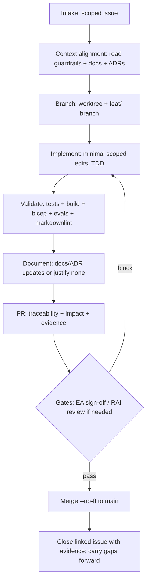

# Delegated Agent Workflow — ATCSimulator

## Purpose

Define the standard **issue → PR → merge** execution path for agent-assisted delivery
in this repository, aligned with the hard guardrails in
[../copilot-instructions.md](../copilot-instructions.md) §3 and the
[SUPERPOWERS_CONTRACT.md](../../SUPERPOWERS_CONTRACT.md).

## Non-negotiable guardrails (apply at every step)

1. **No operational-ATC connectivity** (`CON-01`). Never add a path to live/operational ATC. A request to bridge is a classification-changing event — stop and escalate.
2. **No personal data in the demo** (`CON-03`). Demo plane uses public + synthetic data only.
3. **Data residency** (DP-18). Personal/production data → Switzerland North (DR: Switzerland West); EU Data Zone only when a model is not in-country; US/Sweden Central = demo/non-personal only.
4. **LLM proposes, deterministic layer disposes.** No free-text model output drives the simulator — schema-validated tool calls only.
5. **No secrets in code.** Entra ID + Managed Identity + Key Vault.
6. **Cite ADRs** for architecture-affecting changes ([../../docs/adr/](../../docs/adr/)).

## End-to-end flow

1. **Intake** — Select a scoped issue. Confirm acceptance criteria, non-goals, the
   `FR-##`/`NFR-##` and `US-###` it satisfies, and the allowed folders.
2. **Context alignment** — Read [../copilot-instructions.md](../copilot-instructions.md)
   §3 guardrails and [../../docs/DESIGN-PRINCIPLES.md](../../docs/DESIGN-PRINCIPLES.md);
   then the scope docs (see Scope Guards below); then relevant
   [ADRs](../../docs/adr/) and [../../api/openapi.yaml](../../api/openapi.yaml).
3. **Branching** — Create an isolated worktree under `.worktrees/` and a
   `feat/<slug>` branch from `main`. One concern per branch.
4. **Implementation** — Apply minimal scoped edits following local patterns (TDD:
   failing test first). Keep the deterministic command boundary; change
   `api/openapi.yaml` first when contracts move; never touch operational ATC.
5. **Validation** — Run the required commands for the affected areas
   (see [../copilot-instructions.md](../copilot-instructions.md) build/test section)
   and record command-level evidence, including the golden-phraseology evals when
   read-back/command-mapping is touched.
6. **Documentation** — Update docs and the relevant ADR when behaviour, contracts,
   residency, security, or operations change. If none is required, state why in the PR.
7. **PR creation** — Use the PR contract below. Include full impact and risk
   sections and link parent/child issues and the sprint issue.
8. **Review handoff** — Call out review focus and residual risks. Resolve comments
   and re-run impacted checks.
9. **Merge and closure** — Merge only after policy checks and required approvals
   (`--no-ff` to `main`). Update and close linked issues with an evidence summary;
   carry open gaps into the next sprint's plan and issue.

## Branching model (phased)

Branching and versioning mature with the product (see
[../../docs/VERSIONING.md](../../docs/VERSIONING.md)):

- **Phase 1 — PoC (current):** isolated `.worktrees/` + `feat/<slug>` branches,
  `--no-ff` merge to `main`, one GitHub issue per sprint, manual `0.x` versioning.
  This is the right level of ceremony while proving a PoC.
- **Phase 2 — Post-PoC (planned):** once a PoC is proven, switch that workstream to a
  single-branch model on `main` with `semantic-release` (Conventional Commits drive
  automatic SemVer, Git tags, the GitHub release, and `CHANGELOG.md`).

## PR output contract (hard gate)

An agent must not mark a PR ready for review unless all are satisfied:

1. **Scope** — change set limited to the approved issue scope and allowed folders; unrelated edits excluded or explicitly approved.
2. **Validation** — required build/test/lint/eval commands executed; command-level evidence and outcomes included.
3. **Documentation** — relevant docs/ADRs updated, or explicit justification for none.
4. **Commits** — Conventional Commits; branch and PR linked to the governing issue(s) with `refs #<n>`.
5. **Impact** — API, infrastructure, security/residency, RAI, and telemetry impact stated (or `none` explicitly).
6. **Traceability** — `FR-##`/`NFR-##` → `US-###` → tests/evals → evidence recorded.
7. **Review handoff** — residual risks/open questions and "review this first" summary included.

## Sprint tracking convention

Each sprint is tracked by a dedicated GitHub issue that references its plan in
[../../docs/plans/](../../docs/plans/) and the related documents, manages the
backlog and work-in-progress, and is closed when the committed scope is merged.
Open gaps are carried into the next sprint's plan and issue. Use the `gh` CLI
(`gh issue create --body-file`, `gh issue close --comment`).

## Failure handling

1. **Scope breach risk** — stop and request scope confirmation.
2. **Validation failure** — fix the root cause or document the blocker with evidence.
3. **Policy block** (review/checks/branch protection) — do not bypass without explicit owner approval.
4. **Environment dependency missing** (e.g. `azd`/Azure auth, blocked npm feed) — document the limitation and propose the lowest-risk fallback (e.g. `az bicep build` instead of `azd provision`).

## Rollback guidance

1. Prefer reverting the merge commit or following the repository rollback process.
2. For infra, residency, security, or RAI-sensitive changes, require explicit owner
   approval before rollback execution (see [NON_DELEGABLE_WORK.md](./NON_DELEGABLE_WORK.md)).
