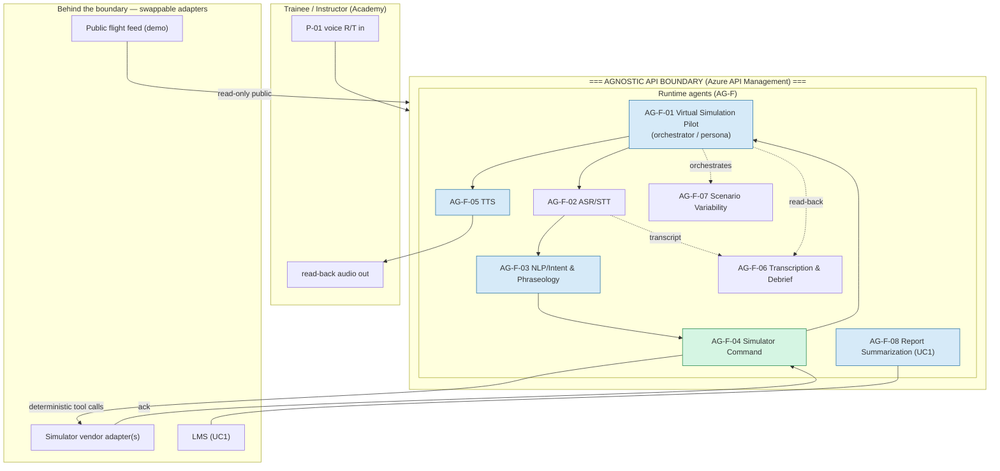

# Agent Registry — Runtime & Engineering Agents

| Field | Value |
|---|---|
| Product | ATCSimulator |
| Document | Agent Registry (runtime `AG-F-##` + engineering `AG-E-##`) |
| Version | 0.1 (Draft) |
| Date | 2026-07-14 |
| Author | Cloud Solution Architect (CSA), Microsoft |
| Status | Draft for Customer workshop (4 August 2026) |
| Classification | Confidential — anonymized |

**Related documents:** [./docs/PERSONAS-JOURNEY.md](./docs/PERSONAS-JOURNEY.md) · [./docs/AI.md](./docs/AI.md) · [./docs/SD.md](./docs/SD.md) · [./docs/BOM.md](./docs/BOM.md) · [./docs/SECURITY.md](./docs/SECURITY.md) · [./docs/COMPLIANCE.md](./docs/COMPLIANCE.md) · [./docs/DATA.md](./docs/DATA.md) · [./docs/DESIGN-PRINCIPLES.md](./docs/DESIGN-PRINCIPLES.md) · API stub: [./api/openapi.yaml](./api/openapi.yaml)

> **Two classes of agent.** This registry covers **(1) runtime / functional agents `AG-F-##`** — the multi-agent system that *runs* ATCSimulator behind the **Agnostic API** — and **(2) engineering / build-time agents `AG-E-##`** — the GitHub Copilot custom agents that *build* it (files under [./.github/agents/](./.github/agents/)).
>
> **Non-negotiable principle — no agent touches operational ATC.** ATCSimulator is a **segregated training environment with no connection to live/operational ATC** ([COMPLIANCE.md](./docs/COMPLIANCE.md) §1, `CON-01`; [SECURITY.md](./docs/SECURITY.md) §6, `NFR-19`). **No `AG-F-##` or `AG-E-##` agent may connect to, read from, or write to any live/operational ATC, surveillance, or voice-comms system.** The only external system a runtime agent may command is the **training simulator, via the vendor-agnostic API**. Any proposal to bridge to an operational system is a classification-changing event requiring re-assessment (RISK-09).

---

## 1. Runtime multi-agent architecture (Agnostic API boundary)

The runtime realizes the brief's **5-step virtual-pilot algorithm** (STT → tokenize/keyword → command lookup+dispatch → read-back → TTS) as a set of cooperating agents orchestrated by **AG-F-01**, all fronted by **Azure API Management** as the **Agnostic API** boundary (DP-20). The LLM **proposes**; a deterministic, schema-validated layer **disposes** — no free-text output ever drives the simulator ([AI.md](./docs/AI.md) §4).

- **Personal/production plane** (Switzerland North): AG-F-02/03/04/05/06 on in-country Azure AI Speech + reasoning model. **Demo plane** (Sweden Central/East US 2, no personal data): real-time speech-to-speech ([COMPLIANCE.md](./docs/COMPLIANCE.md) §5, DP-18).
- **Foundation models are swappable** without changing the Agnostic API contract ([./api/openapi.yaml](./api/openapi.yaml)); see [BOM.md](./docs/BOM.md) for services & regions.

---

## 2. Runtime / functional agents (`AG-F-01…08`)

Each agent below lists **Purpose · Inputs → Outputs · Realizing Azure/AI service (see [BOM.md](./docs/BOM.md)) · Key guardrails · Side effects · Human-in-the-loop (HITL)**. Data domains `D1–D7` are defined in [DATA.md](./docs/DATA.md).

### AG-F-01 — Virtual Simulation Pilot Agent (orchestrator / persona)
- **Purpose.** Play the **simulation-pilot role**: own the session, orchestrate the other agents, and present a single realistic virtual-pilot persona to the trainee.
- **Inputs → Outputs.** Scenario (D1) + trainee voice (D4) + command results → orchestrated exchange + **grounded read-back text** → TTS.
- **Realizing service.** Azure AI Foundry **Agent Service** / orchestrator on Azure Container Apps; read-back generation via Azure OpenAI reasoning model (real-time model in demo). See [BOM.md](./docs/BOM.md).
- **Key guardrails.** Read-backs must mirror the **actually dispatched** command (groundedness); Content Safety on generated text; **AI-pilot disclosure** to the trainee (DP-16); fail-safe **"say again"** on low confidence ([AI.md](./docs/AI.md) §4.6).
- **Side effects.** Writes session/transcript records to store (prod, CH) via AG-F-06; **orchestrates** simulator commands **through AG-F-04** (never directly).
- **HITL.** Instructor (P-02) oversees behaviour; assessment is **advisory only** (RISK-05).

### AG-F-02 — Speech Recognition (ASR/STT) Agent
- **Purpose.** Convert trainee spoken R/T to normalized text, robust to **Swiss dialects/languages + accented English** and R/T vocabulary.
- **Inputs → Outputs.** Voice audio (D4) → normalized R/T transcript (D5) + confidence/N-best.
- **Realizing service.** **Azure AI Speech STT + Custom Speech** (domain-adapted) — **GA in Switzerland North** (in-country); real-time model / `gpt-4o-transcribe`/Whisper in the demo. See [BOM.md](./docs/BOM.md).
- **Key guardrails.** Confidence thresholds; dialect-adapted model; **fairness** parity targets by cohort (DP-12, [AI.md](./docs/AI.md) §5.1); no speaker identification by design (RISK-04).
- **Side effects.** Emits transcript to AG-F-03 and AG-F-06; voice = **personal/sensitive** in prod → CH residency, minimization/purge ([DATA.md](./docs/DATA.md) §4).
- **HITL.** Low-confidence recognitions surfaced to the instructor, not hidden.

### AG-F-03 — NLP / Intent & Phraseology Agent (Swiss ATC fine-tuned)
- **Purpose.** Tokenize/keyword-group the transcript, **validate R/T phraseology**, and produce a **structured intent**.
- **Inputs → Outputs.** Transcript (D5) → structured intent (schema) + phraseology-deviation flags.
- **Realizing service.** Azure OpenAI reasoning model (GPT-4.1/GPT-5.x-class) with a grammar/phraseology parser, **grounded via Azure AI Search** over the ICAO/Swiss phraseology corpus. See [BOM.md](./docs/BOM.md).
- **Key guardrails.** Phraseology validation against the **grounded corpus** (ICAO Doc 9432 / Annex 10 / Swiss conventions); deviations are **flagged for debrief, not silently fixed**; reject-on-ambiguity.
- **Side effects.** Passes intent to AG-F-04; flags to AG-F-06.
- **HITL.** Deviation flags become **advisory** debrief evidence for the instructor.

### AG-F-04 — Simulator Command Agent (voice → API)
- **Purpose.** Turn validated intent into **deterministic, schema-valid simulator commands** and dispatch them to the simulator via the Agnostic API. **This is the only agent that commands the simulator.**
- **Inputs → Outputs.** Structured intent → typed tool calls (`select_aircraft`, `set_heading`, `set_flight_level`, `set_speed`, `set_qnh`, …) → simulator ack (OK/error).
- **Realizing service.** **Deterministic function/tool-calling** with JSON schema; Azure API Management enforces the contract; simulator vendor adapters behind APIM. See [BOM.md](./docs/BOM.md), [./api/openapi.yaml](./api/openapi.yaml).
- **Key guardrails.** **Schema + allow-list + physical-plausibility validation** (e.g., heading 0–360, FL within band); reject/query on ambiguity or low STT confidence; server-side authorization; **no free-text ever reaches the simulator** ([AI.md](./docs/AI.md) §4.1, [SECURITY.md](./docs/SECURITY.md) §9 Tampering).
- **Side effects.** **Calls the (training) simulator API** — a controlled write, bounded to the training simulator only (`CON-01`).
- **HITL.** Rejections surfaced to the instructor; no autonomous action beyond the schema.

### AG-F-05 — Speech Synthesis (TTS) Agent
- **Purpose.** Voice the virtual-pilot read-back with realistic **male/female voices & accents**.
- **Inputs → Outputs.** Read-back text → synthetic pilot audio (D4, **Internal/non-personal**).
- **Realizing service.** **Azure AI Speech Neural TTS** (standard neural voices) in Switzerland North; **Custom Neural Voice (CNV)** optional but **RAI limited-access gated**; real-time model TTS / `gpt-4o-mini-tts` in demo. See [BOM.md](./docs/BOM.md).
- **Key guardrails.** **Synthetic-voice disclosure**; accent variety (DP-15); **CNV only with consented voice talent** — never clone a real controller/pilot (RISK-12, [AI.md](./docs/AI.md) §2).
- **Side effects.** Audio out to trainee + copy to AG-F-06 for transcript alignment.
- **HITL.** None at runtime; CNV enablement requires RAI Lead approval.

### AG-F-06 — Transcription & Debrief Agent
- **Purpose.** Capture the time-aligned transcript and produce **advisory** debrief insights (phraseology, read-back correctness, metrics) for documentation and the closed loop.
- **Inputs → Outputs.** Transcripts (D5) + command log + flags → session/performance records (D6) + debrief view.
- **Realizing service.** STT + summarization on the reasoning model; storage in **Blob/ADLS + Cosmos + SQL** (CH); analytics via **Fabric/Power BI**. See [BOM.md](./docs/BOM.md).
- **Key guardrails.** **Personal/sensitive data → Switzerland North residency**, minimization, retention/purge ([DATA.md](./docs/DATA.md) §4); no personal audio in telemetry ([SECURITY.md](./docs/SECURITY.md) `NFR-20`).
- **Side effects.** **Writes personal data** (transcripts, performance) to storage — the largest data-protection surface in the system.
- **HITL.** **Instructor (P-02) reviews, overrides, and signs off** — assessment is advisory, **no automated pass/fail** (DP-17, RISK-05).

### AG-F-07 — Scenario Variability Agent (surprise engine)
- **Purpose.** Inject **bounded surprise elements** to raise realism and training value.
- **Inputs → Outputs.** Scenario schema (D1) + learner level → approved in-scenario variations/events.
- **Realizing service.** Scenario engine + reasoning model, bounded by the **scenario schema**; state in Cosmos DB. See [BOM.md](./docs/BOM.md).
- **Key guardrails.** Variations confined to a **bounded scenario schema**; **instructor-approved variation set** only; difficulty calibrated to learner level (DP-15).
- **Side effects.** Mutates in-session scenario state (ephemeral, D2); no external writes.
- **HITL.** Scenario Designer (P-03) defines and **instructor approves** the variation bounds.

### AG-F-08 — Report Summarization Agent (UC1 challenger)
- **Purpose.** Draft **per-trainee summaries** of training-session reports held in the LMS, to remove repetitive documentation effort. **Implemented after UC2.**
- **Inputs → Outputs.** LMS training-session reports → **draft** summaries returned to the LMS for review.
- **Realizing service.** Azure OpenAI reasoning model (or Microsoft Copilot Studio / M365 Copilot with SharePoint/Graph connectors to the LMS). See [BOM.md](./docs/BOM.md) (optional M365 stack).
- **Key guardrails.** Groundedness + Content Safety; drafts labelled **advisory**; personal data stays in-country; purpose-limited ([COMPLIANCE.md](./docs/COMPLIANCE.md) `CON-02`).
- **Side effects.** Writes **draft** summaries to the LMS (never final/submitted).
- **HITL.** **Instructor reviews and approves before submission; the instructor retains responsibility** ([AI.md](./docs/AI.md) §6).

### 2.1 Summary table

| Agent | Purpose (one line) | Key input → output | Realizing service ([BOM.md](./docs/BOM.md)) | Primary guardrail |
|---|---|---|---|---|
| AG-F-01 | Orchestrator / virtual-pilot persona | scenario+voice → read-back | Foundry Agent Service + AOAI | Grounded read-back; AI disclosure |
| AG-F-02 | ASR/STT (Swiss dialect) | audio → transcript | Azure AI Speech + Custom Speech | Confidence thresh.; fairness parity |
| AG-F-03 | NLP/intent + phraseology | transcript → intent | AOAI + AI Search (grounding) | Grounded phraseology validation |
| AG-F-04 | Voice → simulator command | intent → tool calls | Deterministic tool-calling + APIM | Schema/allow-list; reject ambiguity |
| AG-F-05 | TTS read-back voice | text → audio | Azure AI Speech Neural TTS / CNV | Synthetic-voice disclosure; no cloning |
| AG-F-06 | Transcription & debrief | transcript → records | Storage (CH) + Fabric/Power BI | CH residency; retention/purge |
| AG-F-07 | Scenario variability | schema → variations | Scenario engine + AOAI | Bounded schema; instructor-approved |
| AG-F-08 | Report summarization (UC1) | reports → draft summaries | AOAI / Copilot Studio + LMS | Advisory draft; instructor approves |

---

## 3. Side-effect & safety control matrix

Which agents may perform which side effects. **✔ = permitted (with the stated control)** · **✘ = never**. The last column restates the hard rule.

| Agent | Call **training** simulator API | Write **personal** data (CH) | Emit synthetic voice | Read public feed (demo) | Write LMS (draft) | Touch **operational ATC** |
|---|---|---|---|---|---|---|
| AG-F-01 Virtual Pilot | ✘ (delegates to AG-F-04) | ✔ via AG-F-06 | ✔ via AG-F-05 | ✔ (seed) | ✘ | **✘ NEVER** |
| AG-F-02 ASR/STT | ✘ | ✔ (transcripts, D5) | ✘ | ✘ | ✘ | **✘ NEVER** |
| AG-F-03 NLP/Intent | ✘ | ✘ (flags → AG-F-06) | ✘ | ✘ | ✘ | **✘ NEVER** |
| AG-F-04 Sim Command | **✔ only agent** (schema/allow-list) | ✘ | ✘ | ✘ | ✘ | **✘ NEVER** |
| AG-F-05 TTS | ✘ | ✘ | ✔ (disclosed; no cloning) | ✘ | ✘ | **✘ NEVER** |
| AG-F-06 Transcription/Debrief | ✘ | **✔ primary writer** (D5/D6, retention) | ✘ | ✘ | ✔ (report, UC1) | **✘ NEVER** |
| AG-F-07 Scenario Variability | ✘ (mutates session state only) | ✘ | ✘ | ✔ (context) | ✘ | **✘ NEVER** |
| AG-F-08 Summarization (UC1) | ✘ | ✔ (in-country) | ✘ | ✘ | ✔ **draft only** (instructor approves) | **✘ NEVER** |

**Governing controls.** The single simulator-writing agent (**AG-F-04**) is constrained by **schema + allow-list + server-side authorization + physical-plausibility** checks ([AI.md](./docs/AI.md) §4.1, [SECURITY.md](./docs/SECURITY.md) §9.1). Personal-data writes (**AG-F-06/08**) inherit **Switzerland North residency, minimization, retention/purge, and DSR** ([DATA.md](./docs/DATA.md) §4, [COMPLIANCE.md](./docs/COMPLIANCE.md) C-05/06). The **demo plane** carries **no personal data** and has **no network path** to the production personal plane (`NFR-19`). **No agent — runtime or engineering — connects to operational ATC (`CON-01`).**

---

## 4. Engineering / build-time agents (`AG-E-01…06`) — GitHub Copilot custom agents

Custom agents that accelerate the **build**. Each is a drop-in `.agent.md` under [./.github/agents/](./.github/agents/), usable with GitHub Copilot. The legacy `.github/chatmodes/` folder remains as template/source material; the supported runtime entry point is `.github/agents/`. Full role, operating principles, quality gates, guardrails, and handoffs are inside each file.

| Agent | One-line role | Custom agent file |
|---|---|---|
| **AG-E-01 Product Owner** | Owns the backlog, user stories from the [PRD.md](./docs/PRD.md), acceptance criteria, prioritization, and MVP-scope (public-data-only) guardrails. | [./.github/agents/product-owner.agent.md](./.github/agents/product-owner.agent.md) |
| **AG-E-02 Developer** | Implements the real-time voice loop & Agnostic API with Azure SDKs, IaC, and tests (TDD); follows the [SD.md](./docs/SD.md). | [./.github/agents/developer.agent.md](./.github/agents/developer.agent.md) |
| **AG-E-03 Enterprise Architect** | Owns the landing zone, WAF/CAF alignment, ADRs, the residency split-plane, and the architecture sign-off gate. | [./.github/agents/enterprise-architect.agent.md](./.github/agents/enterprise-architect.agent.md) |
| **AG-E-04 SecDevOps** | Owns CI/CD (GitHub Actions), GitHub Advanced Security, Defender, secrets, IaC scanning, Zero Trust, and release gates. | [./.github/agents/secdevops.agent.md](./.github/agents/secdevops.agent.md) |
| **AG-E-05 ATC Domain Expert** | ICAO/R-T phraseology SME; Swiss dialect/place-name nuance; validates read-backs; builds golden phraseology fixtures. | [./.github/agents/atc-domain-expert.agent.md](./.github/agents/atc-domain-expert.agent.md) |
| **AG-E-06 Responsible-AI & Compliance Officer** | RAI six principles, Transparency Notes, DPIA prompts, content safety, fairness/dialect-bias evaluation. | [./.github/agents/responsible-ai-officer.agent.md](./.github/agents/responsible-ai-officer.agent.md) |

Repo-wide behaviour common to all custom agents lives in [./.github/copilot-instructions.md](./.github/copilot-instructions.md) (anonymization, residency, "no operational ATC", cite CAF/WAF/RAI). The build RACI mapping these agents to workstreams is in [PERSONAS-JOURNEY.md](./docs/PERSONAS-JOURNEY.md) §6.

---

## 5. Orchestration & handoffs

- **Runtime.** AG-F-01 orchestrates the loop **AG-F-02 → AG-F-03 → AG-F-04 → (AG-F-01 read-back) → AG-F-05**, with AG-F-06 capturing throughout and AG-F-07 shaping the scenario. UC1's AG-F-08 runs off-line against the LMS.
- **Build.** AG-E-01 (PO) feeds stories to AG-E-02 (Dev); AG-E-03 (EA) gates architecture; AG-E-04 (SecDevOps) gates release; AG-E-05 (ATC SME) supplies fixtures that AG-E-06 (RAI) turns into fairness/read-back **eval gates**. Detailed handoffs are in each chat-mode file's **Handoffs** section.
- **Accountability.** Agents accelerate; **named humans hold accountability** — Academy Manager (value), DPO (data protection), Enterprise Architect (architecture sign-off), Responsible-AI Lead (RAI). See [COMPLIANCE.md](./docs/COMPLIANCE.md) §6.2.

*Region/model-availability statements are as of Jul 2026 — re-verify at design time ([BOM.md](./docs/BOM.md)). Financials are ROM, illustrative, CHF, to be validated with the Customer ([BVA.md](./docs/BVA.md)).*
