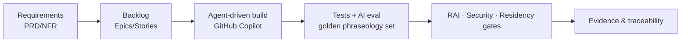
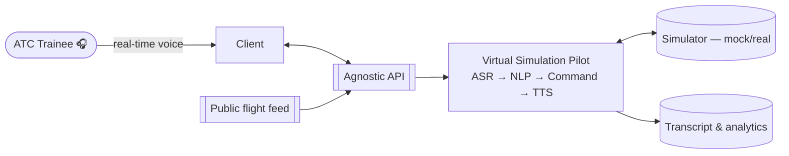
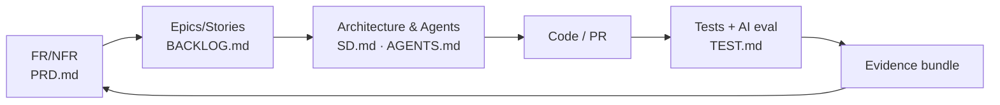

# ATCSimulator

| Field | Value |
|---|---|
| Product | **ATCSimulator** (anonymized) |
| Customer | **the Customer** — Switzerland's national air navigation service provider (ANSP) |
| Version | 0.1 (Draft) |
| Date | 2026-07-14 |
| Author | Cloud Solution Architect (CSA), Microsoft |
| Status | Draft for Customer workshop — 4 August 2026 |
| Classification | Confidential — anonymized |

> **Anonymization.** This repository uses the placeholder product name **ATCSimulator** and refers to the organization only as **the Customer** to protect the real party. No real personal names are used.

---

## Executive summary

**ATCSimulator** automates the *simulation-pilot* role in air-traffic-controller (ATC) training. Today, each simulation-training unit at the Customer's academy (**the Academy**) needs **one instructor/coach plus one to five human simulation pilots** — scarce, expensive, ATS-qualified staff. ATCSimulator replaces the human sim-pilots with a **vendor-agnostic, AI-powered "Virtual Simulation Pilot"** that hears the trainee's radio-telephony (R/T) instructions in **real-time voice**, drives the simulator, and reads back the correct pilot response — enabling **self-service, anytime/anywhere** training at scale.

The solution combines:
- **Real-time speech-to-speech AI** (Azure OpenAI real-time audio) for the demo, and **in-country Azure AI Speech** (STT/TTS) for production.
- A **simulator-vendor-agnostic API** so one set of voice services works across the Academy's multiple simulator vendors.
- **Swiss-first data residency** and **Responsible AI** with the **instructor kept firmly in the loop**.
- **GitHub-native, agent-driven delivery** (GitHub Copilot custom agents) with end-to-end **traceability** from requirement → code → test → evidence.

**Critical scoping fact:** this is a **training-only** product with **no connection to live/operational ATC** — it is **explicitly not critical national infrastructure**.

### Business case (ROM)
The value thesis is simple: **reduce the use of qualified ATS staff to train/retrain other ATS staff**, justifying the TCO on high labor cost. The illustrative ROM model in [BVA.md](./docs/BVA.md) shows a **base-case gross saving ≈ CHF 2.27M/yr, net ≈ CHF 1.88M/yr, simple payback ≈ 7.7 months, ~187% 3-year ROI** — **all figures ROM and to be validated with the Customer.**

## Two solution scopes

| Scope | What | Data residency |
|---|---|---|
| **1 — Full end-to-end (production)** | Vendor-agnostic voice services integrated with the real simulator(s) + LMS, instructor debrief, closed-loop analytics, full governance/ops | **In-country Switzerland North**; EU Data Zone fallback for models not yet in CH |
| **2 — Demo / MVP ("Art of the Possible") — build first** | Trainee **selects an aircraft from a public live-flight feed** (FlightAware/Flightradar24) and runs a **real-time voice** scenario with a Virtual Pilot | **No personal data**; real-time model in Sweden Central (EU) / East US 2 (US) |

## Delivery model (at a glance)
1. **Governance & requirements documented first** (PRD, Compliance, Security, Design Principles).
2. **Agent-driven build** — GitHub Copilot custom agents (Product Owner, Developer, Enterprise Architect, SecDevOps, ATC Domain Expert, Responsible-AI Officer) design, build, and validate the demo.
3. **Security, compliance, RAI & residency evidence** built into the release path with human sign-off gates.



## Solution at a glance



## Key artefacts

| Artefact | Why it matters | Link |
|---|---|---|
| **Product Requirements (PRD)** | Business scope, FR/NFR, constraints, acceptance criteria, traceability baseline | [docs/PRD.md](./docs/PRD.md) |
| **Solution Design & Architecture (SD)** | Multi-agent real-time voice architecture; demo & production; split-plane residency | [docs/SD.md](./docs/SD.md) |
| **Bill of Materials & Availability (BOM)** | Azure/M365 services + **GA/Preview availability across Switzerland North/West and US/EU regions** | [docs/BOM.md](./docs/BOM.md) |
| **Business Value Assessment (BVA)** | ROM TCO/ROI on labor reduction, value levers, KPIs | [docs/BVA.md](./docs/BVA.md) |
| **AI Design & Responsible AI (AI)** | Model choices, 6-step pipeline, RAI six principles, transparency note, evaluation | [docs/AI.md](./docs/AI.md) |
| **Compliance** | Swiss FADP/nFADP + GDPR, residency, DPIA, minimal-viable governance, risk register | [docs/COMPLIANCE.md](./docs/COMPLIANCE.md) |
| **Security** | Zero Trust, network/identity/data controls, threat model, segregation from operational ATC | [docs/SECURITY.md](./docs/SECURITY.md) |
| **Data** | Data domains, classification, flows, retention, residency | [docs/DATA.md](./docs/DATA.md) |
| **Design Principles** | CAF, WAF (5 pillars), Responsible AI, sovereignty-by-design, closed-loop learning | [docs/DESIGN-PRINCIPLES.md](./docs/DESIGN-PRINCIPLES.md) |
| **Personas & E2E Journey** | 7 personas, demo & production journeys, RACI | [docs/PERSONAS-JOURNEY.md](./docs/PERSONAS-JOURNEY.md) |
| **Operations** | Operating model, SLOs, observability, incident, cost, closed loop | [docs/OPERATIONS.md](./docs/OPERATIONS.md) |
| **Test Strategy** | Quality gates, golden phraseology set, AI evaluation metrics | [docs/TEST.md](./docs/TEST.md) |
| **Backlog** | Epics/Stories with acceptance criteria, MoSCoW, roadmap | [docs/BACKLOG.md](./docs/BACKLOG.md) |
| **GitHub Copilot Build Guide** | How the agents design/build/validate the demo with "superpowers"; traceability | [docs/COPILOT-BUILD-GUIDE.md](./docs/COPILOT-BUILD-GUIDE.md) |
| **Agent Registry** | Runtime agents (AG-F-##) + engineering agents (AG-E-##) | [AGENTS.md](./AGENTS.md) |
| **Copilot custom agents** | Product Owner, Developer, Enterprise Architect, SecDevOps, ATC SME, RAI Officer | [.github/agents/](./.github/agents/) |
| **Copilot repo instructions** | Repo-wide Copilot custom instructions & guardrails | [.github/copilot-instructions.md](./.github/copilot-instructions.md) |
| **Superpowers Contract** | Operating rules every Copilot agent must obey | [SUPERPOWERS_CONTRACT.md](./SUPERPOWERS_CONTRACT.md) |
| **Architecture Decision Records** | Real-time model region · Agnostic API · split-plane residency | [docs/adr/](./docs/adr/) |
| **Sample scenario** | LSZH demo scenario seeded with real R/T fixtures | [data/scenarios/sample-scenario.json](./data/scenarios/sample-scenario.json) |
| **Agnostic API (OpenAPI)** | Vendor-agnostic API contract stub | [api/openapi.yaml](./api/openapi.yaml) |

## Agents

**Runtime / functional agents** (the product's Virtual Simulation Pilot system) and **engineering / build-time agents** (GitHub Copilot custom agents) are catalogued in [AGENTS.md](./AGENTS.md).

| Engineering agent | Role | Custom agent |
|---|---|---|
| AG-E-01 Product Owner | Backlog, stories, MVP scope | [product-owner](./.github/agents/product-owner.agent.md) |
| AG-E-02 Developer | Build the voice loop & Agnostic API | [developer](./.github/agents/developer.agent.md) |
| AG-E-03 Enterprise Architect | Landing zone, WAF/CAF, ADRs, sign-off | [enterprise-architect](./.github/agents/enterprise-architect.agent.md) |
| AG-E-04 SecDevOps | CI/CD, security, release gates | [secdevops](./.github/agents/secdevops.agent.md) |
| AG-E-05 ATC Domain Expert | ICAO/R-T phraseology, Swiss nuances | [atc-domain-expert](./.github/agents/atc-domain-expert.agent.md) |
| AG-E-06 Responsible-AI Officer | RAI, DPIA, fairness, content safety | [responsible-ai-officer](./.github/agents/responsible-ai-officer.agent.md) |

## End-to-end traceability



| Layer | Where |
|---|---|
| Requirements | [docs/PRD.md](./docs/PRD.md) (`FR-##`, `NFR-##`, `CON-##`) |
| Backlog | [docs/BACKLOG.md](./docs/BACKLOG.md) (`EP-##`, `US-###`) |
| Architecture & agents | [docs/SD.md](./docs/SD.md), [AGENTS.md](./AGENTS.md) (`AG-F/E-##`, `ADR-####`) |
| Build method | [docs/COPILOT-BUILD-GUIDE.md](./docs/COPILOT-BUILD-GUIDE.md) |
| Tests & evidence | [docs/TEST.md](./docs/TEST.md) |
| Governance | [docs/COMPLIANCE.md](./docs/COMPLIANCE.md), [docs/SECURITY.md](./docs/SECURITY.md), [docs/AI.md](./docs/AI.md), [SUPERPOWERS_CONTRACT.md](./SUPERPOWERS_CONTRACT.md) |

## Repository layout
```
README.md                      AGENTS.md   SUPERPOWERS_CONTRACT.md
.github/copilot-instructions.md
.github/agents/*.agent.md
docs/  PRD · SD · BOM · BVA · AI · COMPLIANCE · SECURITY · DATA
       DESIGN-PRINCIPLES · PERSONAS-JOURNEY · OPERATIONS · TEST
       BACKLOG · COPILOT-BUILD-GUIDE · adr/
data/scenarios/sample-scenario.json
api/openapi.yaml
```

## How to use this repository
1. **Read** [docs/PRD.md](./docs/PRD.md) → [docs/SD.md](./docs/SD.md) → [docs/BOM.md](./docs/BOM.md).
2. **Open the custom agents** in [.github/agents/](./.github/agents/) in VS Code with GitHub Copilot; start with the Product Owner to shape the backlog, then the Enterprise Architect for sign-off, then the Developer to build.
3. **Follow** [docs/COPILOT-BUILD-GUIDE.md](./docs/COPILOT-BUILD-GUIDE.md) to build the demo, honoring the guardrails in [.github/copilot-instructions.md](./.github/copilot-instructions.md) and [SUPERPOWERS_CONTRACT.md](./SUPERPOWERS_CONTRACT.md).

## Provenance & disclaimers
- Built from the Customer's two use-case decks (**UC2 — Virtual Simulation Pilot Agent**, primary; **UC1 — Report Summarization**, challenger) and the discovery call of 9 June 2026.
- **All financials are ROM and illustrative** ([BVA.md](./docs/BVA.md)); **cloud region availability is as of 14 July 2026 and must be re-verified at design time** ([BOM.md](./docs/BOM.md)).
- **Not legal advice** — Customer legal/DPO must validate FADP/GDPR positions ([COMPLIANCE.md](./docs/COMPLIANCE.md)).
