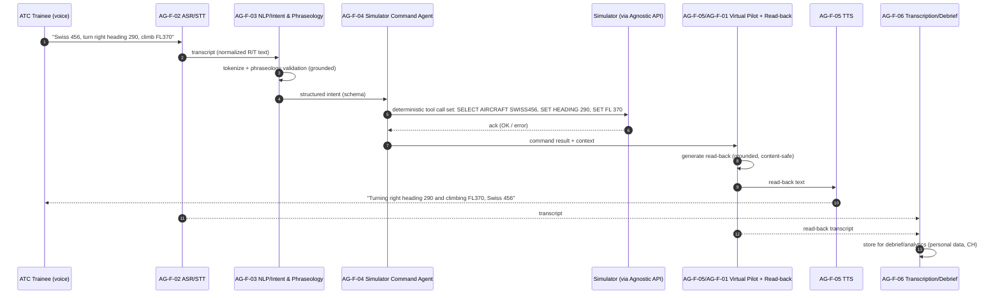
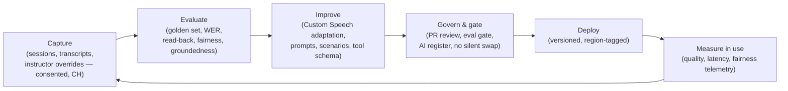

# AI Design & Responsible AI

| Field | Value |
| --- | --- |
| Product | ATCSimulator |
| Document | AI Design & Responsible AI |
| Version | 0.1 (Draft) |
| Date | 2026-07-14 |
| Author | Cloud Solution Architect (CSA), Microsoft |
| Status | Draft for Customer workshop (4 August 2026) |
| Classification | Confidential — anonymized |

**Related documents:** [COMPLIANCE.md](./COMPLIANCE.md) · [SECURITY.md](./SECURITY.md) · [DATA.md](./DATA.md) · [BOM.md](./BOM.md) · [SD.md](./SD.md) · [DESIGN-PRINCIPLES.md](./DESIGN-PRINCIPLES.md)

> **Relationship to DESIGN-PRINCIPLES.md.** [DESIGN-PRINCIPLES.md](./DESIGN-PRINCIPLES.md) holds the *principles-level* view (CAF/WAF/RAI anchors). **This** document is the *detailed* AI + Responsible-AI treatment: model choices, the virtual-pilot pipeline, guardrails, the RAI six-principle deep-dive with concrete controls, a Transparency Note, fairness/dialect evaluation, human-in-the-loop, evaluation & quality, and the closed-loop lifecycle.
> **Non-negotiable framing.** ATCSimulator is a **training simulator**, not an operational or safety-of-life system, and has **no connection to live/operational ATC** ([COMPLIANCE.md](./COMPLIANCE.md) §1, `CON-01`). Every AI capability here is **advisory** to a human instructor and is **out of scope for live ATC and for controller certification/pass-fail without human sign-off** (see §5.7 Transparency Note).

---

## 1. AI capabilities & model choices

ATCSimulator automates the **simulation-pilot** role: understand the trainee controller's spoken R/T instruction, drive the simulator, and voice a realistic virtual-pilot read-back. Two deployment profiles are used, matched to data classification and regional availability (see [COMPLIANCE.md](./COMPLIANCE.md) §5, [BOM.md](./BOM.md); availability is **as of Jul 2026 — verify at design time**).

| Capability | Demo / Art-of-the-Possible (Scope 2) | In-country / production (Scope 1) | Notes |
| --- | --- | --- | --- |
| **Speech-to-speech (real-time)** | **Azure OpenAI real-time audio** (`gpt-realtime` / `gpt-4o-realtime` family) — single low-latency voice loop. | Not used as a single black-box for personal data (real-time family **not in Switzerland North**). Production decomposes into Speech + reasoning + Speech (below). | Real-time family available **Sweden Central (EU) / East US 2 (US)**; **demo only, no personal data** ([COMPLIANCE.md](./COMPLIANCE.md) `CON-03`). |
| **Speech-to-Text (STT)** | Within the real-time model; or `gpt-4o-transcribe`/Whisper. | **Azure AI Speech STT** + **Custom Speech** (domain-adapted) — **GA in Switzerland North** → in-country. | Fine-tune on ATC vocabulary + Swiss languages/dialects + accented English (§1.1). |
| **Text-to-Speech (TTS)** | Within the real-time model; or `gpt-4o-mini-tts`. | **Azure AI Speech Neural TTS** (standard neural voices) in Switzerland North; **Custom Neural Voice (CNV)** optional. | **CNV Pro is limited-access / RAI-gated** (application required); **CNV Lite** is Preview. Use standard neural voices for MVP. |
| **Reasoning / command mapping** (voice→simulator command) | Handled by the real-time model with **function/tool calling**. | **Azure OpenAI GPT-4.1 / GPT-5.x-class** reasoning model with **structured tool-calling** — Switzerland North if available, else **EU Data Zone**. | GPT-4o Standard in Switzerland North had a retirement notice → target GPT-4.1/GPT-5.x. |
| **Domain adaptation / fine-tuning** | Not required for demo (public + synthetic). | **Custom Speech** acoustic/language adaptation for Swiss dialects + R/T phraseology; optional reasoning-model fine-tune/LoRA or strong system-prompt + retrieval grounding. | Prefer synthetic/consented, de-identified corpora ([COMPLIANCE.md](./COMPLIANCE.md) RISK-08). |
| **Grounding / retrieval** | Minimal. | **Azure AI Search** over phraseology corpus (ICAO Doc 9432/Annex 10 extracts) + scenario library. | Grounds phraseology validation & read-back correctness (§7). |
| **Content safety & evaluation** | **Azure AI Content Safety** + Foundry evaluations. | Same, in-region. | See §3, §7. |

### 1.1 Why domain adaptation matters here

Prior vendor speech engines **failed on Swiss dialects and Swiss place names** (the vendor-agnostic justification in the brief). ATCSimulator must handle: Swiss **German** (incl. dialect), **French**, **Italian**, and **accented English**, plus Swiss toponyms embedded in clearances (e.g., "Schrattenfluh", "Evolène"). Approach: Custom Speech **language + acoustic adaptation** on R/T phraseology and Swiss-language corpora; a **phraseology-constrained** vocabulary; and evaluation designed to expose **dialect bias** (§6). This is a first-class fairness requirement, not a nice-to-have.

---

## 2. Model access, gating & regional strategy

- **Custom Neural Voice (CNV) is Responsible-AI limited-access gated** — application/approval required; only eligible (Microsoft-managed) customers; intended-use review. ATCSimulator uses **standard neural voices for the MVP**; CNV is an *optional* production enhancement **only** with (a) approved access, (b) **consented voice talent** (never cloning a real controller/pilot without consent), and (c) a disclosure that the pilot voice is synthetic (RISK-12, §5.3/§5.5). **[validate CNV eligibility with RAI Lead]**
- **Region strategy** follows [COMPLIANCE.md](./COMPLIANCE.md) §5 split-plane: personal/production STT/TTS/reasoning in **Switzerland North** (EU Data Zone fallback for models not in-country); **demo real-time** in **Sweden Central/East US 2** with **no personal data**. Each deployment's region + data-boundary is recorded in the **AI use-case register** ([COMPLIANCE.md](./COMPLIANCE.md) §6).
- **Azure OpenAI data handling:** confirm no-training-on-customer-data and review abuse-monitoring/human-review settings for the personal plane ([COMPLIANCE.md](./COMPLIANCE.md) C-16). **[validate with DPO]**

---

## 3. The 6-step virtual-pilot pipeline → AI components

The runtime maps the brief's virtual-pilot processing steps onto agents (`AG-F-##`) behind the Agnostic API. The **5-step algorithm** (STT → tokenize/keyword → command lookup+dispatch → read-back generation → TTS) is realized as the 6 component agents below.

| Step (brief) | Component / agent | AI technique | Guardrail |
| --- | --- | --- | --- |
| 1. STT transcription | **AG-F-02 ASR/STT** | Azure AI Speech (Custom Speech) / real-time (demo) | Confidence thresholds; dialect-adapted model; N-best |
| 2. Keyword recognition / tokenization | **AG-F-03 NLP/Intent** | LLM + grammar/phraseology parser | **Phraseology validation** against ICAO/Swiss corpus (grounded) |
| 3. Command lookup + build + dispatch | **AG-F-04 Simulator Command Agent** | **Deterministic function/tool calling** with JSON schema | Schema validation; command allow-list; server-side authz; reject-on-ambiguity |
| 4. Read-back generation | **AG-F-01/AG-F-05 Virtual Pilot** | LLM generation (constrained) | Grounded read-back must mirror the *actual* dispatched command; Content Safety |
| 5. TTS output | **AG-F-05 TTS** | Neural TTS / CNV (gated) | Synthetic-voice disclosure; accent variety |
| (cross-cutting) transcription | **AG-F-06 Transcription/Debrief** | STT + summarization | Personal data → CH residency, retention/purge ([DATA.md](./DATA.md)) |
| (cross-cutting) surprise | **AG-F-07 Scenario Variability** | Scenario engine + LLM | Bounded scenario schema; instructor-approved variation set |

---

## 4. Grounding & guardrails

The core safety idea: **the LLM proposes, a deterministic layer disposes.** No free-text LLM output ever directly drives the simulator.

1. **Deterministic command mapping (function/tool calling with schema).** AG-F-04 exposes a **typed tool schema** (e.g., `set_heading`, `set_flight_level`, `set_speed`, `select_aircraft`, `set_qnh`) with validated ranges/enums. The reasoning model emits **structured tool calls**, never raw commands; the command agent **validates against schema + allow-list + physical plausibility** (e.g., heading 0–360, FL within band) and rejects/queries on ambiguity or low STT confidence. This is the primary hallucination containment for actions ([SECURITY.md](./SECURITY.md) §9.1 Tampering).
2. **Phraseology validation.** AG-F-03 checks both the trainee's transmission and the virtual-pilot read-back against a **grounded phraseology corpus** (ICAO Doc 9432 / Annex 10 / national R/T conventions via Azure AI Search). Deviations are flagged for the debrief (training value) rather than silently "fixed".
3. **Grounded, faithful read-backs.** The read-back the virtual pilot voices MUST reflect the **command actually dispatched and acknowledged** by the simulator — not an LLM guess. Read-back generation is conditioned on the command-result payload (groundedness), reducing the risk of a plausible-but-wrong read-back teaching bad habits.
4. **Azure AI Content Safety.** Applied to generative text/voice output (and inputs where relevant): harmful-content filters, jailbreak/prompt-injection detection on any free-text, and custom blocklists. Given the closed R/T domain, out-of-domain output is additionally constrained by system prompts + retrieval grounding.
5. **Groundedness & evaluation gates.** Foundry **evaluations** (groundedness, relevance, and a domain **read-back-correctness** metric, §7) run in CI as a **release gate** — a model/prompt change that regresses phraseology fidelity does not ship ([SECURITY.md](./SECURITY.md) NFR-18; §8 no-silent-swap).
6. **Fail-safe behaviour.** On low confidence/ambiguity, the virtual pilot uses a standard **"say again"** R/T clarification rather than guessing — which is itself realistic and safe.

---

## 5. Responsible AI deep-dive (Microsoft's six principles)

Concrete controls per principle. RAI ownership sits with the **Responsible-AI Lead** ([COMPLIANCE.md](./COMPLIANCE.md) §6.2).

### 5.1 Fairness

- **Risk:** dialect/accent bias — the system understands standard German/French/English speakers better than Swiss-dialect, Italian, or accented speakers, disadvantaging some trainees.
- **Controls:** dialect-stratified evaluation (§6) with **per-cohort WER parity targets**; domain adaptation on Swiss languages/dialects; fixed vocabulary/phraseology reduces long-tail errors; bias findings feed the closed loop (§8). Fairness is a **release gate**, not a report.

### 5.2 Reliability & Safety

- **Risk:** wrong command dispatched; plausible-but-wrong read-back; latency breaking realism.
- **Controls:** deterministic schema-validated command mapping (§4.1); grounded read-backs (§4.3); **latency SLO** (§7); fail-safe "say again" (§4.6); golden-set regression gates (§7). **Safety here = training fidelity**, since there is no live aircraft ([COMPLIANCE.md](./COMPLIANCE.md) §1).

### 5.3 Privacy & Security

- **Risk:** trainee voice (biometric-adjacent), transcripts, performance data exposure; model memorization.
- **Controls:** in-country residency, Private Link, encryption/CMK, minimization & purge ([SECURITY.md](./SECURITY.md) §3/§4; [DATA.md](./DATA.md) §4); no-training-on-customer-data (verify DPA); synthetic/de-identified fine-tune corpora ([COMPLIANCE.md](./COMPLIANCE.md) RISK-08); consent for voice ([COMPLIANCE.md](./COMPLIANCE.md) §3); **no speaker-identification by design** (RISK-04). CNV only with consented voice talent (§2).

### 5.4 Inclusiveness

- **Risk:** trainees with non-standard speech, hearing needs, or minority language backgrounds are underserved.
- **Controls:** multilingual support across Swiss national languages + accented English; accessible client (captions/transcripts available for review; adjustable audio); text fallback path; inclusive voice/accent variety in the virtual pilot. Inclusiveness overlaps Fairness testing (§6).

### 5.5 Transparency

- **Risk:** trainees/instructors don't know they're interacting with AI, its limits, or that a voice is synthetic.
- **Controls:** in-app **AI disclosure**; **synthetic-voice disclosure** for the virtual pilot; **Transparency Note** (§5.7); privacy notice ([COMPLIANCE.md](./COMPLIANCE.md) §3); debrief shows AI outputs **labelled as advisory**; documented intended use & out-of-scope.

### 5.6 Accountability

- **Risk:** unclear who is responsible for AI-influenced assessment; silent model changes.
- **Controls:** **human instructor retains responsibility** (§6 HITL); AI use-case register + model/prompt change control ([COMPLIANCE.md](./COMPLIANCE.md) C-13, §8); RACI ([COMPLIANCE.md](./COMPLIANCE.md) §6.2); RAI assessment signed before production; red-teaming (§7).

| Principle | Primary control | Evidence artefact |
| --- | --- | --- |
| Fairness | Dialect-stratified WER-parity eval gate | Fairness eval report (§6) |
| Reliability & Safety | Deterministic command mapping + golden-set gate | Eval/golden-set results (§7) |
| Privacy & Security | Residency + minimization + CMK + no-speaker-ID | [SECURITY.md](./SECURITY.md)/[DATA.md](./DATA.md) evidence |
| Inclusiveness | Multilingual + accessible client | Accessibility/lang test record |
| Transparency | Transparency Note + AI/synthetic-voice disclosure | This §5.7 + in-app notices |
| Accountability | HITL + AI register + change control | RACI, register, Git history |

### 5.7 Transparency Note (intended use, limitations, out-of-scope)

**Intended use.** ATCSimulator's AI automates the **simulation-pilot** role in a **training** setting: transcribing trainee R/T, driving a simulator via validated commands, and voicing realistic virtual-pilot read-backs, plus producing transcripts and advisory debrief insights. Intended users: ATC trainees, instructors/coaches, scenario authors, at the Academy.

**Capabilities.** Real-time speech understanding/synthesis; Swiss-language/dialect + accented-English handling; phraseology validation; deterministic simulator control; transcription; scenario variability.

**Limitations.** Speech recognition is imperfect on heavy dialect/noise; the model may misrecognize novel toponyms or callsigns; read-backs are only as correct as the dispatched command and the grounding corpus; evaluation is advisory and not a substitute for instructor judgment; performance varies by language/accent (mitigated, not eliminated, by §6).

**Out-of-scope / must-not-use (hard limits).**

- **NEVER** connect to or use for **live/operational ATC** or any safety-of-life function (`CON-01`).
- **NEVER** use AI output as an **authoritative pass/fail or licensing/certification decision** for a controller **without human instructor sign-off** (RISK-05). AI-assisted assessment is **advisory only**.
- **NEVER** use for covert monitoring, disciplinary action, or any purpose beyond training without a new lawful basis ([COMPLIANCE.md](./COMPLIANCE.md) `CON-02`, RISK-06).
- **NEVER** clone a real person's voice without consent (RISK-12).

**Human oversight.** A qualified instructor supervises and is accountable for all training and assessment outcomes (§6).

---

## 6. Human-in-the-loop (HITL)

- **Instructor retains responsibility.** The Coach/Instructor persona supervises exercises and **owns** all assessment/debrief conclusions. ATCSimulator **assists**; it does not decide. This mirrors the UC1 challenger pattern where the instructor reviews and approves AI summaries ([COMPLIANCE.md](./COMPLIANCE.md) source facts).
- **AI-assisted assessment is advisory.** Read-back-correctness, phraseology-deviation flags, and performance metrics are surfaced as **suggestions with evidence** (linked transcript segments). The instructor confirms, overrides, or discards. No automated pass/fail (RISK-05).
- **Escalation/uncertainty surfacing.** Low-confidence recognitions and guardrail rejections are shown to the instructor, not hidden.
- **Feedback capture.** Instructor overrides are captured (with consent/authz) as high-value signal for the closed loop (§8).

---

## 7. Evaluation & quality

### 7.1 Golden phraseology test set (fixtures)

The brief's example exchanges are the seed **golden set** (verbatim fixtures), chosen to exercise standard R/T, Swiss toponyms, QNH/level/heading semantics, and traffic-advisory phrasing:

| # | ATC transmission (input) | Expected virtual-pilot read-back (assertion) | Exercises |
| --- | --- | --- | --- |
| G-01 | "Swiss 456, turn right heading 290 degrees, and climb flight level 370." | "Turning right heading 290 degrees and climbing to flight level 370, Swiss 456." | Heading + level; callsign echo |
| G-02 | "N123AB, crossing to Schrattenfluh approved, descend 5'000 feet, QNH 1019, report crossing completed." | "Crossing to Schrattenfluh approved and descending to 5,000 feet, QNH 1019, call you completed N123AB." | Swiss toponym; QNH; conditional report |
| G-03 | "Heli-NA, Report HE, QNH 1023, look out for opposite helicopter just departed FATO climbing direction Evolène." | "Call you HE, QNH 1023, looking out for traffic Heli-NA." | Swiss municipality; helicopter R/T; reporting point |
| G-04 | "NJE396J, opposite traffic 11 o'clock position 6 miles 4'900 feet climbing eastbound, maintain south of the IGS axis." | "Looking out NJE396J." | Traffic advisory; partial read-back |

The golden set is expanded with instructor-authored cases per Swiss language/dialect and per scenario type; each case asserts (a) correct **command mapping** and (b) correct **read-back**.

### 7.2 Metrics & targets

| Metric | Definition | Target (illustrative — **validate with Academy**) |
| --- | --- | --- |
| **Word Error Rate (WER)** | STT transcription errors vs reference, **stratified by language/dialect/accent**. | e.g. ≤ X% overall **and** per-cohort parity within ±Y% (no cohort materially worse). Set with Academy. |
| **Command-mapping accuracy** | % of transmissions producing the correct, schema-valid simulator command. | High (e.g. ≥ 98% on golden set) — **safety-relevant for training fidelity**. |
| **Read-back correctness** | % of virtual-pilot read-backs faithful to the dispatched command & phraseology. | High (e.g. ≥ 98%); zero tolerance for confidently-wrong read-backs on core clearances. |
| **Latency (SLO)** | End-of-utterance → start-of-read-back audio. | Conversational SLO (e.g. p95 ≤ ~1–1.5 s) for realism; define with Academy. |
| **Phraseology-deviation detection** | Precision/recall of flagging non-standard R/T. | Tuned for training usefulness (favor recall, instructor filters). |
| **Groundedness / hallucination rate** | Foundry groundedness eval on generated text. | Above threshold; regressions block release. |
| **Fairness parity** | Max inter-cohort gap on WER/command accuracy. | Within agreed parity band (§5.1). |

### 7.3 Red-teaming & adversarial testing

- Prompt-injection / jailbreak attempts on any free-text path; out-of-domain requests; malicious/garbled audio; ambiguous or conflicting clearances; accent/dialect stress cases; attempts to elicit unsafe or out-of-scope behaviour. Findings feed guardrail tuning and the risk register. Cadence set post-MVP (fast-follow, [COMPLIANCE.md](./COMPLIANCE.md) §6).

### 7.4 Evaluation as a release gate

Golden-set + fairness + groundedness evals run in **CI**; a regression **blocks deployment** (ties to §8 and [SECURITY.md](./SECURITY.md) NFR-18). Demo scope runs a smoke subset; production runs the full gate.

---

## 8. Fairness & dialect-bias evaluation plan

- **Cohorts:** Swiss **German** (Standard + representative dialects), Swiss **French**, Swiss **Italian**, and **accented English** (non-native controllers). Optionally stratify by gender (voice-model coverage) to catch TTS/STT gender skew.
- **Datasets:** curated, **consented/de-identified** or **synthetic** phraseology recordings per cohort ([COMPLIANCE.md](./COMPLIANCE.md) RISK-08); include Swiss toponyms/callsigns that historically broke prior engines.
- **Method:** measure WER and command-mapping accuracy **per cohort**; compute **parity gap** vs the best cohort; require gaps within the agreed band (§7.2). Investigate systematic error patterns (specific phonemes, toponyms, code-switching).
- **Remediation:** targeted Custom Speech adaptation, vocabulary/pronunciation lexicons, additional grounded phraseology; re-test. Bias fixes flow through the closed loop (§9).
- **Governance:** results recorded in the AI use-case register + fairness eval report (evidence for [COMPLIANCE.md](./COMPLIANCE.md) C-12); parity is a **go/no-go** for production onboarding of a language/cohort.

---

## 9. Closed-loop model improvement & model/prompt governance

- **Closed loop:** capture (consented, in-country) → evaluate → improve models/prompts/scenarios → **govern/gate** → deploy → measure → repeat. Aligns with the closed-loop principle in [DESIGN-PRINCIPLES.md](./DESIGN-PRINCIPLES.md).
- **Model/prompt governance (`no silent model swap`):** every model version, prompt, and tool schema is **versioned in Git**, PR-reviewed, and must **pass the eval gate** (§7.4) before deployment; each deployment records **model + region + data-boundary + RAI tier** in the **AI use-case register** ([COMPLIANCE.md](./COMPLIANCE.md) C-13, §6). Rollback plan per release.
- **Data for improvement:** prefer **synthetic + consented, de-identified** corpora; never silently fold personal voice into a fine-tune set; erasure requests must reach fine-tune datasets ([COMPLIANCE.md](./COMPLIANCE.md) RISK-07/08).
- **Human signal:** instructor overrides (§6) are a primary, high-value improvement signal.

---

## 10. Key AI assumptions & validations

- Real-time speech-to-speech regional availability is **volatile** — **re-verify** on the live model-availability page at design time ([BOM.md](./BOM.md)). `ASS`
- **CNV eligibility/gating** and **Azure OpenAI data-handling settings** require confirmation ([COMPLIANCE.md](./COMPLIANCE.md) C-16, RISK-12). **[validate with RAI Lead / DPO]**
- WER/latency/accuracy **targets are illustrative** and must be set with the Academy against training-outcome needs (§7.2). **[validate with Academy]**
- Fine-tune corpus provenance and de-identification approach must be confirmed by the DPO ([COMPLIANCE.md](./COMPLIANCE.md) §3). **[validate with DPO]**
