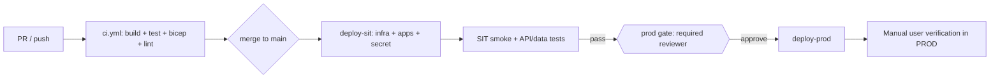

# ATCSimulator — Application Lifecycle Management (ALM)

| Field | Value |
| --- | --- |
| Product | ATCSimulator |
| Document | Application Lifecycle Management (ALM) |
| Type | Key |
| Version | 0.1 (Draft) |
| Date | 2026-07-15 |
| Author | ATCSimulator team |
| Status | Active |
| Classification | Confidential — anonymized |

**Related documents:** [SECURITY.md](./SECURITY.md) · [VERSIONING.md](./VERSIONING.md) · [OPERATIONS.md](./OPERATIONS.md) · [cloud CI/CD design](./specs/2026-07-15-cloud-platform-cicd-design.md) · [cloud CI/CD plan](./plans/2026-07-15-cloud-platform-cicd-plan.md) · [../.github/agents/NON_DELEGABLE_WORK.md](../.github/agents/NON_DELEGABLE_WORK.md)

---

## 1. Environments

| Environment | Resource group / region | Purpose | Deployment |
| --- | --- | --- | --- |
| dev | Local only (no cloud) | Developer inner loop | Vite dev server + `dotnet run` |
| sit | `rg-atcsim-sit`, Sweden Central | Integration testing | Auto-deploy on merge to `main` |
| prod | `rg-atcsim-prod`, Sweden Central | Production for PoC / Demo / MVP | Manual required-reviewer gate |

## 2. CI/CD flow

- **`ci.yml`** runs on every pull request and push: it builds and tests the APIs and the web shell, runs `az bicep build` on the infrastructure, and lints the Markdown.
- **`cd.yml`** runs after merge to `main`: it auto-deploys to SIT (`deploy-sit`), runs the SIT verification gate, waits for the PROD required-reviewer approval, then deploys to PROD (`deploy-prod`).



## 3. One-time bootstrap (human-run)

This bootstrap is **non-delegable** and must be performed by a human with the required privileges (see [../.github/agents/NON_DELEGABLE_WORK.md](../.github/agents/NON_DELEGABLE_WORK.md)).

1. Sign in as a subscription **Owner**, then run the OIDC and resource-group bootstrap script:

   ```powershell
   az login
   pwsh scripts/bootstrap-cicd.ps1 -SubscriptionId 75102af9-fc92-45d4-99a8-5510a24b5421
   ```

2. In GitHub, open **Settings → Environments** and create the `sit` and `prod` environments. Add a **required reviewer** to `prod`.

3. On **both** environments, set the environment variables and secret:

   - Variables: `AZURE_CLIENT_ID`, `AZURE_TENANT_ID`, `AZURE_SUBSCRIPTION_ID`, `WEB_CLIENT_ID`, `API_SCOPE`.
   - Secret: `FR24_TOKEN`.

## 4. Promotion & gates

- Merge to `main` **auto-deploys SIT** via `cd.yml`.
- The **automated SIT verification** (`scripts/verify-environment.ps1`) must pass before promotion continues.
- **PROD requires manual reviewer approval** through the `prod` GitHub environment gate.
- After the PROD deploy, a **human performs the manual walkthrough**: sign in, select an aircraft, and run the voice proof.

## 5. Residency traceability

- **SIT and PROD run in Sweden Central (EU)** to showcase the current Microsoft stack, including the real-time speech-to-speech model.
- The **PoC / Demo uses public and synthetic data only**, so EU hosting is compliant — no personal or production data is processed (**CON-03**).
- **Personal / production data and classic STT/TTS for the MVP require Switzerland North** for in-country residency (**DP-18**); this is documented and intentionally deferred beyond the PoC.
- As of **Jul 2026** the real-time speech model is **not GA in Switzerland North**, so a future in-country plane may need the **EU Data Zone** or a **classic STT + TTS** pipeline instead. Re-verify at design time.
