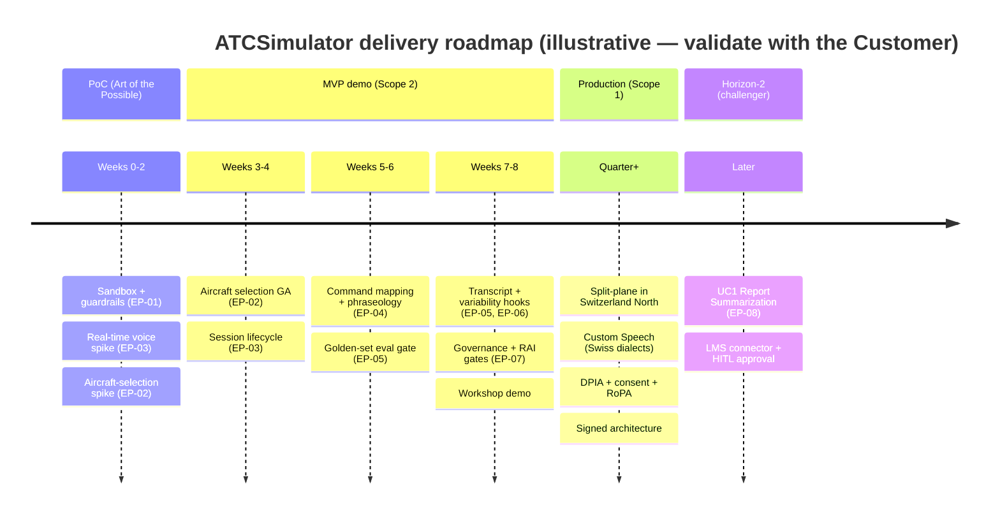

# Product Backlog

| Field | Value |
|---|---|
| Product | ATCSimulator |
| Document | Product Backlog (Epics, User Stories, Roadmap) |
| Version | 0.1 (Draft) |
| Date | 2026-07-14 |
| Author | Cloud Solution Architect (CSA), Microsoft |
| Status | Draft for Customer workshop (4 August 2026) |
| Classification | Confidential — anonymized |

**Related documents:** [PRD.md](./PRD.md) · [COPILOT-BUILD-GUIDE.md](./COPILOT-BUILD-GUIDE.md) · [AI.md](./AI.md) · [DATA.md](./DATA.md) · [SECURITY.md](./SECURITY.md) · [COMPLIANCE.md](./COMPLIANCE.md) · [DESIGN-PRINCIPLES.md](./DESIGN-PRINCIPLES.md) · [adr/ADR-0001-realtime-model-region.md](./adr/ADR-0001-realtime-model-region.md) · [../api/openapi.yaml](../api/openapi.yaml) · [../data/scenarios/sample-scenario.json](../data/scenarios/sample-scenario.json) · [../AGENTS.md](../AGENTS.md) · [../SUPERPOWERS_CONTRACT.md](../SUPERPOWERS_CONTRACT.md)

> **Scope of this backlog.** The **MVP demo (Scope 2)** is the delivery target: *"an ATC selects an aircraft from a public live-flight feed and starts a real-time voice simulation scenario with a virtual pilot."* Public + synthetic data only — **no personal data, no operational-ATC connection** (`CON-01`, `CON-03`). The **UC1 Report Summarization** challenger is deliberately **Horizon-2** (§5). Functional requirements (`FR-##`) are owned by [PRD.md](./PRD.md); this backlog maps epics/stories to them.

---

## 1. Functional requirements this backlog delivers (from the PRD)

| FR | Requirement (UC2 primary) | MVP demo? |
|---|---|---|
| `FR-01` | Real-time speech recognition (ASR/STT) of ATC R/T incl. Swiss languages/dialects + accented English | ✓ (demo: via real-time model) |
| `FR-02` | NLP/intent recognition + **phraseology validation** (Swiss ATC fine-tuned) | ✓ (baseline) |
| `FR-03` | Deterministic **voice → simulator command** mapping (schema/tool-calling) | ✓ |
| `FR-04` | **Virtual-pilot read-back** generation (grounded, faithful) | ✓ |
| `FR-05` | Real-time speech synthesis (TTS), male/female voices & accents | ✓ |
| `FR-06` | Conversation **transcription** for documentation/debrief | ✓ (non-personal in demo) |
| `FR-07` | Scenario definition, authoring & management | ✓ (seed scenario) |
| `FR-08` | **Aircraft selection from public live-flight feed** | ✓ |
| `FR-09` | Real-time **session lifecycle** (start/stop, voice loop) | ✓ |
| `FR-10` | **Scenario-variability / surprise-event engine** | Partial (hooks) |
| `FR-11` | Simulator-**vendor-agnostic API façade** | ✓ |
| `FR-12` | Debrief & **closed-loop analytics** | Partial (transcript + eval) |
| `FR-13` | (UC1 challenger) Report summarization with human-in-the-loop approval | Horizon-2 |

Personas referenced: `P-01` ATC Trainee · `P-02` Coach/Instructor · `P-03` Scenario Designer · `P-04` Academy Manager · `P-05` Data Protection/Compliance Officer · `P-06` Platform/Cloud Ops Engineer · `P-07` LMS Administrator (UC1). See [PERSONAS-JOURNEY.md](./PERSONAS-JOURNEY.md).

---

## 2. Epics (`EP-##`)

| Epic | Name | Delivers | Primary agents (build) |
|---|---|---|---|
| `EP-01` | Foundations, landing zone & guardrails | Sandbox subscription, azd+Bicep IaC, CI/CD, GHAS, policy-as-code, custom agents, ADRs | `AG-E-03` EA, `AG-E-04` SecDevOps |
| `EP-02` | Live-flight feed & aircraft selection | `FR-08`, `FR-11` | `AG-E-02` Dev, `AG-E-05` ATC SME |
| `EP-03` | Real-time voice loop (virtual pilot) | `FR-01`, `FR-04`, `FR-05`, `FR-09` | `AG-E-02` Dev, `AG-E-05` ATC SME, `AG-E-06` RAI |
| `EP-04` | Command mapping & phraseology validation | `FR-02`, `FR-03` | `AG-E-02` Dev, `AG-E-05` ATC SME |
| `EP-05` | Transcript, debrief & evaluation harness | `FR-06`, `FR-12` | `AG-E-02` Dev, `AG-E-06` RAI |
| `EP-06` | Scenario authoring & variability engine | `FR-07`, `FR-10` | `AG-E-01` PO, `AG-E-05` ATC SME |
| `EP-07` | Governance, Responsible AI & compliance gates | `CON-01/03`, `C-*`, `NFR-*`, RAI eval gate | `AG-E-06` RAI, `AG-E-04` SecDevOps |
| `EP-08` | **(Horizon-2)** UC1 Report Summarization challenger | `FR-13` | `AG-E-01` PO, `AG-E-06` RAI |

---

## 3. User stories (`US-###`) with acceptance criteria — MVP demo

Acceptance criteria use **Given / When / Then**. Every story is traceable: `EP-##` → `FR/NFR` → `US-###` → PR → test/eval → evidence ([SUPERPOWERS_CONTRACT.md](../SUPERPOWERS_CONTRACT.md)).

### EP-01 — Foundations, landing zone & guardrails

**US-001 — Provision the demo sandbox with one command** · MoSCoW: **Must** · `NFR-05`, `NFR-16`, `DP-03/DP-10`
- **Given** a clean Azure subscription and the repo, **When** an engineer runs `azd up`, **Then** a Sweden Central sandbox is provisioned via Bicep (Container Apps env, APIM, Key Vault, Log Analytics, Storage, Azure OpenAI real-time deployment) with **no public endpoints on data services** and **allowed-regions policy = CH/EU**.
- **And** the deployment uses **OIDC federation** (no long-lived cloud secrets) and IaC passed the pre-deploy scan.

**US-002 — Repo guardrails are active from commit one** · MoSCoW: **Must** · `NFR-15`, `C-13`
- **Given** the repository, **When** any push occurs, **Then** secret scanning + push protection, CodeQL, and Dependabot are enabled and a committed secret is **blocked**.
- **And** `.github/copilot-instructions.md`, the six custom agents, and ADR-0001..0003 are present and referenced by CI checks.

**US-003 — Traceability & sign-off gates are enforced** · MoSCoW: **Must** · `SUPERPOWERS_CONTRACT` §3
- **Given** a PR, **When** it lacks an `FR/NFR` + `US-###` link or evidence, **Then** the PR is **not mergeable**; **And** changes to architecture/contract/residency require **EA (`AG-E-03`)** review and model/prompt/eval changes require **RAI (`AG-E-06`)** review via `CODEOWNERS`.

### EP-02 — Live-flight feed & aircraft selection

**US-010 — Query the public flight feed via the Agnostic API** · MoSCoW: **Must** · `FR-08`, `FR-11`, `NFR-08/09`
- **Given** an authenticated trainee (`P-01`), **When** they call `GET /flights?nearIcao=LSZH` through APIM, **Then** they receive candidate aircraft (callsign, type, position, altitude, heading) sourced **read-only** from the public feed, ingested **only via APIM**, with **no route** to any production/personal plane.
- **And** no personal data is present in the response; the feed ToS check is recorded (`RISK-13`).

**US-011 — Select an aircraft into a session** · MoSCoW: **Must** · `FR-08`, `FR-09`
- **Given** an active/starting session, **When** the trainee selects `SWR456` via `POST /sessions/{id}/aircraft`, **Then** the aircraft state seeds the scenario (matching [../data/scenarios/sample-scenario.json](../data/scenarios/sample-scenario.json)) and is echoed back with source = `public-feed`.

**US-012 — Handle feed unavailability gracefully** · MoSCoW: **Should** · `DP-07`
- **Given** the public feed is unreachable, **When** the trainee queries flights, **Then** the API returns a clear error and offers the **seed scenario aircraft** as fallback, so the demo still runs.

### EP-03 — Real-time voice loop (virtual pilot)

**US-020 — Start a real-time voice session** · MoSCoW: **Must** · `FR-09`, `ADR-0001`
- **Given** a selected scenario + aircraft, **When** the trainee calls `POST /sessions` and negotiates audio (`POST /sessions/{id}/audio/negotiate`), **Then** a bidirectional WebSocket/WebRTC channel opens to the **real-time speech-to-speech model in Sweden Central**, and the session shows `scope=demo`, `personalData=false`, `region=swedencentral`.

**US-021 — Speak an instruction and hear a virtual-pilot read-back** · MoSCoW: **Must** · `FR-01`, `FR-04`, `FR-05`
- **Given** an open audio channel, **When** the trainee says *"Swiss 456, turn right heading 290 degrees, and climb flight level 370,"* **Then** the virtual pilot voices a correct read-back (*"Turning right heading 290 degrees and climbing to flight level 370, Swiss 456"*) in a synthetic neural voice.
- **And** the exchange meets the conversational **latency SLO** (illustrative p95 ≤ ~1,000 ms utterance-end → read-back-start, [AI.md](./AI.md) §7.2, `DP-11`).

**US-022 — Synthetic-voice disclosure** · MoSCoW: **Must** · RAI `DP-16`, `RISK-12`
- **Given** a session start, **When** the trainee begins, **Then** the client **discloses** that the pilot voice is an **AI-generated synthetic voice** and that no personal data is processed in the demo.

**US-023 — Fail safe on low confidence** · MoSCoW: **Should** · `AI.md` §4.6, `DP-07/DP-13`
- **Given** a garbled/ambiguous transmission, **When** the model's confidence is low, **Then** the virtual pilot responds with a standard **"say again"** rather than guessing, and the event is surfaced (not hidden).

### EP-04 — Command mapping & phraseology validation

**US-030 — Deterministic command mapping** · MoSCoW: **Must** · `FR-03`, `AI.md` §4.1
- **Given** a recognized instruction, **When** it is mapped, **Then** the system emits only **schema-validated commands** from the enum (`SELECT_AIRCRAFT`, `SET_HEADING` 0–360, `SET_FLIGHT_LEVEL`, `SET_ALTITUDE`, `SET_QNH`, `REPORT_POINT`, `TRAFFIC_INFO`) per [../api/openapi.yaml](../api/openapi.yaml); out-of-range/unknown commands are **rejected**.
- **And** the read-back is **grounded** in the command actually dispatched & acknowledged (`grounded=true`).

**US-031 — Phraseology validation & flagging** · MoSCoW: **Should** · `FR-02`, `DP-12/DP-13`
- **Given** a trainee transmission or a virtual-pilot read-back, **When** it deviates from ICAO/Swiss R/T phraseology, **Then** the deviation is **flagged for debrief** (not silently corrected), grounded in the phraseology corpus.

**US-032 — Swiss toponym & dialect handling** · MoSCoW: **Should** · `FR-01/FR-02`, `DP-12`
- **Given** clearances containing Swiss place names (e.g., *Schrattenfluh*, *Evolène*), **When** recognized, **Then** they are handled correctly by the golden-set cases G-02/G-03 ([AI.md](./AI.md) §7.1).

### EP-05 — Transcript, debrief & evaluation harness

**US-040 — Fetch the session transcript** · MoSCoW: **Must** · `FR-06`
- **Given** a completed session, **When** the trainee/instructor calls `GET /sessions/{id}/transcript`, **Then** a time-aligned R/T transcript (trainee + virtual pilot) is returned with `personalData=false` in the demo.

**US-041 — Golden-set evaluation harness in CI** · MoSCoW: **Must** · `FR-12`, `AI.md` §7.4, `NFR-18`
- **Given** a PR that touches models/prompts/command mapping, **When** CI runs, **Then** the **golden phraseology set** (G-01..G-04) executes and a regression in command-mapping or read-back correctness **blocks merge**.

**US-042 — Latency & quality telemetry (no personal payloads)** · MoSCoW: **Should** · `DP-05/DP-11`, `NFR-20`
- **Given** a running session, **When** exchanges occur, **Then** latency/quality metrics are emitted to Azure Monitor/App Insights **without any audio payload or PII**.

### EP-06 — Scenario authoring & variability engine

**US-050 — Author/load a scenario definition** · MoSCoW: **Must** · `FR-07`
- **Given** a Scenario Designer (`P-03`), **When** they load [../data/scenarios/sample-scenario.json](../data/scenarios/sample-scenario.json), **Then** the scenario validates against the schema and is runnable (metadata, aircraft, waypoints, scripted exchanges).

**US-051 — Surprise-event hooks** · MoSCoW: **Could** · `FR-10`, `DP-19`
- **Given** an enabled surprise event (e.g., pop-up traffic `SEV-01`), **When** its trigger fires and it is **instructor-approved**, **Then** the engine injects the event within the bounded scenario schema and it appears in the transcript.

### EP-07 — Governance, Responsible AI & compliance gates

**US-060 — Content Safety on generative output** · MoSCoW: **Must** · `C-11`, `AI.md` §4.4
- **Given** any generative text/voice output, **When** produced, **Then** Azure AI Content Safety filters apply and out-of-domain output is constrained by grounding.

**US-061 — Demo "no personal data" screening recorded** · MoSCoW: **Must** · `C-03`, `COMPLIANCE.md` §4
- **Given** the demo deployment, **When** it is registered, **Then** a short **"no personal data" screening** and an **AI use-case register** entry (model + region + data-boundary) exist — no full DPIA required for the demo.

**US-062 — Region/residency policy proven** · MoSCoW: **Must** · `CON-03`, `RISK-03`, `C-01`
- **Given** the demo plane, **When** policy runs in CI and at the subscription, **Then** only CH/EU (+ demo US exception) regions are permitted and personal-plane data services **deny public endpoints**; a mis-scoped region **fails** the deployment.

---

## 4. Prioritization — MoSCoW story map

| Capability lane | Must (MVP) | Should | Could | Won't (this release) |
|---|---|---|---|---|
| **Foundations** | US-001, US-002, US-003 | — | — | Full CAF landing zone |
| **Aircraft selection** | US-010, US-011 | US-012 | — | Multi-feed federation |
| **Real-time voice** | US-020, US-021, US-022 | US-023 | — | Custom Neural Voice (RAI-gated) |
| **Command & phraseology** | US-030 | US-031, US-032 | — | Full multi-language fine-tune |
| **Transcript & eval** | US-040, US-041 | US-042 | — | Fabric/Power BI analytics |
| **Scenario & variability** | US-050 | — | US-051 | Multi-aircraft team sim |
| **Governance & RAI** | US-060, US-061, US-062 | — | — | Full DPIA, RoPA (production) |
| **Horizon-2 (UC1)** | — | — | — | US-070..US-073 (§5) |

> **Won't-now ≠ never.** "Won't" items are explicitly deferred to keep the MVP thin (`DP-02`, minimal-viable-governance) — most become production (Scope 1) or Horizon-2 work.

---

## 5. Horizon-2 — UC1 Report Summarization (challenger)

Built **after** UC2 to validate product readiness/design. Human-in-the-loop is mandatory: **the instructor retains responsibility** ([AI.md](./AI.md) §6, `DP-17`).

**EP-08** — Report Summarization challenger · `FR-13` · runtime agent `AG-F-08`

- **US-070 — Ingest training-session reports from the LMS** · **Should (H2)** · `P-07`
  - **Given** the LMS holds many session reports, **When** the connector runs, **Then** reports are retrieved via a governed SharePoint/Graph connector into the summarization workflow.
- **US-071 — Generate per-trainee summary drafts** · **Should (H2)** · `FR-13`
  - **Given** ingested reports, **When** the summarization agent runs, **Then** a **draft** summary per trainee is produced with source citations and **labelled as advisory**.
- **US-072 — Instructor review & approval (HITL)** · **Must (for H2)** · `DP-17`, `RISK-05`
  - **Given** a draft summary, **When** the instructor (`P-02`) reviews, **Then** they can edit/approve/reject; **only an approved** summary is written back to the LMS. No auto-submission.
- **US-073 — Provenance & governance** · **Should (H2)** · `C-13`
  - **Given** any summary, **When** produced, **Then** model/prompt version + region + data-boundary are recorded; personal data stays in **Switzerland North**.

> UC1 introduces **personal data** and therefore the full production compliance envelope (DPIA, consent, residency) — it is **not** a demo/synthetic exercise like UC2's MVP.

---

## 6. Roadmap — PoC → MVP → Production (timeline)

> All timings are **ROM / illustrative** and to be validated with the Customer. The MVP demo targets the **workshop (4 August 2026)** and thereafter a fast-follow hardening pass before any production (Scope 1) work introduces personal data.
