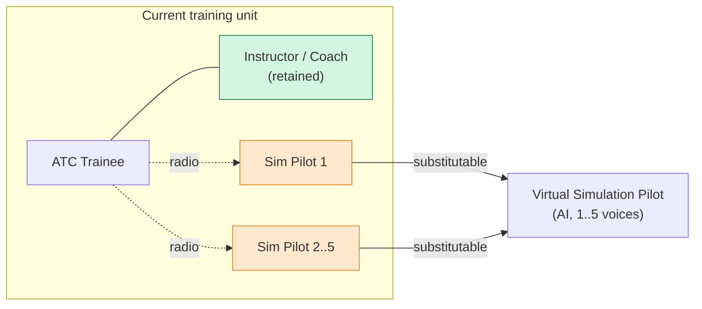
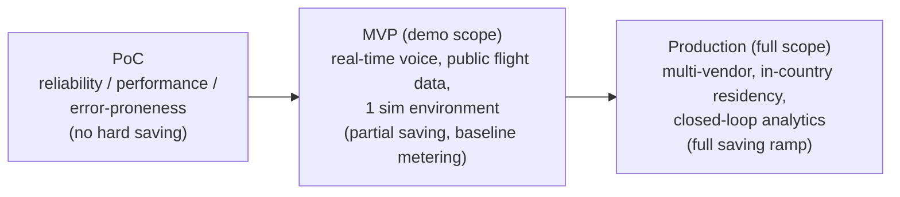

# Business Value Assessment (BVA)

| Field | Value |
| --- | --- |
| Product | ATCSimulator |
| Document | Business Value Assessment (BVA) |
| Version | 0.1 (Draft) |
| Date | 2026-07-14 |
| Author | Cloud Solution Architect (CSA), Microsoft |
| Status | Draft for Customer workshop (4 August 2026) |
| Classification | Public — anonymized demo |

**Related documents:** [PRD.md](./PRD.md) · [SD.md](./SD.md) · [BOM.md](./BOM.md) · [AI.md](./AI.md) · [DESIGN-PRINCIPLES.md](./DESIGN-PRINCIPLES.md) · [COMPLIANCE.md](./COMPLIANCE.md) · [SECURITY.md](./SECURITY.md) · [OPERATIONS.md](./OPERATIONS.md)

> **ROM notice.** Every financial figure in this document is a **Rough Order of Magnitude (ROM)** value expressed in **Swiss Francs (CHF)**, built from **transparent, illustrative placeholder parameters** shown in `[assumption: …]` brackets. **No real Customer figures are used.** All values are directional and **MUST be validated with the Customer** before any investment decision. Where a parameter drives the result, it appears in the assumptions table so the Customer can substitute its own data and re-run the model.

---

## 1. Executive summary

ATCSimulator introduces AI **virtual simulation pilots** into the Customer's air traffic control (ATC) simulator training. Today, delivering a single simulator training unit requires **one instructor/coach plus one to five human simulation pilots** — all of them qualified, expensive Air Traffic Services (ATS) staff. The virtual pilot replaces the **human simulation-pilot role** with real-time speech-to-speech AI agents, while the **instructor/coach remains in the loop** as the pedagogical owner and assessor.

The core value thesis, set by the engagement owner, is a **labor-substitution** argument:

> **Reduce the use of real ATS employees to train and retrain other ATS staff.** The high fully-loaded labor cost of simulation pilots is the dominant cost driver; substituting it with AI voice agents justifies the solution's total cost of ownership (TCO) under conservative ROM assumptions.

On the **base ROM scenario** (all parameters illustrative and to be validated):

- **Gross annual labor saving ≈ CHF 2.27 M/year** (simulation-pilot substitution only; the instructor is *not* substituted).
- **Net annual benefit ≈ CHF 1.88 M/year** after the solution's Azure run-rate.
- **Simple payback ≈ 7.7 months**; **3-year cumulative net benefit ≈ CHF 4.43 M**; **3-year ROI ≈ 187 %**.
- Even the **conservative (low) scenario** stays cash-positive within ~2 years (~30 % 3-year ROI), and the **optimistic (high) scenario** pays back in <3 months.

Beyond labor, ATCSimulator increases **training throughput**, enables **self-service "anytime / anywhere" practice**, raises **scenario quality and safety** through a surprise-injection engine, and creates a **closed-loop analytics** capability (automatic transcripts → phraseology scoring → continuous improvement) that the current human-only setup cannot produce at scale.

Because this is a **segregated training environment with no connection to live or operational ATC systems**, it is explicitly **not** classified as critical national infrastructure, which materially de-risks the compliance and approval path for an MVP.

---

## 2. Value hypothesis

> **If** the Customer automates the simulation-pilot role with real-time AI voice agents (delivered as simulator-vendor-independent services behind an agnostic API),
> **then** it can remove the majority of simulation-pilot labor hours from routine training, lift training capacity, and generate closed-loop quality analytics,
> **so that** it releases scarce ATS specialists back to operational and higher-value work, shortens controller time-to-qualification, and improves phraseology/safety outcomes —
> **at a solution run-cost that is a fraction of the labor it displaces.**

The hypothesis is **falsifiable** and will be tested against the KPI framework in §8, starting from a PoC and hardening through MVP to production (§10).

---

## 3. Problem economics — current state

The Customer's Academy runs simulator training with a fixed, labor-heavy staffing model. Per training unit:

- **1 instructor/coach** sits beside the trainee, supervises the exercise, advises, and documents it for the subsequent debriefing.
- **1–5 human simulation pilots** are connected to the trainee by radio (Sprechfunk); they receive and read back instructions, drive the simulator software, run scripted events, and coordinate with each other.

This model has four structural cost and capacity problems, all confirmed in the source material:

| # | Constraint | Economic effect |
| --- | --- | --- |
| C1 | **High personnel cost per unit** — every seat is a qualified ATS specialist | Directly caps the **number of training units** trainees can receive. |
| C2 | **Many people per session** | Complex, inflexible **planning and coordination**; scheduling overhead; idle time when any role is unavailable. |
| C3 | **High staffing → many workstations → large physical footprint** | Limits **scalability of simulation stations**; real-estate and facility cost. |
| C4 | **Human-bound availability** | No self-service, no "anytime/anywhere" practice; throughput is bounded by roster availability. |

**Cost concentration.** The **simulation-pilot headcount (1–5 per session)** is the swing cost and the swing capacity constraint. A single instructor is intrinsic to the pedagogy and is retained; the **1–5 sim pilots are the substitutable labor**. This is the pool the value case targets, and — deliberately — the *only* pool credited with hard savings in the ROM model below.



---

## 4. Value levers

Five levers move value. Lever 1 is the **hard, quantified** saving in the ROM model; levers 2–5 are quantifiable over time but are treated as **strategic / secondary** here to avoid double-counting and keep the core case conservative.

| Lever | Description | Value type | Quantified in §5? |
| --- | --- | --- | --- |
| **L1 — Labor substitution** | Virtual pilots replace **1–5 human sim pilots per session**; instructor retained | Hard cost-out | **Yes (core)** |
| **L2 — Throughput / capacity & self-service** | Removes the roster bottleneck; enables autonomous, "anytime & anywhere" training and more units per trainee | Capacity / revenue-enabling | Secondary (KPI-tracked) |
| **L3 — Scenario quality & safety uplift** | Surprise-injection (scenario-variability) engine raises realism and difficulty → better prepared controllers → safety contribution | Risk-reduction / quality | Intangible (see §6) |
| **L4 — Traceability & analytics** | Automatic transcripts → phraseology scoring → closed-loop quality management (impossible to do manually at scale) | Quality / compliance | Intangible → closed-loop (see [DESIGN-PRINCIPLES.md](./DESIGN-PRINCIPLES.md)) |
| **L5 — Space / footprint reduction** | Fewer human sim-pilot stations → smaller physical footprint, lower facility cost | Cost avoidance | Secondary (site-specific) |

---

## 5. ROM cost model

> **All figures illustrative CHF, ROM, to be validated with the Customer.** The instructor/coach cost is **excluded** from savings on purpose (the role is retained for human-in-the-loop assessment). The model credits **only simulation-pilot labor substitution (L1)**; levers L2–L5 are upside not booked here.

### 5.1 Assumptions table (base case)

| ID | Parameter | Illustrative value | Note |
| --- | --- | --- | --- |
| ASS-01 | Fully-loaded ATS **simulation-pilot** cost | `[assumption: ≈ CHF 120 / hour]` | Salary + social + overhead + facility; sim pilots are qualified ATS staff. |
| ASS-02 | Simulator **training sessions per year** (Academy-wide) | `[assumption: ≈ 3,000 sessions / yr]` | Ab-initio + recurrent/refresher across centers and airports. |
| ASS-03 | **Simulation pilots per session** | `[assumption: 3]` | Midpoint of the documented 1–5 range. |
| ASS-04 | **Hours per session** (billable sim-pilot time) | `[assumption: 3 h]` | Briefing + exercise + reset. |
| ASS-05 | **Substitution rate** (share of sim-pilot hours automated) | `[assumption: 70 %]` | Steady state; complex multi-pilot team scenarios stay human initially. |
| ASS-06 | **Annual solution run-cost** (Azure BOM run-rate) | `[assumption: ≈ CHF 390,000 / yr]` | Built up in §5.4; see [BOM.md](./BOM.md). |
| ASS-07 | **One-time build cost** (PoC → MVP → production) | `[assumption: ≈ CHF 1,200,000]` | Engineering, fine-tuning, integration, governance stand-up. |
| ASS-08 | Instructor/coach cost | **Excluded from savings** | Retained; human-in-the-loop (see [AI.md](./AI.md)). |

### 5.2 Baseline annual training-labor cost (sim-pilots only)

```text
Baseline sim-pilot labor
  = sessions/yr × sim-pilots/session × hours/session × loaded CHF/hour
  = 3,000 × 3 × 3 × 120
  = 27,000 sim-pilot-hours/yr × CHF 120
  = CHF 3,240,000 / year
```

### 5.3 Automated scenario — gross saving

```text
Gross annual saving
  = Baseline sim-pilot labor × substitution rate
  = CHF 3,240,000 × 70 %
  = CHF 2,268,000 / year
```

Interpreted physically: of 27,000 sim-pilot-hours/yr, **~18,900 hours** are handled by virtual pilots and released back to operations/higher-value work; **~8,100 hours** remain human (complex team scenarios, edge cases, ramp).

### 5.4 Solution run cost (Azure BOM run-rate, ROM)

Cost drivers map directly to the architecture in [SD.md](./SD.md) and the line items in [BOM.md](./BOM.md).

| Cost driver | Basis | ROM CHF / yr |
| --- | --- | ---: |
| Real-time audio model minutes | ~567,000 billable min/yr @ ≈ CHF 0.35/min (18,900 substituted h × 50 % active-audio streaming × 60) | 200,000 |
| Speech STT / TTS + Custom Speech | full-session transcription + custom model hosting | 25,000 |
| Compute & integration | Container Apps/AKS, Functions, API Management (agnostic API), Web PubSub, Service Bus | 70,000 |
| Data & storage | Cosmos DB (state), Azure SQL, Blob/ADLS (audio + transcripts), AI Search (scenario/phraseology) | 35,000 |
| Security, governance & ops | Defender for Cloud, Purview, Monitor/App Insights/Log Analytics, Key Vault, Entra | 45,000 |
| Licensing | GitHub + Copilot + miscellaneous | 15,000 |
| **Total run-rate (ASS-06)** | | **390,000** |

> The **real-time audio minute** line is the single most sensitive run-cost driver and the primary target for cost-optimization (voice-activity streaming, model right-sizing, region choice). See Performance Efficiency / Cost pillars in [DESIGN-PRINCIPLES.md](./DESIGN-PRINCIPLES.md).

### 5.5 Net benefit, payback, 3-year, ROI (base case)

```text
Net annual benefit  = Gross saving − Annual run cost
                    = 2,268,000 − 390,000
                    = CHF 1,878,000 / year

Simple payback      = One-time build ÷ Net annual benefit
                    = 1,200,000 ÷ 1,878,000
                    = 0.64 yr  ≈  7.7 months

3-yr cumulative net = (Net annual benefit × 3) − One-time build
                    = (1,878,000 × 3) − 1,200,000
                    = CHF 4,434,000

3-yr investment     = Build + (Run × 3)
                    = 1,200,000 + (390,000 × 3)
                    = CHF 2,370,000

3-yr ROI            = 3-yr cumulative net ÷ 3-yr investment
                    = 4,434,000 ÷ 2,370,000
                    ≈ 187 %
```

### 5.6 Sensitivity (low / base / high)

Each column is a **coherent scenario**, not a single-variable sweep: the "low" case stacks conservative demand, a lower substitution rate, and higher build/run cost; "high" does the reverse.

| Parameter | Low (conservative) | Base | High (optimistic) |
| --- | ---: | ---: | ---: |
| Sessions / yr (ASS-02) | 2,500 | 3,000 | 4,000 |
| Sim-pilots / session (ASS-03) | 2.5 | 3 | 3.5 |
| Hours / session (ASS-04) | 3 | 3 | 3 |
| Loaded CHF/hour (ASS-01) | 120 | 120 | 130 |
| Substitution rate (ASS-05) | 55 % | 70 % | 85 % |
| **Baseline sim-pilot labor** | **CHF 2,250,000** | **CHF 3,240,000** | **CHF 5,460,000** |
| **Gross annual saving** | **CHF 1,237,500** | **CHF 2,268,000** | **CHF 4,641,000** |
| Annual run cost (ASS-06) | 450,000 | 390,000 | 350,000 |
| **Net annual benefit** | **CHF 787,500** | **CHF 1,878,000** | **CHF 4,291,000** |
| One-time build (ASS-07) | 1,500,000 | 1,200,000 | 1,000,000 |
| **Simple payback** | **≈ 1.9 yr (22.9 mo)** | **≈ 7.7 mo** | **≈ 2.8 mo** |
| **3-yr cumulative net** | **CHF 862,500** | **CHF 4,434,000** | **CHF 11,873,000** |
| **3-yr ROI** | **≈ 30 %** | **≈ 187 %** | **≈ 579 %** |

**Read-out:** the case is **robust to the downside** — even stacking pessimistic assumptions the solution is cash-positive within ~2 years. The result is most sensitive to **substitution rate (ASS-05)** and **sim-pilot labor cost (ASS-01)**; these two parameters should be the Customer's first validation priority.

---

## 6. Non-financial / strategic benefits & intangible value

| Theme | Benefit |
| --- | --- |
| **Workforce leverage** | Releases scarce ATS specialists from repetitive sim-pilot duty back to operational control and higher-value coaching; mitigates specialist-staffing scarcity. |
| **Throughput & flexibility** | Removes the multi-person scheduling bottleneck; enables **self-service, autonomous training** with no pressure and no constant observation; **location-independent** practice. |
| **Training quality & safety** | Surprise-injection scenario engine produces **more demanding, realistic** exercises; systematic, automated **R/T phraseology checking** raises correctness. Long-term this contributes to the **safety and efficiency of air navigation**. |
| **Traceability & pedagogy** | Automatic transcripts give objective, reviewable evidence for debriefs and trend analytics — a capability the human-only model cannot produce at scale. |
| **Footprint** | Fewer human sim-pilot stations → smaller physical footprint and facility cost (L5). |
| **Organizational maturity** | First production-grade, **sovereign-by-design** AI use case seeds the Customer's cloud & AI governance muscle (green-field → repeatable pattern). |
| **Vendor independence** | Simulator-vendor-agnostic voice services (agnostic API) avoid lock-in and let the whole Academy benefit across multiple simulator vendors. |

---

## 7. Cost drivers of the solution

The run-rate in §5.4 is dominated by usage-based AI services; understanding these drivers is essential to protecting the value case. Cross-reference [BOM.md](./BOM.md) (line-item pricing & region availability) and [SD.md](./SD.md) (where each driver sits in the architecture).

| Driver | Scales with | Optimization levers |
| --- | --- | --- |
| **Real-time audio model minutes** | Automated conversation minutes | Voice-activity streaming (bill only on speech), model right-sizing, session length caps, region/SKU choice. |
| **Speech STT / TTS minutes** | Session transcription volume; read-back synthesis | Batch vs real-time transcription; standard neural voice vs Custom Neural Voice (RAI-gated); selective retention. |
| **Compute** | Concurrent sessions | Scale-to-zero (Container Apps), autoscale, reserved capacity once demand is known. |
| **Storage** | Audio + transcript **retention window** | Tiered storage, lifecycle policies; retention set by policy (Cost **and** Privacy — see [SECURITY.md](./SECURITY.md)). |
| **Platform / ops** | Environments & observability | Shared landing-zone services; minimal-viable-governance (see [DESIGN-PRINCIPLES.md](./DESIGN-PRINCIPLES.md)). |
| **Licensing** | Seats & dev tooling | GitHub/Copilot right-sizing; consumption-based AI services vs commitments. |

---

## 8. KPIs & value-realization framework

Value is realized only if it is **measured**. The framework pairs **leading** indicators (predict value) with **lagging** indicators (confirm value), baselined **before** MVP and tracked after.

### 8.1 Leading indicators

| KPI | Definition | Target direction |
| --- | --- | --- |
| Automated session share | % of sessions run with virtual pilots (vs human) | ↑ toward substitution-rate assumption (ASS-05) |
| Virtual-pilot availability | % uptime of the voice service during training windows | ↑ (see Reliability, [DESIGN-PRINCIPLES.md](./DESIGN-PRINCIPLES.md)) |
| Voice round-trip latency | ATC utterance → pilot read-back (p50/p95) | ↓ within latency budget |
| Read-back / command accuracy | % correct read-backs & correct simulator commands | ↑ |
| Self-service adoption | # autonomous (no-instructor-scheduling) sessions | ↑ |

### 8.2 Lagging indicators (value confirmation)

| KPI | Definition | Ties to lever |
| --- | --- | --- |
| **Sim-pilot hours released** | Human sim-pilot hours removed vs baseline | **L1 (hard saving)** |
| **Net CHF saving realized** | Released hours × validated loaded cost − run cost | **L1** |
| Training throughput | Training units delivered per trainee per period | L2 |
| Time-to-qualification | Elapsed time / units to reach competency | L2/L3 |
| Phraseology error rate | Automated R/T phraseology scoring trend | L3/L4 |
| Instructor time reallocated | Instructor hours shifted from ops to coaching | L2 |
| Footprint reduction | Human sim-pilot stations decommissioned | L5 |

### 8.3 How to measure the saving post-MVP

1. **Baseline** sim-pilot hours and loaded cost with the Customer's actual roster/finance data (replaces ASS-01–ASS-04).
2. **Meter** automated session-hours from platform telemetry (Azure Monitor / analytics — see [OPERATIONS.md](./OPERATIONS.md)).
3. **Realized saving = (baseline sim-pilot hours − residual human hours) × validated loaded cost − actual run cost.**
4. Feed results back into the model quarterly; converge ASS-05 (substitution rate) on measured reality.

---

## 9. Risks to value realization & assumptions to validate

| ID | Risk / assumption to validate | Impact | Mitigation |
| --- | --- | --- | --- |
| RISK-01 | **Substitution rate (ASS-05) lower than modeled** — complex multi-pilot team scenarios resist automation | High (top sensitivity) | Phase automation: start single-pilot scenarios; grow team-simulation automation over time. |
| RISK-02 | **Loaded sim-pilot cost (ASS-01) overstated** | High | Validate with Customer finance before commitment; model is transparent to re-run. |
| RISK-03 | **Real-time audio minutes cost overrun** | Medium–High | Voice-activity streaming, model right-sizing, region choice; monitor as a first-order FinOps metric. |
| RISK-04 | **Dialect / accent recognition quality** across Swiss national languages | High (adoption) | Domain fine-tuning on ATC vocabulary + Swiss languages; fairness testing (see [AI.md](./AI.md)). |
| RISK-05 | **Data residency / sovereignty** — flagship real-time models not in Switzerland North today | Medium (design) | Split-plane: personal/production data in Switzerland North; cutting-edge real-time in Sweden Central (EU); public-only data for US demo. See [BOM.md](./BOM.md). |
| RISK-06 | **Instructor adoption / change management** | Medium | Human-in-the-loop retained; instructor is value owner, not displaced. |
| RISK-07 | **Build cost (ASS-07) / integration effort** underestimated | Medium | Vendor-agnostic API reduces per-vendor integration; PoC de-risks before MVP commitment. |
| RISK-08 | **Realized-saving attribution** — freed hours not actually reallocated | Medium | Governance: track "hours released" as a managed KPI (§8), not just a modeled figure. |

**Anti-scope reassurance:** the ATCSimulator is a **segregated training environment with no connection to live/operational ATC**, so it is **not** critical national infrastructure — this narrows the compliance surface and shortens the approval path (see [COMPLIANCE.md](./COMPLIANCE.md)).

---

## 10. Phasing — value ramp (PoC → MVP → Production)



| Phase | Scope | Value booked | Success gate |
| --- | --- | --- | --- |
| **PoC** | Prove real-time voice + command mapping in one sim environment; measure reliability, performance, error rate | **None** (validation only) | Latency & accuracy thresholds met; go/no-go to MVP |
| **MVP (demo scope)** | ATC selects a public live flight and runs a real-time voice scenario with a virtual pilot; **public/synthetic data only, no personal data**; single simulator | **Partial** — first automated sessions; **establish the measurement baseline** (§8.3) | Instructor acceptance; measured substitution on pilot cohort |
| **Production (full scope)** | Vendor-agnostic services integrated to real simulator(s) + LMS; **in-country residency**; full governance/ops; closed-loop analytics; team-simulation automation | **Full ramp** toward base/high scenario | Realized net saving converges on ROM within tolerance |

Value **ramps** — do not annualize the full base-case saving until production substitution is measured. The MVP's job is to convert modeled ROM into **measured** unit economics.

---

## 11. Summary & next steps

- The labor-substitution thesis is **economically compelling and downside-robust**: base ROM payback ≈ **7.7 months**, 3-year ROI ≈ **187 %**, with the conservative case still cash-positive within ~2 years.
- The hard case rests on **two parameters to validate first**: **substitution rate (ASS-05)** and **loaded sim-pilot cost (ASS-01)**.
- Recommended next step at the **4 August 2026 workshop**: agree the MVP scope, replace the illustrative assumptions with Customer data, and stand up the **measurement baseline** so the PoC/MVP converts ROM into measured value.

> **Reminder:** all figures herein are **ROM, illustrative, in CHF, and must be validated with the Customer.** No real Customer financials were used.
