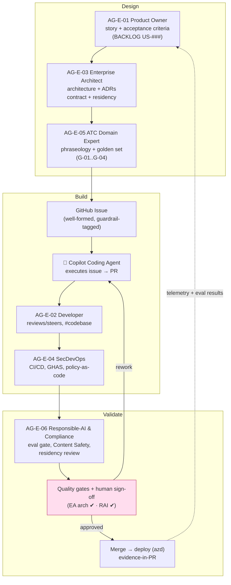
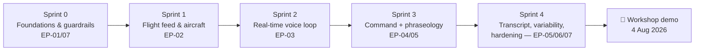
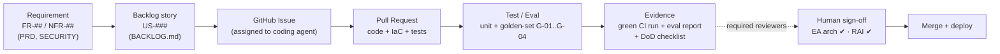
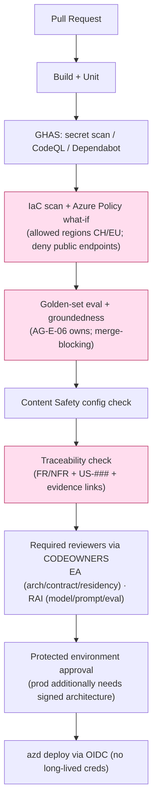

# Copilot Build Guide — Building the ATCSimulator Demo with GitHub Copilot "Superpowers"

| Field | Value |
|---|---|
| Product | ATCSimulator |
| Document | Copilot Build Guide (agent-driven build of the DEMO/MVP) |
| Version | 0.1 (Draft) |
| Date | 2026-07-14 |
| Author | Cloud Solution Architect (CSA), Microsoft |
| Status | Draft for Customer workshop (4 August 2026) |
| Classification | Confidential — anonymized |

**Related documents:** [BACKLOG.md](./BACKLOG.md) · [AI.md](./AI.md) · [DATA.md](./DATA.md) · [SECURITY.md](./SECURITY.md) · [COMPLIANCE.md](./COMPLIANCE.md) · [DESIGN-PRINCIPLES.md](./DESIGN-PRINCIPLES.md) · [BOM.md](./BOM.md) · [SD.md](./SD.md) · [adr/ADR-0001-realtime-model-region.md](./adr/ADR-0001-realtime-model-region.md) · [adr/ADR-0002-agnostic-api-facade.md](./adr/ADR-0002-agnostic-api-facade.md) · [adr/ADR-0003-split-plane-data-residency.md](./adr/ADR-0003-split-plane-data-residency.md) · [../AGENTS.md](../AGENTS.md) · [../SUPERPOWERS_CONTRACT.md](../SUPERPOWERS_CONTRACT.md) · [../.github/copilot-instructions.md](../.github/copilot-instructions.md) · [../api/openapi.yaml](../api/openapi.yaml) · [../data/scenarios/sample-scenario.json](../data/scenarios/sample-scenario.json)

> ## ⚠️ Non-negotiable demo framing (read first)
> This guide builds the **DEMO / MVP (Scope 2)** only. The demo uses **PUBLIC live-flight data + SYNTHETIC virtual-pilot voices**. It processes **NO personal data**, and it has **NO connection to operational/live ATC** (`CON-01`, `CON-03`; [COMPLIANCE.md](./COMPLIANCE.md) §1/§9). Every agent and every pipeline in this guide inherits those guardrails from [../SUPERPOWERS_CONTRACT.md](../SUPERPOWERS_CONTRACT.md) and [../.github/copilot-instructions.md](../.github/copilot-instructions.md). Region/model availability facts are *as of Jul 2026 — verify at design time* on the live Azure model-availability page ([BOM.md](./BOM.md)).

---

## 1. What "Copilot superpowers" means here

We build the MVP with an **agent-driven SDLC**: a small team of **GitHub Copilot custom agents** (the engineering agents `AG-E-01..AG-E-06` in [../AGENTS.md](../AGENTS.md)) design and specify the work, and the **GitHub Copilot coding agent** executes it as **issue → pull request**, under the governance of [../SUPERPOWERS_CONTRACT.md](../SUPERPOWERS_CONTRACT.md). The "superpowers" are four capabilities used together:

1. **Copilot coding agent** — takes a well-formed GitHub issue and opens a PR with the code, tests, and IaC.
2. **Custom agents** — role-specialized personas (PO, EA, Dev, SecDevOps, ATC SME, RAI) with scoped instructions and tools.
3. **Custom instructions** — repo-wide ([../.github/copilot-instructions.md](../.github/copilot-instructions.md)) + path-scoped, keeping every suggestion inside the guardrails.
4. **MCP (Model Context Protocol) tools** — connect Copilot to Azure, GitHub, the flight feed, and Foundry evaluations so agents can act on real context.

> **Runtime vs build-time agents.** Do not confuse the two. `AG-F-01..AG-F-08` (in [../AGENTS.md](../AGENTS.md)) are the **product's runtime agents** (virtual pilot, ASR, NLP, command, TTS, transcription, variability, UC1 summarizer). `AG-E-01..AG-E-06` are the **build-time Copilot agents** that construct the product. This guide is about the latter building the former.

---

## 2. The engineering agents and how they collaborate (design → build → validate)

Each engineering agent is a custom agent file under [`../.github/agents/`](../.github/agents/) with a focused system prompt, allowed tools, and the guardrails it enforces.

| Agent | Custom agent | Owns | Enforces / gate |
|---|---|---|---|
| `AG-E-01` **Product Owner** | `product-owner.chatmode.md` | Epics/stories, acceptance criteria, MoSCoW, demo narrative ([BACKLOG.md](./BACKLOG.md)) | scope clarity |
| `AG-E-02` **Developer** | `developer.chatmode.md` | Code, tests, IaC; drives issue → PR with the coding agent | small reviewable PRs |
| `AG-E-03` **Enterprise Architect** | `enterprise-architect.chatmode.md` | Architecture, ADRs, API contract, split-plane residency | **Architecture approval** |
| `AG-E-04` **SecDevOps** | `secdevops.chatmode.md` | CI/CD, GHAS, IaC scanning, policy-as-code, secrets | pipeline/policy gate |
| `AG-E-05` **ATC Domain Expert** | `atc-sme.chatmode.md` | ICAO/R-T phraseology, Swiss toponyms/dialect, golden set | phraseology correctness |
| `AG-E-06` **Responsible-AI & Compliance** | `responsible-ai.chatmode.md` | RAI, Content Safety, evaluations, residency/data-protection review | **RAI review** |

### 2.1 The collaboration loop

The agents work a **thin vertical slice** per story: the PO frames it, the EA constrains it, the ATC SME supplies domain truth, the Developer + coding agent build it, SecDevOps wires the gates, and RAI validates it — with **two human sign-off gates** (EA architecture, RAI review) before anything production-affecting merges.



Legend: the loop is **closed** — deploy telemetry and eval results feed the PO's next story (closed-loop, `DP-19`). The single 🤖 node is the Copilot coding agent doing the execution; the chat-mode agents are the humans-in-a-role steering it.

---

## 3. Sprint-by-sprint build plan for the MVP

**MVP goal:** *"an ATC selects an aircraft from a public live-flight feed and starts a real-time voice simulation scenario with a virtual pilot."* Sprints are 1 week (illustrative), targeting the **workshop demo (4 August 2026)**. Each sprint maps to **agents → artefacts → Azure services** and to epics/stories in [BACKLOG.md](./BACKLOG.md).

### Sprint 0 — Foundations & guardrails (`EP-01`, `EP-07`)
- **Lead agents:** `AG-E-03` EA, `AG-E-04` SecDevOps (support: `AG-E-06` RAI).
- **Do:** `azd init`; Bicep sandbox; GitHub repo + branch protection + `CODEOWNERS`; enable GHAS; author `copilot-instructions.md`, the six custom agents, ADR-0001..0003; Azure Policy allowed-regions (CH/EU) + deny-public-endpoint; AI use-case register + "no personal data" screening.
- **Artefacts:** `infra/*.bicep`, `azure.yaml`, `.github/workflows/*`, `.github/agents/*`, `docs/adr/*`, register entry.
- **Azure services:** Container Apps environment, **APIM** (Agnostic API skeleton), **Key Vault**, **Log Analytics/App Insights**, **Blob Storage**, **Azure OpenAI real-time** deployment in **Sweden Central** (ADR-0001), Azure Policy.
- **Stories:** US-001, US-002, US-003, US-061, US-062.

### Sprint 1 — Flight feed & aircraft selection (`EP-02`)
- **Lead agents:** `AG-E-02` Dev, `AG-E-05` ATC SME (support: `AG-E-03` EA).
- **Do:** implement the `/flights` and `/sessions/{id}/aircraft` endpoints behind APIM; public-feed adapter (read-only, via APIM only); load & validate [../data/scenarios/sample-scenario.json](../data/scenarios/sample-scenario.json).
- **Artefacts:** feed adapter service, `openapi.yaml` updates, scenario loader + schema test.
- **Azure services:** APIM, Container Apps (feed adapter), Cosmos DB (session/scenario state), Key Vault (feed API key), Azure Monitor.
- **Stories:** US-010, US-011, US-012, US-050.

### Sprint 2 — Real-time voice loop (`EP-03`)
- **Lead agents:** `AG-E-02` Dev, `AG-E-05` ATC SME, `AG-E-06` RAI.
- **Do:** session lifecycle (`POST /sessions`, `/stop`); audio negotiation (`/audio/negotiate`) + streaming channel; connect to the **real-time speech-to-speech** model; virtual-pilot read-back; synthetic-voice disclosure; "say again" fail-safe.
- **Artefacts:** orchestrator service, audio gateway (Web PubSub/WebRTC signalling), disclosure UI copy, latency probe.
- **Azure services:** **Azure OpenAI real-time (Sweden Central)**, **Azure Web PubSub / Event Grid** (audio streaming), Container Apps, APIM, App Insights (latency telemetry).
- **Stories:** US-020, US-021, US-022, US-023.

### Sprint 3 — Command mapping & phraseology (`EP-04`, `EP-05`)
- **Lead agents:** `AG-E-02` Dev, `AG-E-05` ATC SME (support: `AG-E-06` RAI).
- **Do:** deterministic tool/function-calling command mapping (schema-validated enum); grounded read-backs; phraseology validation vs corpus; **golden-set evaluation harness** (G-01..G-04) wired into CI as a release gate.
- **Artefacts:** command agent + JSON tool schema, phraseology validator, `evals/golden-set/*`, CI eval job.
- **Azure services:** **Azure OpenAI (reasoning/tool-calling)**, **Azure AI Search** (phraseology corpus), **Azure AI Foundry Evaluations**, **Content Safety**, Container Apps.
- **Stories:** US-030, US-031, US-032, US-041, US-060.

### Sprint 4 — Transcript, variability & demo hardening (`EP-05`, `EP-06`, `EP-07`)
- **Lead agents:** `AG-E-02` Dev, `AG-E-01` PO, `AG-E-06` RAI, `AG-E-04` SecDevOps.
- **Do:** transcript retrieval + store; surprise-event hooks (instructor-approved); latency/quality telemetry; finalize RAI/compliance gates; demo script + Definition-of-Done pass.
- **Artefacts:** transcript service, `data/scenarios/*` variability config, dashboards, demo runbook, DoD checklist evidence.
- **Azure services:** **Blob/ADLS** (transcripts — non-personal in demo), Cosmos DB, Azure Monitor/**Dashboards**, Foundry Evaluations, Defender for Cloud.
- **Stories:** US-040, US-042, US-051.



---

## 4. Reference tech stack & repo layout

### 4.1 Stack
- **AI/Foundry:** Azure AI Foundry (project, Agent Service, Evaluations, Content Safety); Azure OpenAI **real-time audio** (demo, Sweden Central); GPT-4.1/GPT-5.x-class (reasoning/command mapping); Azure AI Speech (production in-country STT/TTS — not the demo default). See [AI.md](./AI.md), [BOM.md](./BOM.md).
- **Compute/host:** Azure Container Apps (default), Azure Functions (event glue).
- **Integration:** **Azure API Management** (Agnostic API façade, ADR-0002); Azure Web PubSub / Event Grid (real-time audio).
- **Data:** Cosmos DB (session/scenario state), Blob/ADLS (transcripts), Azure AI Search (phraseology/scenario retrieval).
- **Security/gov:** Entra ID, Managed Identity, Key Vault, Purview, Defender for Cloud, Azure Policy, Private Link/VNet.
- **DevEx/IaC:** **Azure Developer CLI (`azd`)** + **Bicep**; **GitHub Actions** CI/CD; **GitHub Advanced Security**; **GitHub Copilot** (coding agent + custom agents).
- **Demo data:** public live-flight feed (FlightAware AeroAPI / Flightradar24), read-only, via APIM only.

### 4.2 Repo layout (build additions on top of the doc set)

```text
ATCSimulator/
  README.md
  AGENTS.md                          # runtime + engineering agent registry
  SUPERPOWERS_CONTRACT.md            # agent operating rules
  azure.yaml                         # azd project (services + hooks)
  .github/
    copilot-instructions.md          # repo-wide Copilot instructions
    agents/*.agent.md                # AG-E-01..06 engineering agents
    instructions/*.instructions.md   # path-scoped instructions (e.g. infra/**, evals/**)
    workflows/                       # CI/CD (build, security, IaC, eval gates, deploy)
    CODEOWNERS                       # EA + RAI required reviewers
  infra/                             # Bicep IaC (Container Apps, APIM, KV, storage, AOAI, policy)
    main.bicep
    modules/*.bicep
  src/
    api/                             # Agnostic API implementation (behind APIM)
    orchestrator/                    # session + real-time voice loop
    command-agent/                   # deterministic tool-calling command mapping
    feed-adapter/                    # public flight-feed adapter (read-only)
    transcript/                      # transcript service
  evals/
    golden-set/                      # G-01..G-04 fixtures + runner (release gate)
  data/scenarios/sample-scenario.json
  api/openapi.yaml                   # authoritative Agnostic API contract
  docs/                              # PRD, SD, BOM, AI, DATA, SECURITY, COMPLIANCE, this guide, BACKLOG, adr/
```

### 4.3 azd + Bicep + CI/CD (shape)
- **`azd up`** provisions the sandbox from `infra/` and deploys `src/` services defined in `azure.yaml`. Region and data-boundary are **parameters**, defaulted to Sweden Central for the demo (ADR-0001/0003).
- **Bicep** encodes the guardrails: allowed regions (CH/EU), deny-public-endpoint on data services, managed identity, Key Vault, Private Link (production plane). IaC is **scanned before deploy** (`NFR-16`).
- **GitHub Actions** pipeline (see §8): build → unit → GHAS (secret/CodeQL) → IaC scan/policy → **golden-set eval** → Content Safety config check → `azd deploy` to a **protected environment** via **OIDC** (no long-lived creds, `NFR-18`).

### 4.4 Evaluation harness (golden phraseology set)
The **golden set** (G-01..G-04, [AI.md](./AI.md) §7.1) is the demo's quality backbone, seeded from [../data/scenarios/sample-scenario.json](../data/scenarios/sample-scenario.json). Each case asserts **(a) correct command mapping** and **(b) correct read-back**; the runner also checks **groundedness** and (production) **dialect fairness**. It runs locally (`Developer`) and in CI as a **merge-blocking gate** owned by `AG-E-06` RAI. Metrics/targets in [AI.md](./AI.md) §7.2 (command-mapping ≥ ~98%, read-back ≥ ~98%, latency p95 ≤ ~1 s — illustrative, validate with the Academy).

---

## 5. Copilot superpowers playbook

### 5.1 Prompt patterns
- **Role + task + constraints + evidence.** *"As the Developer custom agent, implement `US-021` (real-time read-back). Constraints: deterministic command enum from `#file:../api/openapi.yaml`; grounded read-back; latency SLO. Produce code + unit tests + a golden-set case. Cite ADR-0001."*
- **Spec-first.** Ask the EA/PO mode to produce the acceptance criteria and the OpenAPI delta **before** asking the Developer mode to implement.
- **Red-team prompt.** Ask the RAI mode: *"What could make this read-back confidently wrong? Add negative golden-set cases."*
- **Refactor-with-guardrails.** *"Refactor the feed adapter; must remain read-only and route only via APIM (`NFR-08/09`)."*

### 5.2 Using each custom agent
- **PO** for backlog shaping and demo narrative; **EA** for architecture/ADR/contract/residency decisions (and the arch sign-off); **Dev** for implementation and driving the coding agent; **SecDevOps** for pipelines/policy/GHAS; **ATC SME** for phraseology truth and golden cases; **RAI** for evals/Content Safety/residency review (and the RAI sign-off). Switch agents deliberately; do not ask the Dev agent to make a residency decision — that is the EA's call.

### 5.3 `#codebase` and file grounding
- Use **`#codebase`** to ground answers in the whole repo (e.g., *"Using #codebase, where is the command enum defined and validated?"*).
- Reference specific files with **`#file:`** (e.g., `#file:../api/openapi.yaml`, `#file:../data/scenarios/sample-scenario.json`) so suggestions match the real contract and fixtures.

### 5.4 Issue → PR with the coding agent
1. The PO/EA/SME modes produce a **well-formed issue**: title, story link (`US-###`), acceptance criteria (G/W/T), guardrail tags (`CON-01/03`), touched files, and the evidence required.
2. **Assign the issue to the Copilot coding agent.** It opens a **draft PR**, implements the slice, and runs the checks.
3. The **Developer** mode reviews/steers the PR (comments, `#codebase`), iterating until green.
4. **CODEOWNERS** pulls in **EA** and/or **RAI** as required reviewers based on the paths changed.
5. Merge only when CI is green, the eval gate passes, and the human sign-off(s) are given — **evidence-in-PR** ([../SUPERPOWERS_CONTRACT.md](../SUPERPOWERS_CONTRACT.md) §1.9).

### 5.5 Custom-instructions precedence
When guidance conflicts, apply the **most specific that is still safe**:

```
explicit prompt
  > active custom agent (.github/agents/*.agent.md)
    > path-scoped instructions (.github/instructions/*.instructions.md, applyTo globs)
      > repo-wide instructions (.github/copilot-instructions.md)
        > personal / organization defaults
```

The **hard guardrails** (`CON-01` no operational wiring; `CON-03` no personal data in the demo / Swiss residency; RAI advisory-only; no secrets) are **non-overridable** regardless of precedence. (Precedence is a practical convention — verify current behaviour against GitHub's docs at design time.)

### 5.6 MCP tool usage
Connect Copilot to real context via **MCP servers** (configure per the GitHub/VS Code MCP docs; keep credentials in the developer's own vault, never in the repo):
- **GitHub MCP** — issues, PRs, Actions status (drives the issue → PR flow).
- **Azure MCP** — read resource/region/deployment state to verify residency and wiring (`CON-03`).
- **Flight-feed MCP** (or an APIM-fronted tool) — read-only public-feed queries for realistic fixtures.
- **Foundry Evaluations MCP** — trigger/inspect golden-set + groundedness runs from chat.

**MCP guardrails:** tools are **read-mostly** for agents; any state-changing tool call still goes through a PR + the sign-off gates. Never grant an MCP tool a path to the production personal plane or operational ATC (`CON-01`).

---

## 6. Traceability model (requirement → backlog → code/PR → test → evidence)

Traceability is a **hard rule** ([../SUPERPOWERS_CONTRACT.md](../SUPERPOWERS_CONTRACT.md) §1.1): nothing merges without the full chain.



**Worked examples:**

| Requirement | Story | Issue/PR | Test / Eval | Evidence |
|---|---|---|---|---|
| `FR-08` aircraft selection | `US-010`/`US-011` | Issue "Flight feed via Agnostic API" → PR | contract test on `/flights`; feed-adapter unit tests | green CI + APIM policy trace |
| `FR-03`/`FR-04` command + read-back | `US-030` | Issue "Deterministic command mapping" → PR | golden-set G-01 (command + read-back) | Foundry eval report ≥ target |
| `FR-01`/`FR-09` real-time loop | `US-020`/`US-021` | Issue "Real-time voice session" → PR | latency probe vs SLO | App Insights latency chart |
| `CON-03` residency | `US-062` | Issue "Region policy" → PR | Azure Policy `what-if` in CI | policy pass + region inventory |
| `C-11` content safety | `US-060` | Issue "Content Safety" → PR | safety config check | Content Safety config export |

---

## 7. Definition of Done & quality gates (demo)

### 7.1 Definition of Done (per story)
A story is **Done** only when **all** hold:
- [ ] Acceptance criteria (G/W/T) met and demoable.
- [ ] Code + IaC + unit tests merged via PR; small and reviewed.
- [ ] Traceability chain complete (`FR/NFR` → `US-###` → PR → test → evidence).
- [ ] CI green: build, unit, **GHAS** (secret scanning/push protection, CodeQL, Dependabot), **IaC scan + policy-as-code**.
- [ ] **Golden-set eval** passes (no regression in command-mapping/read-back/groundedness).
- [ ] **Content Safety** applied to any generative output.
- [ ] Guardrails proven: **no secrets**, **no personal data** in demo, **CH/EU region** policy pass, **no operational-ATC path**.
- [ ] Required human sign-off(s) given (**EA** for architecture/contract/residency; **RAI** for model/prompt/eval).
- [ ] Docs/ADRs updated; telemetry emits (no PII/audio in logs).

### 7.2 How the RAI / compliance gates are enforced in CI



- **Merge-blocking automated gates:** GHAS, IaC/policy (region + endpoint rules → `CON-03`, `RISK-03`), golden-set eval ([AI.md](./AI.md) §7.4), Content Safety check, traceability check.
- **Human gates (as required reviewers / protected environments):** **EA architecture approval** and **RAI review**, wired via `CODEOWNERS` and GitHub Environments; production additionally requires the **signed architecture** artefact ([COMPLIANCE.md](./COMPLIANCE.md) §6.1).
- **Demo vs production:** the demo runs a **smoke subset** of evals and platform-managed keys; production runs the full gate, in-country residency, CMK, and tested segregation ([SECURITY.md](./SECURITY.md) §10).

---

## 8. Reference CI/CD pipeline (stages)

| Stage | Tooling | Gate |
|---|---|---|
| Build & unit | GitHub Actions | must pass |
| Security (SAST/secrets/deps) | GitHub Advanced Security (CodeQL, secret scanning + push protection, Dependabot) | must pass (`NFR-15`) |
| IaC quality | Bicep build + template analyzer / PSRule + `az deployment what-if` | must pass (`NFR-16`) |
| Policy-as-code | Azure Policy (allowed regions CH/EU; deny public endpoints) | must pass (`CON-03`, `RISK-03`) |
| AI evaluation | Foundry Evaluations — golden set G-01..G-04 + groundedness (+ fairness in prod) | **merge-blocking** (`AG-E-06`) |
| Content safety | Content Safety config assertion | must pass (`C-11`) |
| Traceability | PR template + link check (`FR/NFR` + `US-###` + evidence) | must pass |
| Sign-off | `CODEOWNERS` (EA/RAI) + protected environment approval | human gate |
| Deploy | `azd deploy` via **OIDC** federation to Entra | no long-lived creds (`NFR-18`) |

---

## 9. Guardrails recap (say it twice, on purpose)

- **PUBLIC data + SYNTHETIC voices only** in the demo. **No personal data** (`CON-03`).
- **No connection to operational / live ATC** — ever (`CON-01`). A request to wire it is a stop-and-escalate event.
- **Swiss/EU residency:** demo real-time in **Sweden Central (EU)**; US only for a non-personal, US-only Preview (ADR-0001/0003). Personal data → **Switzerland North** (production only).
- **Deterministic boundary:** the LLM proposes, schema-validated tool calls dispose ([AI.md](./AI.md) §4).
- **Trace everything, prove everything in the PR, get the sign-offs.** ([../SUPERPOWERS_CONTRACT.md](../SUPERPOWERS_CONTRACT.md)).
- **Availability facts** are *as of Jul 2026 — verify at design time* on the live Azure model-availability page ([BOM.md](./BOM.md)).
