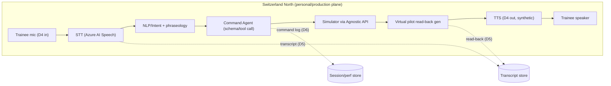
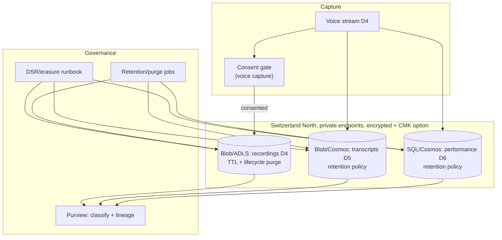

# Data Design & Governance

| Field | Value |
| --- | --- |
| Product | ATCSimulator |
| Document | Data Design & Governance |
| Version | 0.1 (Draft) |
| Date | 2026-07-14 |
| Author | Cloud Solution Architect (CSA), Microsoft |
| Status | Draft for Customer workshop (4 August 2026) |
| Classification | Public — anonymized demo |

**Related documents:** [COMPLIANCE.md](./COMPLIANCE.md) · [SECURITY.md](./SECURITY.md) · [AI.md](./AI.md) · [SD.md](./SD.md) · [BOM.md](./BOM.md) · API stub: [`../api/openapi.yaml`](../api/openapi.yaml)

> **Framing.** ATCSimulator is a segregated **training** environment with **no operational-ATC connection** ([COMPLIANCE.md](./COMPLIANCE.md) §1). Its data-protection weight comes from **personal/biometric-adjacent data** (trainee voice) in production. The **demo carries no personal data** (public feed + synthetic voices). This document defines data domains, classification, flows, retention/residency, and the Agnostic-API data contracts.

---

## 1. Data domains

| # | Domain | Description | Example content |
| --- | --- | --- | --- |
| D1 | **Scenario definitions** | Authored exercise scripts: aircraft, initial states, events, waypoints, surprise elements, difficulty. | `data/scenarios/sample-scenario.json` |
| D2 | **Aircraft / flight state** | Runtime simulator state per aircraft (position, heading, level, speed, phase). | Ephemeral sim state |
| D3 | **Live-flight public feed (demo)** | Read-only public flight data used to seed a demo scenario. | FlightAware AeroAPI / Flightradar24 records |
| D4 | **Voice audio streams** | Trainee spoken R/T (in) + virtual-pilot synthetic voice (out); optional recordings. | PCM/Opus audio; WAV recordings |
| D5 | **Transcripts** | STT output of trainee speech + virtual-pilot read-backs. | Time-aligned R/T text |
| D6 | **Session / performance records** | Trainee identity, session metadata, command log, scores, phraseology flags, instructor notes. | Session JSON; performance rows |
| D7 | **Model training / fine-tune data** | Corpora for Custom Speech adaptation & evaluation (golden set). | De-identified/synthetic audio + refs |

---

## 2. Data classification per domain

Four-tier scheme shared with [COMPLIANCE.md](./COMPLIANCE.md) §3.1 and [SECURITY.md](./SECURITY.md).

| Domain | Classification | Personal data? | Rationale |
| --- | --- | --- | --- |
| D1 Scenario definitions | **Internal** | No | Customer training IP; no personal data. |
| D2 Aircraft/flight state | **Internal** (Public in demo) | No | Simulated/derived state. |
| D3 Live-flight public feed | **Public** | No | Read-only public feed; demo only. |
| D4 Voice audio streams | **Sensitive** (trainee); Internal (synthetic pilot out) | **Yes** (trainee) | Voice is **biometric-adjacent** ([COMPLIANCE.md](./COMPLIANCE.md) §3.2, RISK-04). Synthetic output is not personal (absent non-consented cloning). |
| D5 Transcripts | **Personal** | **Yes** | Content attributable to an identified trainee; may embed incidental personal data. |
| D6 Session/performance records | **Personal → Sensitive** (evaluative) | **Yes** | Identity + evaluative performance data. |
| D7 Model training/fine-tune data | **Personal → Internal** (after de-identification) | **Depends** | Personal if it contains real voice/transcripts; target de-identified/synthetic. |

---

## 3. Data flows (mermaid)

### 3.1 Real-time voice loop



Design intent: voice (D4) is processed **transient-first**; only **transcripts (D5)** and **command/performance logs (D6)** persist by default — **audio recording is opt-in** and time-boxed (see §4). In the **demo**, the same loop runs against **public/synthetic data** in the EU/US real-time plane with **no persistence of personal data** ([COMPLIANCE.md](./COMPLIANCE.md) §5, `CON-03`).

### 3.2 Storage of recordings & transcripts



Controls per [SECURITY.md](./SECURITY.md) §3/§4: private endpoints, encryption + CMK option, no public egress; Purview lineage; erasure reaches **all** stores incl. fine-tune sets ([COMPLIANCE.md](./COMPLIANCE.md) C-06, RISK-07).

---

## 4. Retention, minimization & residency per domain

Ties to [COMPLIANCE.md](./COMPLIANCE.md) §3 (minimization, retention, DSR) and §5 (residency). **All retention periods are illustrative defaults — [validate with Customer legal/DPO] and Academy.**

| Domain | Residency (production) | Residency (demo) | Minimization default | Retention (illustrative) | Erasure/DSR |
| --- | --- | --- | --- | --- | --- |
| D1 Scenario | Switzerland North | Any (non-personal) | N/A | Lifecycle of the scenario | N/A |
| D2 Flight state | Switzerland North | EU/US demo plane | Ephemeral | Not persisted (or short debug TTL) | N/A |
| D3 Public feed | N/A (demo only) | EU/US demo plane | Read-only, no store | Cache only | N/A |
| D4 Voice audio | **Switzerland North (in-country)** | EU/US, synthetic only | **Transient-first; recording opt-in** | Recordings: short TTL (e.g. 30–90 days) then purge; prefer **no raw-audio retention** | Full erasure; CMK crypto-shred backstop |
| D5 Transcripts | **Switzerland North** | No personal data | Store only what debrief needs | e.g. training-cycle duration then purge/anonymize | Full erasure |
| D6 Session/performance | **Switzerland North** | No personal data | Pseudonymize identity where possible | Per Academy training-record policy | Full erasure/anonymize |
| D7 Fine-tune/eval data | **Switzerland North** (or EU Data Zone for model op) | Synthetic only | **De-identified/synthetic preferred** | Versioned; reviewed | Erasure must reach fine-tune sets (RISK-07/08) |

**Residency rules** follow `CON-03` ([COMPLIANCE.md](./COMPLIANCE.md) §5): personal/sensitive → **Switzerland North** (Switzerland West DR); EU Data Zone only where a required model isn't in-country; **US = demo/non-personal only**.

---

## 5. Data contracts for the Agnostic API (high level)

The **Agnostic API** (APIM façade, [SECURITY.md](./SECURITY.md) §3, NFR-08) decouples the AI voice services from any simulator vendor. Contracts below are **high-level**; the machine-readable stub lives at [`../api/openapi.yaml`](../api/openapi.yaml). Design tenets: **minimum-necessary fields**, **no personal data on the vendor path**, **strict schema validation**, **deterministic command enums** ([AI.md](./AI.md) §4).

### 5.1 Core payload shapes

**Simulator command (AI → simulator).** Deterministic, schema-validated, enum-constrained.

```json
{
  "sessionId": "uuid",
  "correlationId": "uuid",
  "aircraft": { "callsign": "SWISS456" },
  "commands": [
    { "type": "SELECT_AIRCRAFT", "callsign": "SWISS456" },
    { "type": "SET_HEADING", "direction": "RIGHT", "degrees": 290 },
    { "type": "SET_FLIGHT_LEVEL", "value": 370 }
  ],
  "issuedAtUtc": "2026-07-14T09:00:00Z"
}
```

**Command acknowledgement (simulator → AI).**

```json
{
  "sessionId": "uuid",
  "correlationId": "uuid",
  "results": [
    { "type": "SET_HEADING", "status": "OK" },
    { "type": "SET_FLIGHT_LEVEL", "status": "OK" }
  ]
}
```

**Read-back event (AI → transcript/debrief).** No raw audio on this path.

```json
{
  "sessionId": "uuid",
  "speaker": "VIRTUAL_PILOT",
  "text": "Turning right heading 290 degrees and climbing to flight level 370, Swiss 456.",
  "phraseologyValid": true,
  "timestampUtc": "2026-07-14T09:00:01Z"
}
```

### 5.2 Contract rules

| Rule | Detail |
| --- | --- |
| **Command type enum** | `SELECT_AIRCRAFT`, `SET_HEADING`, `SET_FLIGHT_LEVEL`, `SET_ALTITUDE`, `SET_SPEED`, `SET_QNH`, `REPORT_POINT`, `TRAFFIC_INFO` … validated ranges (heading 0–360, etc.). Unknown types rejected ([AI.md](./AI.md) §4.1). |
| **No personal data on vendor path** | Vendor/simulator integration sees callsigns, commands, session/correlation IDs — **not** trainee identity, voice, or performance data ([SECURITY.md](./SECURITY.md) §9.2; [COMPLIANCE.md](./COMPLIANCE.md) C-04). |
| **Correlation** | `sessionId` + `correlationId` for traceability/audit (redacted logging, [SECURITY.md](./SECURITY.md) NFR-22). |
| **Idempotency & ordering** | Commands carry order; simulator acks per command; retries idempotent by `correlationId`. |
| **Schema validation at APIM** | Requests/responses validated against the OpenAPI schema; reject-on-violation. |
| **Versioning** | Contract versioned; breaking changes gated (change control, [AI.md](./AI.md) §9). |

### 5.3 Voice scenario contracts (mock voice loop)

Four new endpoints on the VoiceAgentApi broker (base path `/api/voice`) support the mock scenario voice loop with Azure AI Speech STT/TTS:

**`GET /api/voice/capabilities` → Voice engine availability.**

```json
{
  "liveAvailable": false,
  "mockAvailable": true
}
```

- `liveAvailable` is true only when VoiceLive AgentId AND ProjectId are configured; drives the mock↔live UI toggle.
- `mockAvailable` is always true for the deterministic mock scenario path.

**`GET /api/voice/scenarios` → Scenario catalog.**

```json
[
  {
    "id": "EX-01",
    "title": {
      "en": "Airliner instruction",
      "de": "Anweisung an Verkehrsflugzeug",
      "fr": "…",
      "it": "…"
    },
    "aircraftClass": "airliner",
    "expectedCommands": ["SET_HEADING", "SET_FLIGHT_LEVEL"],
    "scope": "demo",
    "personalData": false
  }
]
```

- Four seeded scenarios (EX-01..EX-04): airliner (SET_HEADING, SET_FLIGHT_LEVEL), light (REPORT_POINT), any (TRAFFIC_INFO), IFR (TRAFFIC_INFO).
- Localized titles (en/de/fr/it); public/synthetic data only (`personalData: false`).

**`GET /api/voice/speech/token` → Azure AI Speech authorization token.**

```json
{
  "token": "<short-lived-token>",
  "region": "switzerlandnorth",
  "scope": "demo",
  "personalData": false
}
```

- Short-lived authorization token minted server-side via the broker's Managed Identity (no key in the browser).
- Region is **Switzerland North** for in-country audio processing.
- Audio stays within Azure; no third-party routing (design decision D2).

**`POST /api/voice/scenario/turn` → Process scenario turn.**

Request:

```json
{
  "scenarioId": "EX-01",
  "atcTranscript": "Swiss 456, turn right heading 270 degrees and climb flight level 370."
}
```

Response (ScenarioTurnResponse):

```json
{
  "accepted": true,
  "command": "SET_HEADING",
  "readBackText": "Turning right heading 270 degrees and climbing to flight level 370, Swiss 456.",
  "phraseologyFlags": [],
  "scope": "demo",
  "personalData": false
}
```

- Runs the deterministic SimCommandValidator → FunctionCallHandler/MockSimulatorAdapter boundary.
- Publishes ATC and Pilot transcript events via TranscriptHub.
- No LLM; demo scope; no persistence this sprint.
- `phraseologyFlags` array contains any deviations from ICAO/Swiss phraseology standards.

> The OpenAPI stub at [`../api/openapi.yaml`](../api/openapi.yaml) is the authoritative interface definition; keep this section and the stub in sync.

### 5.4 Flight-feed resilience contracts (Sprint 3)

Three endpoints on the FlightDataApi keep the demo working when the FR24 account is out of credit. See [ADR-0008](./adr/ADR-0008-fr24-resilience-snapshots.md).

**`GET /api/aircraft?bounds={lat1,lon1,lat2,lon2}` → Aircraft feed envelope.**

```json
{
  "source": "live",
  "snapshotAt": null,
  "aircraft": [
    {
      "callsign": "SWR456",
      "aircraftType": "A320",
      "registration": "HB-IJW",
      "latitude": 47.46,
      "longitude": 8.55,
      "altitudeFt": 6000,
      "headingDeg": 275,
      "groundSpeedKt": 220
    }
  ]
}
```

- `source` is `live` (fresh FR24 fetch) or `snapshot` (served from ADLS Gen2 fallback).
- `snapshotAt` is the capture time when `source` is `snapshot`; `null` for live.
- Every successful live fetch is persisted as a Parquet snapshot (write-through).
- On FR24 **402** (credit exhausted) the API transparently returns the latest snapshot.
- `?snapshot={id}` pins a specific stored snapshot (id format below).

**`GET /api/flight-snapshots` → Saved snapshots (newest first, max 10).**

```json
[
  { "id": "dt=2026-07-21/10-30-05", "capturedAt": "2026-07-21T10:30:05Z" }
]
```

- The `id` is the archive path without the `region=<r>/` prefix and without the `.parquet` suffix.

**`GET /api/flight-feed/status` → Tri-state feed status (polled every 60s).**

```json
{ "state": "connected", "checkedAt": "2026-07-21T10:30:00Z" }
```

- `connected` (green) = live FR24 streaming; `no_credit` (yellow) = FR24 reachable but out of credit (serving snapshots); `offline` (red) = feed service unreachable.

#### Snapshot storage layout (ADLS Gen2)

- **Account:** StorageV2 with hierarchical namespace (`isHnsEnabled: true`), Sweden Central, TLS 1.2, no public blob access, Entra-only (managed identity, no account keys). See [`../infra/modules/storage.bicep`](../infra/modules/storage.bicep).
- **Container / filesystem:** `flight-snapshots`.
- **Path:** `region=<r>/dt=<yyyy-MM-dd>/<HH-mm-ss>.parquet` (region `ch` for Switzerland). The snapshot **id** drops the `region=<r>/` prefix and the `.parquet` suffix.
- **Format:** Parquet (via Parquet.Net). One row per aircraft.

| Column | Type | Notes |
| --- | --- | --- |
| `snapshotAt` | `timestamp (UTC)` | Capture time; stored as UTC `DateTime` (Parquet.Net does not round-trip `DateTimeOffset`). |
| `callsign` | `string` | |
| `aircraftType` | `string` | |
| `registration` | `string` (nullable) | |
| `latitude` | `double` | |
| `longitude` | `double` | |
| `altitudeFt` | `int` | |
| `headingDeg` | `int` | |
| `groundSpeedKt` | `int` | |

- **Personal data:** none — public aircraft state only (`personalData: false`); same envelope as §6.

---

## 6. Demo data

- **Public live-flight feed** (FlightAware AeroAPI / Flightradar24): **read-only, public** data ingested **only via APIM** into the non-personal demo plane ([SECURITY.md](./SECURITY.md) NFR-09). Confirm feed **ToS** permits demo/eval use ([COMPLIANCE.md](./COMPLIANCE.md) RISK-13). **[validate with Customer legal]**
- **Synthetic voices:** virtual-pilot audio is machine-generated (standard neural voices); **no real person's voice** is captured or cloned in the demo ([AI.md](./AI.md) §2).
- **No personal data in the demo:** the demo processes **public + synthetic** data only → far lighter compliance envelope ([COMPLIANCE.md](./COMPLIANCE.md) §9); permits **EU/US** real-time deployment (`CON-03`).
- **No operational linkage:** demo data never touches operational ATC and the demo plane has no route to the production personal plane (`CON-01`, [SECURITY.md](./SECURITY.md) NFR-19).

---

## 7. Data governance summary & open items

- **Cataloguing/lineage:** Microsoft Purview classifies D4–D7, tracks lineage voice→transcript→performance, applies sensitivity labels ([SECURITY.md](./SECURITY.md) NFR-21).
- **Ownership:** Data Owner = **Data Protection / Compliance Officer** (with Academy Manager as value owner) per RACI ([COMPLIANCE.md](./COMPLIANCE.md) §6.2).
- **Open items to validate:** retention periods per domain **[DPO/Academy]**; pseudonymization approach for D6 **[DPO]**; fine-tune de-identification method for D7 **[DPO]** ([COMPLIANCE.md](./COMPLIANCE.md) RISK-08); public-feed ToS for D3 **[legal]**; whether any raw-audio retention (D4) is justified vs transcript-only **[DPO]**.
