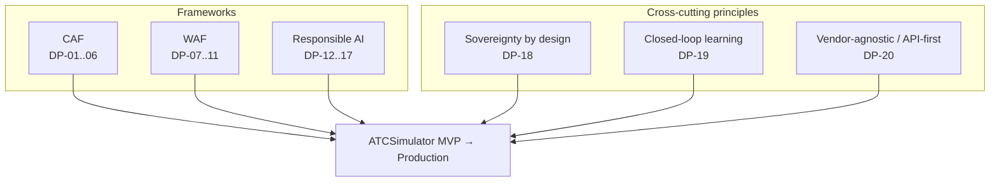
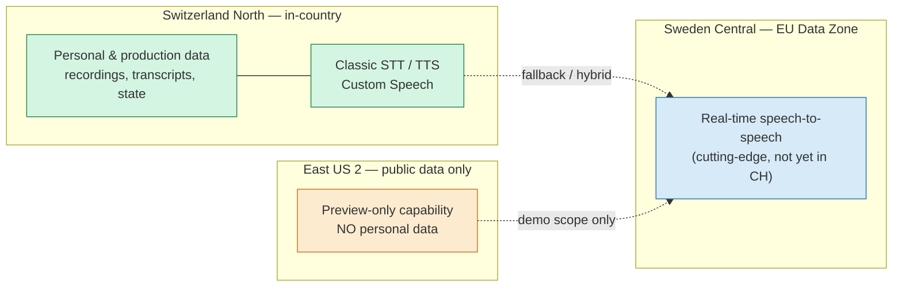
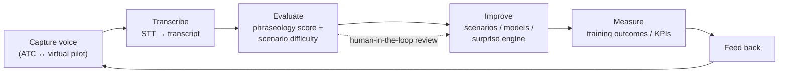

# Design Principles

| Field | Value |
| --- | --- |
| Product | ATCSimulator |
| Document | Design Principles (CAF · WAF · Responsible AI · Sovereignty · Closed-loop) |
| Version | 0.1 (Draft) |
| Date | 2026-07-14 |
| Author | Cloud Solution Architect (CSA), Microsoft |
| Status | Draft for Customer workshop (4 August 2026) |
| Classification | Confidential — anonymized |

**Related documents:** [PRD.md](./PRD.md) · [SD.md](./SD.md) · [BOM.md](./BOM.md) · [BVA.md](./BVA.md) · [AI.md](./AI.md) · [DATA.md](./DATA.md) · [SECURITY.md](./SECURITY.md) · [COMPLIANCE.md](./COMPLIANCE.md) · [OPERATIONS.md](./OPERATIONS.md) · [TEST.md](./TEST.md) · [../api/openapi.yaml](../api/openapi.yaml)

---

## 0. How to read this document

These are the **design principles** for ATCSimulator — the durable "why" behind the architecture. Each principle has an ID (**DP-##**), a **statement**, a **rationale**, and a **"how we apply it here"** note grounded in the ATCSimulator use case. Principles are organized by framework:

- **Microsoft Cloud Adoption Framework (CAF)** — DP-01…DP-06
- **Azure Well-Architected Framework (WAF)** — DP-07…DP-11
- **Microsoft Responsible AI** — DP-12…DP-17 (principles view; deeper treatment in [AI.md](./AI.md))
- **Sovereignty / data-residency-by-design** — DP-18
- **Closed-loop learning & continuous improvement** — DP-19
- **Vendor-agnostic / API-first** — DP-20

Two cross-cutting themes run through everything, reflecting the Customer's **green-field** cloud maturity and the engagement owner's guidance:

> **Start small, scale fast.** Ship a tangible MVP; grow PoC → MVP → production without a big-bang design.
> **Minimal-viable-governance.** Governance is a **frame, not a blocker** — just enough guardrails to be safe and compliant, sized to a green-field organization, avoiding endless definition phases.
> **Scope reminder:** the ATCSimulator is a **segregated training environment with no connection to live/operational ATC systems** and is therefore **not** critical national infrastructure. Principles are calibrated to a training system that nonetheless processes **personal data (voice)** and must meet **FADP/revDSG + GDPR**.

---

## 1. Cloud Adoption Framework (CAF)

### DP-01 — Strategy: business-outcome-driven, single high-value use case first

- **Statement.** Anchor the cloud/AI investment to a measurable business outcome and start with **one** high-value use case rather than a platform-first programme.
- **Rationale.** The Customer wants operational feasibility and quick wins from day one, not theory. A single, well-chosen outcome creates momentum and a reusable pattern.
- **How we apply it here.** UC2 **Virtual Simulation Pilot** is the primary MVP; its outcome (release scarce ATS specialists from sim-pilot duty) is quantified in [BVA.md](./BVA.md). UC1 (Report Summarization) is deliberately the **challenger / Horizon-2** validation, sequenced after UC2.

### DP-02 — Plan: adopt incrementally, invest in skills, avoid definition-paralysis

- **Statement.** Plan in thin, shippable increments (PoC → MVP → production) with an explicit skilling/adoption path; prefer working software over exhaustive up-front definition.
- **Rationale.** Green-field maturity + "avoid endless definition phases" means the plan must produce a tangible artefact fast and bring the Customer's people along.
- **How we apply it here.** The phasing in [BVA.md](./BVA.md) §10 and the build path in [COPILOT-BUILD-GUIDE.md](./COPILOT-BUILD-GUIDE.md); an Enterprise Architect and a Governance/Compliance lead are engaged from the start.

### DP-03 — Ready: sovereign-by-design landing zone, "start small, scale fast"

- **Statement.** Establish a landing zone that is secure and **sovereign by default** yet minimal — enough structure to scale, not a fully-built enterprise estate.
- **Rationale.** The Customer needs a clear path from sandbox to secure production without over-engineering a green-field environment.
- **How we apply it here.** A small landing zone with the **split-plane** residency pattern (DP-18): personal/production workloads in **Switzerland North**; cutting-edge real-time capability in **Sweden Central (EU)**; a public-data-only sandbox for the demo. Regions and services are itemized in [BOM.md](./BOM.md); topology in [SD.md](./SD.md).

### DP-04 — Govern: minimal-viable-governance for a green-field customer

- **Statement.** Apply the **least governance that is still safe and compliant**, expressed as automated guardrails, and grow it as adoption grows.
- **Rationale.** Governance must be a frame, not a blocker; the Customer has no existing cloud/AI governance and expects pragmatic best practice from Microsoft.
- **How we apply it here.** A short guardrail set — Azure Policy baselines, Entra ID + Conditional Access, Key Vault, Purview for data catalog/DLP/audit, an AI-usage policy — enforced by default rather than by committee. Production requires a **signed-off architecture** unless it is an isolated sandbox. Details in [COMPLIANCE.md](./COMPLIANCE.md) and [SECURITY.md](./SECURITY.md).

### DP-05 — Manage: operate and observe from day one

- **Statement.** Build observability, cost visibility, and operational runbooks into the MVP, not after go-live.
- **Rationale.** Operational feasibility (resources & cost) matters from day one; you cannot manage or prove value for what you cannot see.
- **How we apply it here.** Azure Monitor, Application Insights, Log Analytics and dashboards from the MVP; FinOps metering of the real-time-audio cost driver (the top run-cost line in [BVA.md](./BVA.md)); runbooks in [OPERATIONS.md](./OPERATIONS.md).

### DP-06 — Secure: zero-trust on a segregated training environment

- **Statement.** Apply zero-trust identity, network, and data controls proportionate to a training system that processes personal voice data but is isolated from live ATC.
- **Rationale.** Voice is personal data (FADP/GDPR); isolation from operational ATC bounds the blast radius and keeps the system out of critical-infrastructure scope.
- **How we apply it here.** Managed Identity, Conditional Access, Private Link/VNet, Key Vault, Defender for Cloud; hard segregation from operational ATC; secrets and recordings protected by policy. See [SECURITY.md](./SECURITY.md).

---

## 2. Azure Well-Architected Framework (WAF)

### DP-07 — Reliability

- **Statement.** Design for graceful degradation of the real-time voice experience; a training session must fail safe, never mislead.
- **Rationale.** A frozen or wrong virtual pilot degrades training value and could reinforce bad phraseology.
- **How we apply it here.** Health probes and autoscale on the voice/compute plane; fallback from real-time speech-to-speech to classic STT+TTS if the real-time model is unavailable; session state in Cosmos DB so an exercise can resume; **explicit "not for live ATC"** guard so failure never touches operations.

### DP-08 — Security

- **Statement.** Security is a WAF pillar and a first-class design input, not a later hardening pass.
- **Rationale.** Personal voice data + Swiss/EU regulation demand defense-in-depth by default.
- **How we apply it here.** Encryption in transit/at rest, Key Vault-managed secrets, least-privilege Managed Identity, Purview classification of recordings/transcripts, private networking. Retention of recordings/transcripts is a **security AND cost** control (see DP-09/DP-14). Full treatment in [SECURITY.md](./SECURITY.md).

### DP-09 — Cost Optimization

- **Statement.** Treat usage-based AI spend as a managed, observable quantity and optimize the dominant drivers first.
- **Rationale.** The value case depends on run-cost staying a fraction of displaced labor; the **real-time audio minute** is the swing cost ([BVA.md](./BVA.md) §5.4).
- **How we apply it here.** Voice-activity streaming (bill only on speech), model right-sizing, scale-to-zero compute, tiered storage with lifecycle policies, and **retention windows** that cut both cost and privacy exposure. FinOps metering wired in at MVP.

### DP-10 — Operational Excellence

- **Statement.** Everything-as-code, repeatable deployments, and measurable operations.
- **Rationale.** Repeatability is how a green-field team scales safely from sandbox to production.
- **How we apply it here.** Bicep/Terraform IaC, Azure Developer CLI (`azd`), GitHub Actions CI/CD, GitHub Advanced Security; build accelerated by GitHub Copilot custom agents (engineering agents `AG-E-##`). See [OPERATIONS.md](./OPERATIONS.md) and [COPILOT-BUILD-GUIDE.md](./COPILOT-BUILD-GUIDE.md).

### DP-11 — Performance Efficiency (real-time voice latency budget)

- **Statement.** Meet an explicit end-to-end **latency budget** for the ATC-utterance → pilot-read-back loop so the exchange feels like real radio.
- **Rationale.** Radio-telephony training only transfers if timing is natural; excess latency breaks realism and pedagogy.
- **How we apply it here.** An **illustrative p95 target of ≤ ~1,000 ms** utterance-end → read-back-start (to be validated), budgeted across ASR → NLP/intent → command/response generation → TTS. Region proximity (Sweden Central for the real-time plane), streaming, and model selection are chosen against this budget; latency is a first-class KPI in [BVA.md](./BVA.md) §8 and a test target in [TEST.md](./TEST.md).

---

## 3. Microsoft Responsible AI

> Principles view only. The deeper controls, evaluations, red-teaming, and content-safety design live in **[AI.md](./AI.md)**; regulatory mapping in **[COMPLIANCE.md](./COMPLIANCE.md)**.

### DP-12 — Fairness (dialect & accent equity)

- **Statement.** The speech stack must perform equitably across **Swiss national languages, dialects, and accents**, and across speaker gender.
- **Rationale.** Earlier vendor speech engines failed on Swiss dialects and place names; biased recognition would disadvantage trainees and erode trust.
- **How we apply it here.** Domain fine-tuning on ATC vocabulary + Swiss languages; disaggregated accuracy evaluation by language/dialect/accent; male & female virtual-pilot voices. Fairness test fixtures use the source phraseology (incl. Swiss place names such as Schrattenfluh, Evolène). See [AI.md](./AI.md), [TEST.md](./TEST.md).

### DP-13 — Reliability & Safety (phraseology correctness; never live ATC; human-in-the-loop)

- **Statement.** The system must be correct on R/T phraseology, must **never** be used for live/operational ATC, and must keep a human in the loop for assessment.
- **Rationale.** Incorrect phraseology reinforced in training is a safety-negative; isolation from operations bounds risk.
- **How we apply it here.** Systematic automated phraseology checking; hard architectural segregation from operational ATC (DP-06); the **instructor/coach retains pedagogical authority** and signs off assessments and (for UC1) summaries.

### DP-14 — Privacy & Security (voice = personal data; FADP/GDPR)

- **Statement.** Treat voice recordings and transcripts as **personal data** and minimize, protect, and time-bound them by design.
- **Rationale.** FADP/revDSG + GDPR apply; trainee voice is identifiable personal data.
- **How we apply it here.** Data-residency by design (DP-18), purpose limitation, retention windows, Purview classification, and **public/synthetic-only data in the demo** (no personal data leaves Switzerland/EU). See [DATA.md](./DATA.md), [SECURITY.md](./SECURITY.md), [COMPLIANCE.md](./COMPLIANCE.md).

### DP-15 — Inclusiveness

- **Statement.** Design the training experience to be accessible and usable for the full trainee population.
- **Rationale.** Inclusive design widens the qualified-controller pipeline and is a Responsible-AI obligation.
- **How we apply it here.** Multi-language support, adjustable scenario difficulty (surprise engine dialed to learner level), transcript-based review for different learning styles, and accessible instructor tooling.

### DP-16 — Transparency (trainees know they speak to an AI pilot; transcripts)

- **Statement.** Trainees must always know they are speaking to an **AI virtual pilot**, and interactions are transcribed and reviewable.
- **Rationale.** Informed users trust and learn better; transparency is required for accountable AI and for FADP/GDPR notice.
- **How we apply it here.** Explicit disclosure at session start; automatic transcripts surfaced in debrief; model/scenario provenance recorded. See [AI.md](./AI.md).

### DP-17 — Accountability (instructor retains responsibility)

- **Statement.** A named human — the instructor/coach — remains accountable for training outcomes and for any AI-produced artefact.
- **Rationale.** AI augments, it does not own responsibility; accountability must sit with a person.
- **How we apply it here.** Instructor is the value owner and human-in-the-loop reviewer (UC2 assessment; UC1 summary approval before submission). Roles in [PERSONAS-JOURNEY.md](./PERSONAS-JOURNEY.md); governance in [COMPLIANCE.md](./COMPLIANCE.md).

---

## 4. Sovereignty / data-residency-by-design

### DP-18 — Data residency and sovereignty are first-class, decided per data class

- **Statement.** Choose data location **by data classification**, defaulting personal/production data to **in-country (Switzerland)**, using **EU Data Zone** when a required capability is not available in-country, and **US only** for public-data, no-personal-data demos.
- **Rationale.** The Customer requires data to stay in Switzerland where possible, under FADP/GDPR; but the flagship **real-time speech-to-speech** models are **not currently in Switzerland North** (as of Jul 2026 — verify at design time), forcing a deliberate, documented trade-off rather than an accidental one.
- **How we apply it here — the split-plane pattern:**

  Personal/production data and classic STT/TTS stay **in-country**; the real-time plane runs in **Sweden Central (EU)**; the US region is used **only** for public-data demos with no personal data. Region availability and rationale are itemized in [BOM.md](./BOM.md); **always confirm current model-region status at design time.**

---

## 5. Closed-loop learning & continuous improvement

### DP-19 — Capture → transcribe → evaluate → improve → measure → feed back

- **Statement.** Every training interaction feeds a closed loop that improves scenarios, models, and outcomes over time.
- **Rationale.** The human-only setup cannot analyze training at scale; automatic transcripts unlock continuous, evidence-based quality improvement and are a core intangible in [BVA.md](./BVA.md).
- **How we apply it here.** Voice is captured and transcribed; phraseology and scenario difficulty are evaluated; scenarios and models are refined (including the surprise-injection engine); training outcomes are measured and fed back — governed so that improvements are reviewed, not auto-promoted (DP-17).

---

## 6. Vendor-agnostic / API-first

### DP-20 — Simulator-vendor independence via an agnostic API

- **Statement.** Expose the voice/AI capabilities as **simulator-vendor-independent services** behind a stable **agnostic API**; never couple core logic to one simulator vendor.
- **Rationale.** The Customer runs simulators from multiple vendors; a single-vendor speech engine would hamper integration and limit value for the whole Academy. Earlier single-vendor algorithms already failed on Swiss needs.
- **How we apply it here.** Azure API Management fronts the ASR/NLP/TTS/command services as the **Agnostic API** boundary; simulator adapters sit behind it; the contract is versioned in [../api/openapi.yaml](../api/openapi.yaml). Foundation models are swappable (OpenAI/Microsoft/others) without changing the API. Architecture in [SD.md](./SD.md).

---

## 7. Principle → where enforced

| DP | Principle | Primary enforcing artefact(s) |
| --- | --- | --- |
| DP-01 | Strategy: single high-value use case | [BVA.md](./BVA.md), [PRD.md](./PRD.md) |
| DP-02 | Plan: incremental + skills | [BVA.md](./BVA.md) §10, [COPILOT-BUILD-GUIDE.md](./COPILOT-BUILD-GUIDE.md), [BACKLOG.md](./BACKLOG.md) |
| DP-03 | Ready: sovereign landing zone | [SD.md](./SD.md), [BOM.md](./BOM.md) |
| DP-04 | Govern: minimal-viable-governance | [COMPLIANCE.md](./COMPLIANCE.md), Azure Policy baseline |
| DP-05 | Manage: operate from day one | [OPERATIONS.md](./OPERATIONS.md), Azure Monitor/App Insights |
| DP-06 | Secure: zero-trust, segregated | [SECURITY.md](./SECURITY.md), [SD.md](./SD.md) |
| DP-07 | Reliability | [SD.md](./SD.md), [OPERATIONS.md](./OPERATIONS.md), [TEST.md](./TEST.md) |
| DP-08 | Security (WAF) | [SECURITY.md](./SECURITY.md) |
| DP-09 | Cost Optimization | [BVA.md](./BVA.md) §5.4/§7, FinOps metering |
| DP-10 | Operational Excellence | IaC (Bicep/Terraform), GitHub Actions, [OPERATIONS.md](./OPERATIONS.md) |
| DP-11 | Performance Efficiency (latency budget) | [SD.md](./SD.md), [TEST.md](./TEST.md), [BOM.md](./BOM.md) |
| DP-12 | Fairness (dialect/accent) | [AI.md](./AI.md), [TEST.md](./TEST.md), [DATA.md](./DATA.md) |
| DP-13 | Reliability & Safety (phraseology, HITL) | [AI.md](./AI.md), [SD.md](./SD.md), [PERSONAS-JOURNEY.md](./PERSONAS-JOURNEY.md) |
| DP-14 | Privacy & Security (voice = personal data) | [DATA.md](./DATA.md), [SECURITY.md](./SECURITY.md), [COMPLIANCE.md](./COMPLIANCE.md) |
| DP-15 | Inclusiveness | [AI.md](./AI.md), [PERSONAS-JOURNEY.md](./PERSONAS-JOURNEY.md) |
| DP-16 | Transparency | [AI.md](./AI.md), [PERSONAS-JOURNEY.md](./PERSONAS-JOURNEY.md) |
| DP-17 | Accountability (instructor) | [COMPLIANCE.md](./COMPLIANCE.md), [PERSONAS-JOURNEY.md](./PERSONAS-JOURNEY.md), [AGENTS.md](../AGENTS.md) |
| DP-18 | Sovereignty / residency by design | [BOM.md](./BOM.md), [SD.md](./SD.md), [COMPLIANCE.md](./COMPLIANCE.md) |
| DP-19 | Closed-loop learning | [SD.md](./SD.md), [DATA.md](./DATA.md), [BVA.md](./BVA.md) §8 |
| DP-20 | Vendor-agnostic / API-first | [../api/openapi.yaml](../api/openapi.yaml), [SD.md](./SD.md) |

---

*All region/model-availability statements reflect status as of Jul 2026 and must be re-verified at design time on the live Azure model-availability sources. Financial references point to [BVA.md](./BVA.md), where all figures are ROM, illustrative, in CHF, and to be validated with the Customer.*
