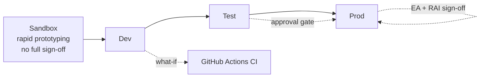

# ATCSimulator — Operations Model (OPERATIONS)

| Field | Value |
| --- | --- |
| Product | ATCSimulator |
| Document | Operations Model |
| Version | 0.1 (Draft) |
| Date | 2026-07-14 |
| Author | Cloud Solution Architect (CSA), Microsoft |
| Status | Draft for Customer workshop (4 August 2026) |
| Classification | Confidential — anonymized |

**Related documents:** [SD.md](./SD.md) · [SECURITY.md](./SECURITY.md) · [BOM.md](./BOM.md) · [DESIGN-PRINCIPLES.md](./DESIGN-PRINCIPLES.md) · [TEST.md](./TEST.md) · [COPILOT-BUILD-GUIDE.md](./COPILOT-BUILD-GUIDE.md)

---

## 1. Target operating model

ATCSimulator is a **training-only** service (not critical infrastructure, **CON-01**). It is operated by the Customer's **Platform / Cloud Operations Engineer** (P-06) with the **Academy Manager** (P-04) as service owner and the **DPO/Compliance Officer** (P-05) as governance owner. Given the Customer's green-field maturity, operations start **lean** and mature over horizons (**CON-04**, minimal-viable-governance).

| Aspect | Demo / MVP | Production |
| --- | --- | --- |
| Ownership | CSA + Customer platform engineer | Customer platform team, Microsoft support |
| Environments | sandbox / dev | sandbox → dev → test → prod (isolated subscriptions) |
| Change control | lightweight (PR review) | EA sign-off + RAI review gates |
| Data | transient, non-personal | in-country, retained per [DATA.md](./DATA.md) |

## 2. Environments & promotion

- IaC (Bicep + `azd`), deployed by GitHub Actions with **what-if** validation and **approval-gated** SIT→PROD promotion using OIDC (no static cloud secrets). See [COPILOT-BUILD-GUIDE.md](./COPILOT-BUILD-GUIDE.md).
- **Azure Policy** enforces the allowed-region allow-list (residency, **CON-03**) and permitted SKUs.

## 3. Service levels (SLO targets — validate with Customer)

| SLO | Demo | Production |
| --- | --- | --- |
| Availability (Academy hours) | ≥ 99% | ≥ 99.5% (target) |
| Conversational latency (p95) | ≤ 2.0 s | tighter, TBD |
| Read-back correctness (golden set) | ≥ target in [TEST.md](./TEST.md) | ≥ target |
| RPO / RTO | n/a (transient) | defined per data domain |

## 4. Observability & run health

- **Azure Monitor / Application Insights / Log Analytics**: distributed traces across the voice loop (ASR→NLP→command→TTS), latency & WER dashboards, Content Safety events, Agnostic-API metrics.
- **Golden-signal dashboards**: latency, errors, saturation (concurrent sessions), model/region health.
- **Fail-safe alerting**: if the real-time model/region is unavailable, sessions pause and **no simulator command is dispatched** (NFR-05); page on sustained model errors.

## 5. Incident & problem management

- Severity model (Sev1–Sev4); training-only so **no safety-of-life escalation path** — but treat data-protection incidents (voice = personal data) as high severity with DPO notification and FADP/GDPR breach assessment (see [COMPLIANCE.md](./COMPLIANCE.md)).
- Runbooks: model/region failover (EU Data Zone), region residency incident, feed-provider outage (demo), simulator-adapter failure.

## 6. Cost & capacity management

- Track the cost drivers from [BOM.md](./BOM.md) §6 against **NFR-25**: real-time-audio minutes, Speech minutes, reasoning tokens, compute, storage, APIM tier.
- Right-size Container Apps scale rules to concurrent-session demand; scale-to-zero in non-Academy hours; budget alerts via Azure Monitor.

## 7. Continuous improvement (closed loop)

Operations feeds the **closed-loop learning** cycle ([DESIGN-PRINCIPLES.md](./DESIGN-PRINCIPLES.md) DP for closed loop): capture → transcribe → evaluate (phraseology & difficulty) → improve scenarios/models → measure outcomes. Fabric/Power BI provide the analytics surface.

## 8. PoC Operations Addendum

- FR24 sandbox and Foundry credentials must be stored in Key Vault.
- Application Insights is required for flight-data response timing and voice-turn latency.
- App Service configuration must use `atcsim` naming conventions and environment-specific secret references.
