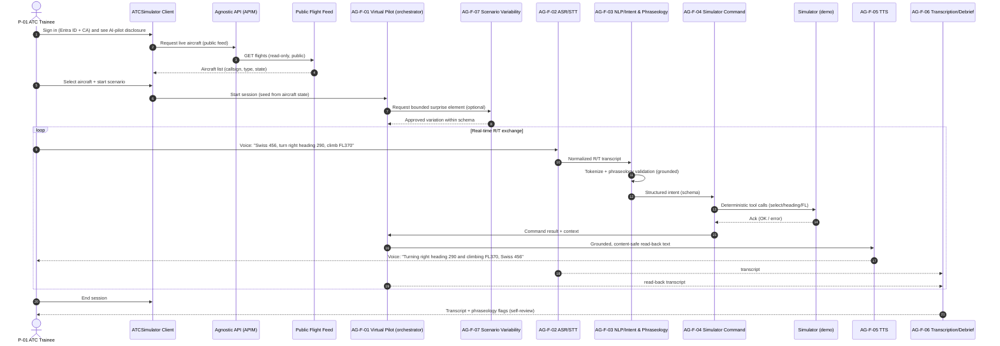
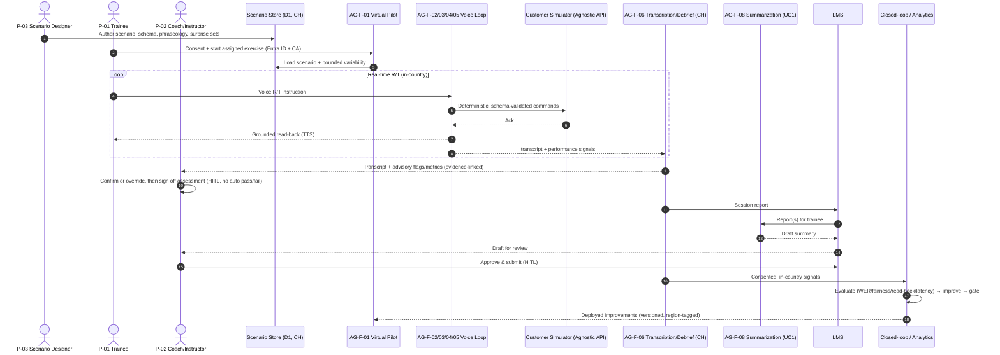

# Personas & End-to-End Journey

| Field | Value |
| --- | --- |
| Product | ATCSimulator |
| Document | Personas & End-to-End Journey |
| Version | 0.1 (Draft) |
| Date | 2026-07-14 |
| Author | Cloud Solution Architect (CSA), Microsoft |
| Status | Draft for Customer workshop (4 August 2026) |
| Classification | Confidential — anonymized |

**Related documents:** [../AGENTS.md](../AGENTS.md) · [PRD.md](./PRD.md) · [SD.md](./SD.md) · [AI.md](./AI.md) · [BOM.md](./BOM.md) · [DATA.md](./DATA.md) · [SECURITY.md](./SECURITY.md) · [COMPLIANCE.md](./COMPLIANCE.md) · [DESIGN-PRINCIPLES.md](./DESIGN-PRINCIPLES.md) · [OPERATIONS.md](./OPERATIONS.md) · [TEST.md](./TEST.md)

> **Framing.** ATCSimulator is a **segregated training and simulation environment with no connection to live/operational ATC** ([COMPLIANCE.md](./COMPLIANCE.md) §1, `CON-01`) and is therefore **not** critical national infrastructure. The **primary** use case is **UC2 — the Virtual Simulation Pilot Agent**; **UC1 — Report Summarization** is the sequenced **challenger**. The **demo/MVP (Scope 2)** processes **no personal data** (public flight feed + synthetic voices); the **full/production (Scope 1)** processes trainee **voice = personal/biometric-adjacent data** under FADP/GDPR.

---

## 1. How to read this document

- **Personas** (`P-##`) are the human roles ATCSimulator serves or depends on. Each entry has **Goals**, **Responsibilities**, **Pains today**, **What changes with ATCSimulator**, and the **runtime agents (`AG-F-##`) they interact with** (registered in [../AGENTS.md](../AGENTS.md)).
- Roles use **titles only** — no real personal names — per the anonymization rules.
- Two **end-to-end journeys** are given for the primary use case: the **Demo/MVP** (the one to build) and the **Full/production** target state.
- A **swimlane responsibilities table** (persona × stage) and a **build RACI** close the document.
- Runtime agents referenced here: **AG-F-01** Virtual Simulation Pilot (orchestrator/persona), **AG-F-02** ASR/STT, **AG-F-03** NLP/Intent & Phraseology, **AG-F-04** Simulator Command, **AG-F-05** TTS, **AG-F-06** Transcription & Debrief, **AG-F-07** Scenario Variability, **AG-F-08** Report Summarization (UC1). Engineering (build-time) agents `AG-E-##` are in [../AGENTS.md](../AGENTS.md) §4.

---

## 2. Human personas (`P-##`)

### P-01 — ATC Trainee (primary user)

*Air traffic controller in training who issues clearances and instructions by radio (R/T).*

- **Goals.** Build fluent, correct radiotelephony and traffic-management skill; accumulate as many realistic training repetitions as possible; get objective, evidence-based feedback; practise without fear of judgment.
- **Responsibilities.** Issue flight clearances/instructions (takeoff/landing, altitude, heading, speed); transmit traffic information (collision avoidance); coordinate ground movements (taxi/runway); provide navigation/waypoint aids; pass weather info; conduct emergency communication — all as **exercises**, never on live traffic.
- **Pains today.** Training units are scarce because each one needs **1 instructor + 1–5 human simulation pilots**; sessions must be scheduled around many people; practice happens under constant observation with limited privacy; feedback is manual and inconsistent; no scalable way to drill difficult/rare scenarios.
- **What changes with ATCSimulator.** Self-service, **"anytime & anywhere"** training against an AI virtual pilot; more repetitions and more demanding/surprising scenarios; automatic transcripts and phraseology feedback for self-review; lower-pressure practice (no room full of observers). The trainee is always told they are speaking to an **AI pilot** (DP-16 transparency).
- **Runtime agents.** Speaks to **AG-F-01** (the virtual-pilot persona) in real time; is served transparently by **AG-F-02→AG-F-03→AG-F-04→AG-F-05** (the voice loop) and by **AG-F-07** (surprise elements); reviews output from **AG-F-06** (transcript/self-review).

### P-02 — Coach / Instructor (human-in-the-loop reviewer & debriefer)

*Experienced controller who supervises the exercise, advises, and owns the debrief and assessment.*

- **Goals.** Maximize each trainee's learning; run efficient, evidence-based debriefs; retain full pedagogical authority and accountability for assessment.
- **Responsibilities.** Supervise/observe exercises; advise during and after; **document the exercise for debrief**; judge phraseology and decision-making; **sign off assessments** (and, for UC1, approve trainee report summaries). Remains the accountable human for all AI-influenced outcomes (DP-17, [AI.md](./AI.md) §6).
- **Pains today.** Must be physically present for every unit; manual note-taking during a fast exercise; limited ability to review objectively (no reliable transcript); debrief quality varies; time split across too few sessions.
- **What changes with ATCSimulator.** Can supervise more sessions (no longer tied to staffing 1–5 sim pilots per unit); receives **auto-generated transcripts, phraseology-deviation flags, and advisory metrics** with linked evidence; confirms/overrides/discards AI suggestions; **no automated pass/fail** — the instructor decides (RISK-05). In the full scope, debrief is a structured HITL step feeding the LMS and the closed loop.
- **Runtime agents.** Consumes **AG-F-06** (transcription/debrief insights) as the primary tool; oversees **AG-F-01** behaviour and can select/approve **AG-F-07** variability sets; for UC1, **reviews and approves AG-F-08** summaries before submission.

### P-03 — Scenario Designer / Training Content Author

*Instructional designer / SME who authors the exercises, phraseology content, and surprise elements.*

- **Goals.** Produce realistic, pedagogically-targeted scenarios at the right difficulty; keep phraseology content correct and current; enable progressive difficulty and variability.
- **Responsibilities.** Author **scenario definitions** (aircraft, initial states, events, waypoints, difficulty — data domain **D1**, [DATA.md](./DATA.md)); curate the **phraseology corpus** (ICAO/Swiss R/T) that grounds validation; define **allowed simulator commands** and their parameters; design **surprise/variability** sets and approve their bounds.
- **Pains today.** Scenarios are effort-heavy and hard to vary; injecting realistic surprises depends on skilled human sim pilots improvising; little reuse; no systematic way to test that a scenario exercises the intended phraseology.
- **What changes with ATCSimulator.** Authors scenarios once and reuses them across trainees and simulator vendors (vendor-agnostic API, DP-20); defines a **bounded scenario schema** that **AG-F-07** varies within instructor-approved limits; contributes **golden phraseology fixtures** (with the ATC Domain Expert, [AI.md](./AI.md) §7) so scenarios are testable.
- **Runtime agents.** Authors content consumed by **AG-F-01** and **AG-F-07**; defines the command tool-schema used by **AG-F-04**; curates the grounding corpus used by **AG-F-03**.

### P-04 — Training Academy Manager (value owner)

*Owns the Academy's training throughput, quality, budget, and the ATCSimulator value case.*

- **Goals.** Increase training capacity and quality without proportional headcount; demonstrate ROI; de-risk delivery; scale from MVP to standard operation.
- **Responsibilities.** Owns the business outcome and the **AI use-case register** upkeep ([COMPLIANCE.md](./COMPLIANCE.md) §6.2); prioritizes scope with the Product Owner; is accountable that AI assessment stays **advisory** (shared with the RAI Lead, RISK-05); approves roadmap/phasing.
- **Pains today.** Capacity capped by sim-pilot staffing and physical workstation footprint; high personnel cost per unit; complex planning; limited analytics to prove or improve training quality.
- **What changes with ATCSimulator.** Frees scarce ATS specialists from sim-pilot duty; grows training units without linear cost; gains **closed-loop analytics** (capture→transcribe→evaluate→improve→measure, DP-19) to evidence quality; value quantified in [BVA.md](./BVA.md) (ROM, CHF, illustrative).
- **Runtime agents.** Does not operate agents directly; consumes **aggregated analytics** derived from **AG-F-06** and the closed loop; is the value owner for the whole `AG-F-##` roster.

### P-05 — Data Protection / Compliance Officer (DPO)

*Accountable owner of lawful basis, DPIA, residency, retention, and data-subject rights.*

- **Goals.** Ensure ATCSimulator meets **FADP/revDSG + GDPR** "state of the art"; keep personal data in Switzerland where possible; prevent function creep; keep governance **minimal but sufficient**.
- **Responsibilities.** Owns lawful-basis & consent design, the **DPIA** (production gate), data classification & residency enforcement, retention/purge, DSR runbook, breach notification — see the RACI in [COMPLIANCE.md](./COMPLIANCE.md) §6.2. Confirms the **demo carries no personal data** (screening only).
- **Pains today.** Green-field cloud/AI governance — no existing concepts/processes; risk of either under-governing (exposure) or over-governing (stalling the MVP, RISK-10); voice is biometric-adjacent and high-risk.
- **What changes with ATCSimulator.** Gets a **split-plane residency** design (personal data in Switzerland North; cutting-edge real-time in EU; US demo-only, no personal data — DP-18, `CON-03`); a lightweight AI use-case register; minimization/retention baked in ([DATA.md](./DATA.md) §4); clear demo-vs-production compliance delta ([COMPLIANCE.md](./COMPLIANCE.md) §9).
- **Runtime agents.** Governs (not operates) the data produced by **AG-F-02** (voice, D4) and **AG-F-06** (transcripts D5, performance D6); sets residency/retention constraints all `AG-F-##` inherit.

### P-06 — Platform / Cloud Operations Engineer

*Builds and runs the landing zone, deploys the agents, and keeps the service healthy, cheap, and secure.*

- **Goals.** Reliable, observable, cost-controlled operation from day one; repeatable deployments; enforce Zero-Trust and residency by policy; hit the real-time latency budget (DP-11).
- **Responsibilities.** Landing zone & IaC (Bicep/Terraform, `azd`); deploy/scale the voice/compute plane; wire **Azure Monitor/App Insights/Log Analytics**; FinOps metering of the real-time-audio cost driver; enforce Azure Policy (allowed regions CH/EU, deny public endpoints); operate retention/purge jobs. **Segregation of duties:** operators do **not** read trainee performance data ([SECURITY.md](./SECURITY.md) §2, `NFR-04`).
- **Pains today.** No existing landing zone or governance guardrails; new real-time-audio cost/latency profile to master; must prove operational feasibility (resources & cost) from day one.
- **What changes with ATCSimulator.** Everything-as-code (DP-10); observability and cost visibility built into the MVP (DP-05); managed/PaaS-first to cut patch surface; policy-enforced residency and private networking.
- **Runtime agents.** Deploys, scales, monitors and secures **all `AG-F-##`** and the APIM Agnostic-API façade; owns their runtime SLOs and cost — but has **no data-plane read** of personal performance data.

### P-07 — LMS Administrator (UC1 challenger)

*Administers the Learning Management System and its integration with the summarization agent.*

- **Goals.** Reduce repetitive manual documentation; get accurate trainee report summaries into the LMS with the instructor firmly in control.
- **Responsibilities.** Manage LMS connectors/permissions; configure ingestion of **training-session reports** to **AG-F-08** and publication of **summary drafts** back per trainee; ensure the **instructor review & approval (HITL)** step is enforced before any summary is submitted.
- **Pains today.** Instructors spend disproportionate time writing repetitive summaries; documentation backlog; no scalable drafting.
- **What changes with ATCSimulator (UC1).** A specialized summarization agent drafts per-trainee summaries; the **instructor retains responsibility** for reviewing and submitting them ([COMPLIANCE.md](./COMPLIANCE.md) source facts, [AI.md](./AI.md) §6). UC1 is implemented **after** UC2.
- **Runtime agents.** Integrates the LMS with **AG-F-08**; ensures the instructor (P-02) approval gate is wired; consumes transcripts/records that originate from **AG-F-06**.

> **Persona → primary agent map (quick reference)**
>
> | Persona | Primary runtime agent(s) | Interaction mode |
> | --- | --- | --- |
> | P-01 ATC Trainee | AG-F-01 (+02/03/04/05, 07) | Real-time voice R/T |
> | P-02 Coach/Instructor | AG-F-06 (+01, 07); AG-F-08 (UC1) | Review, oversight, sign-off |
> | P-03 Scenario Designer | AG-F-01, AG-F-07, AG-F-04 (schema), AG-F-03 (corpus) | Authoring |
> | P-04 Academy Manager | Closed-loop analytics (from AG-F-06) | Value/roadmap |
> | P-05 DPO/Compliance | Governs AG-F-02/06 data | Governance (non-operational) |
> | P-06 Platform/Cloud Ops | All AG-F-## + APIM | Deploy/operate/secure |
> | P-07 LMS Administrator | AG-F-08 | Integration (UC1) |

---

## 3. End-to-end journey — **Demo / MVP (Scope 2, the one to build)**

**Scenario:** An ATC Trainee opens ATCSimulator, picks a real aircraft from a **public live-flight feed** (FlightAware/Flightradar24), a scenario starts, and the trainee runs a **real-time voice R/T loop** with the AI virtual pilot, ending in a transcript and self-review. **No personal data; public + synthetic only.** Real-time speech-to-speech runs in **Sweden Central (EU)** (or East US 2 if a Preview capability is US-only) because it carries no personal data ([COMPLIANCE.md](./COMPLIANCE.md) §9; DP-18).

### 3.1 Numbered step flow

1. **Sign in.** Trainee authenticates via **Microsoft Entra ID + Conditional Access** and opens the ATCSimulator client. An **AI-pilot disclosure** is shown (DP-16).
2. **Select aircraft.** The client calls the **public live-flight feed via the APIM Agnostic-API façade**; the trainee picks a live aircraft (callsign, type, position, level). *(Public data only — `NFR-09`.)*
3. **Start scenario.** **AG-F-01 (Virtual Simulation Pilot)** seeds a scenario from the selected aircraft's state; **AG-F-07 (Scenario Variability)** may inject a bounded surprise element (e.g., a traffic conflict) within the scenario schema.
4. **Trainee transmits (voice).** The trainee issues an R/T instruction, e.g. *"Swiss 456, turn right heading 290 degrees, and climb flight level 370."*
5. **ASR / STT.** **AG-F-02** transcribes the audio to normalized R/T text (real-time audio model in the demo; dialect-adapted Custom Speech in production).
6. **NLP / intent + phraseology.** **AG-F-03** tokenizes/keyword-groups the transcript, validates phraseology against the grounded corpus, and emits a **structured intent** (schema).
7. **Command build & dispatch.** **AG-F-04** converts the intent into **deterministic, schema-validated tool calls** (`select_aircraft`, `set_heading 290`, `set_flight_level 370`) and dispatches them to the **simulator via the Agnostic API**; the simulator acknowledges (OK/error). *(The LLM proposes; the deterministic layer disposes — [AI.md](./AI.md) §4.)*
8. **Read-back generation.** **AG-F-01/AG-F-05** generate a **grounded read-back** that mirrors the *actual dispatched command* (not a guess), content-safety checked.
9. **TTS.** **AG-F-05** voices the read-back back to the trainee: *"Turning right heading 290 degrees and climbing to flight level 370, Swiss 456."* — inside the real-time latency budget (DP-11, illustrative p95 ≤ ~1 s).
10. **Transcript capture.** **AG-F-06** captures the time-aligned transcript of the exchange (demo: non-personal/synthetic).
11. **Loop.** Steps 4–10 repeat for the exercise; **AG-F-07** may add further surprises to raise training value.
12. **Self-review.** At session end the trainee reviews the transcript and any phraseology flags for **self-review** (no instructor required in the demo).

### 3.2 Sequence diagram (demo runtime agents)

---

## 4. End-to-end journey — **Full / production (Scope 1, target state)**

The production journey **adds** scenario authoring, **coach/instructor HITL debrief**, **LMS integration (UC1)**, and **closed-loop analytics** — and re-locates all personal data to **Switzerland North** with full governance ([COMPLIANCE.md](./COMPLIANCE.md) §5, [SECURITY.md](./SECURITY.md)). Voice is now **personal/biometric-adjacent data**: consent, DPIA, residency, retention, and DSR apply.

### 4.1 Numbered step flow

1. **Author.** **P-03 Scenario Designer** authors/updates scenario definitions (D1), the command schema, the phraseology corpus, and **instructor-approved** surprise sets for **AG-F-07**.
2. **Enrol & consent.** Trainee is enrolled; **explicit, informed, revocable consent for voice capture** is captured and enforced at the session gate (`RISK-01`, [COMPLIANCE.md](./COMPLIANCE.md) C-02).
3. **Launch.** Trainee (P-01) signs in (Entra ID + CA), sees AI-pilot + synthetic-voice + privacy disclosures, and starts an assigned exercise; **P-02 Coach** may supervise live.
4. **Real-time R/T loop.** The **AG-F-02→03→04→05** loop runs exactly as in §3, but on **in-country** Azure AI Speech (Custom Speech, dialect-adapted) + a reasoning model in Switzerland North / EU Data Zone; commands dispatched to the **Customer's real simulator(s)** via the vendor-agnostic API (DP-20).
5. **Surprise/variability.** **AG-F-07** injects difficulty within bounds the instructor approved, calibrated to the learner level (DP-15 inclusiveness).
6. **Transcription.** **AG-F-06** captures voice→transcript (D5) and performance signals (D6) in Switzerland North, under minimization/retention policy ([DATA.md](./DATA.md) §4).
7. **Debrief (HITL).** **P-02 Coach** reviews the transcript with **advisory** phraseology-deviation flags, read-back-correctness, and metrics (evidence-linked); the coach **confirms/overrides/discards** and **signs off** the assessment. **No automated pass/fail** (RISK-05, DP-17).
8. **LMS integration (UC1).** Session reports flow to the LMS; **AG-F-08** drafts **per-trainee summaries**; **P-07 LMS Admin** manages the pipeline; **P-02 instructor reviews & approves** each summary before submission (HITL).
9. **Closed-loop analytics.** Consented, in-country data feeds **capture→evaluate→improve→measure** (DP-19): dialect-stratified WER/fairness, command/read-back accuracy, latency, scenario difficulty. Improvements to Custom Speech, prompts, tool schema, and scenarios are **PR-reviewed and pass the eval gate** before deployment ("no silent model swap", [AI.md](./AI.md) §9).
10. **Govern & operate.** **P-05 DPO** governs residency/retention/DSR and the AI register; **P-06 Cloud Ops** operates, scales, secures, and meters cost; **P-04 Academy Manager** reads aggregated analytics to steer capacity and prove value.

### 4.2 Sequence diagram (production, incl. HITL, LMS & closed loop)

---

## 5. Swimlane responsibilities (persona × journey stage)

Legend: **●** primary/does the work · **◐** supports/reviews · **○** informed/consumes output · — not involved. Stages marked **(prod)** exist only in the full/production journey.

| Stage | P-01 Trainee | P-02 Coach | P-03 Designer | P-04 Manager | P-05 DPO | P-06 Cloud Ops | P-07 LMS Admin |
| --- | --- | --- | --- | --- | --- | --- | --- |
| Author scenario / phraseology / schema | — | ◐ | ● | ○ | ○ | — | — |
| Enrol & voice consent **(prod)** | ◐ | ○ | — | ○ | ● | ○ | — |
| Sign in + disclosures | ● | ○ | — | — | ◐ | ◐ | — |
| Select aircraft (demo) / start exercise | ● | ◐ | ○ | — | — | ○ | — |
| Real-time R/T voice loop | ● | ◐ | ○ | — | ○ | ◐ (operate) | — |
| Surprise / variability injection | ○ | ◐ (approve) | ● (define) | — | — | ○ | — |
| Transcript capture | ○ | ◐ | — | — | ◐ (residency) | ◐ (operate) | — |
| Debrief & assessment sign-off **(prod)** | ○ | ● | ○ | ○ | ○ | — | — |
| Self-review (demo) | ● | — | — | — | — | — | — |
| LMS summary review & approval **(prod, UC1)** | ○ | ● | — | ○ | ○ | — | ◐ (integrate) |
| Closed-loop analytics & improvement **(prod)** | — | ◐ | ◐ | ● (value) | ◐ | ● (run) | ○ |
| Govern / operate / secure / meter cost | — | — | — | ◐ | ● (data) | ● (platform) | ◐ (LMS) |

---

## 6. RACI for the **build** (engineering)

Maps build workstreams to the **engineering (build-time) agents `AG-E-##`** (custom agents in [../.github/agents/](../.github/agents/)) and the human sign-off roles. **R** = Responsible (does it), **A** = Accountable (owns the outcome/sign-off), **C** = Consulted, **I** = Informed. AG-E roster: AG-E-01 Product Owner · AG-E-02 Developer · AG-E-03 Enterprise Architect · AG-E-04 SecDevOps · AG-E-05 ATC Domain Expert · AG-E-06 Responsible-AI & Compliance Officer. Human sign-off: **Academy Mgr (P-04)** and **DPO (P-05)**.

| Build workstream | AG-E-01 PO | AG-E-02 Dev | AG-E-03 EA | AG-E-04 SecDevOps | AG-E-05 ATC SME | AG-E-06 RAI | P-04 Mgr | P-05 DPO |
| --- | --- | --- | --- | --- | --- | --- | --- | --- |
| Backlog, user stories & acceptance criteria (from [PRD.md](./PRD.md)) | **A/R** | C | C | I | C | C | C | I |
| MVP scope guardrails (public-data-only demo) | **A/R** | C | C | C | C | **C** | C | C |
| Real-time voice loop implementation (AG-F-02/03/04/05) | C | **A/R** | C | C | C | C | I | I |
| Agnostic API (APIM façade, OpenAPI contract, DP-20) | C | **R** | **A** | C | I | I | I | I |
| Landing zone, WAF/CAF alignment, residency split-plane (DP-18) | I | C | **A/R** | C | I | C | I | C |
| ADRs & architecture sign-off gate | I | C | **A/R** | C | I | C | I | C |
| CI/CD, GitHub Advanced Security, Defender, IaC scanning | I | C | C | **A/R** | I | I | I | I |
| Secrets, Zero-Trust, release gates ([SECURITY.md](./SECURITY.md)) | I | C | C | **A/R** | I | C | I | C |
| Phraseology validation & golden test fixtures (Swiss dialect) | C | C | I | I | **A/R** | C | I | I |
| Read-back correctness / command-mapping evals as release gate | C | **R** | I | C | **C** | **A** | I | I |
| RAI six-principle controls, Transparency Note, fairness/dialect-bias eval | I | C | C | C | C | **A/R** | I | C |
| DPIA prompts, consent design, residency/retention enforcement | I | C | C | C | I | **R** | I | **A** |
| Demo delivery (Art-of-the-Possible, no personal data) | **A** | **R** | C | C | C | C | **C** | C (screening) |
| Value case & roadmap MVP→production ([BVA.md](./BVA.md)) | **R** | I | C | I | I | I | **A** | I |

> **Human accountability is never delegated to an agent.** Engineering agents `AG-E-##` accelerate the build; **named humans** (Academy Manager, DPO, Enterprise Architect, Responsible-AI Lead) hold the **A** for value, data protection, architecture sign-off, and Responsible AI respectively ([COMPLIANCE.md](./COMPLIANCE.md) §6.2). Production requires a **signed-off architecture** unless it is an isolated sandbox; the demo runs as an isolated sandbox and needs no sign-off.

---

## 7. Traceability

| This document | Links to |
| --- | --- |
| Personas `P-01…P-07` | [../AGENTS.md](../AGENTS.md) (agent interactions), [COMPLIANCE.md](./COMPLIANCE.md) §6.2 (RACI), [AI.md](./AI.md) §6 (HITL) |
| Demo journey (Scope 2) | [COMPLIANCE.md](./COMPLIANCE.md) §9, [SECURITY.md](./SECURITY.md) §10, [BOM.md](./BOM.md) (regions), [SD.md](./SD.md) |
| Production journey (Scope 1) | [SD.md](./SD.md), [DATA.md](./DATA.md), [AI.md](./AI.md) §9 (closed loop) |
| Principles cited (DP-11/15/16/17/18/19/20) | [DESIGN-PRINCIPLES.md](./DESIGN-PRINCIPLES.md) |

*All region/model-availability statements are as of Jul 2026 and must be re-verified at design time. Financials are ROM, illustrative, in CHF, to be validated with the Customer ([BVA.md](./BVA.md)).*
