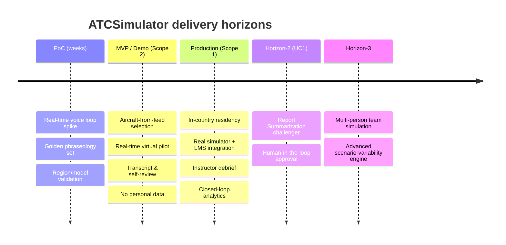

# ATCSimulator — Product Requirements Document (PRD)

| Field | Value |
| --- | --- |
| Product | ATCSimulator |
| Document | Product Requirements Document (PRD) |
| Version | 0.1 (Draft) |
| Date | 2026-07-14 |
| Author | Cloud Solution Architect (CSA), Microsoft |
| Status | Draft for Customer workshop (4 August 2026) |
| Classification | Public — anonymized demo |

**Related documents:** [SD.md](./SD.md) · [BOM.md](./BOM.md) · [BVA.md](./BVA.md) · [AI.md](./AI.md) · [COMPLIANCE.md](./COMPLIANCE.md) · [SECURITY.md](./SECURITY.md) · [DATA.md](./DATA.md) · [DESIGN-PRINCIPLES.md](./DESIGN-PRINCIPLES.md) · [PERSONAS-JOURNEY.md](./PERSONAS-JOURNEY.md) · [BACKLOG.md](./BACKLOG.md) · [../AGENTS.md](../AGENTS.md)

---

## 1. Purpose & vision

**ATCSimulator** automates the *simulation-pilot* role in air-traffic-controller (ATC) training. Today, each simulation-training unit at the Customer's training academy (**the Academy**) requires **one instructor/coach plus one to five human simulation pilots**. ATCSimulator replaces the human simulation pilots with a **vendor-agnostic, AI-powered "Virtual Simulation Pilot"** that listens to the trainee's radio-telephony (R/T) instructions in real time, drives the simulator, and reads back the correct pilot response by voice — so trainees can practise **anytime, anywhere, in self-service**, and the Academy can scale training without scaling scarce, expensive Air Traffic Services (ATS) staff.

> **Vision statement.** *Give every trainee controller unlimited, realistic, self-service simulation time with a virtual pilot that speaks their language — Swiss German/French/Italian and standard aviation English — while keeping personal data in Switzerland and human instructors firmly in the loop for assessment.*

The Customer is **Switzerland's national air navigation service provider (ANSP)**. **This training/simulation product is explicitly NOT part of critical national infrastructure**: ATCSimulator is a **segregated training environment with no connection to live or operational ATC systems** (see constraint **CON-01**). That boundary is the single most important scoping decision in this document.

## 2. Background & problem statement

Derived from the Customer's use-case material and the discovery call of 9 June 2026:

- **High personnel cost & limited throughput.** A single training unit consumes 1 coach + up to 5 qualified sim-pilots. Because these are expensive ATS-qualified staff, the number of training units for trainee controllers is capped.
- **Complex, inflexible scheduling.** Coordinating 2–7 people per session makes planning brittle.
- **Physical footprint.** Human sim-pilots need many simulator workstations and rooms, capping the number of concurrent stations.
- **Vendor lock-in on speech.** Earlier speech engines from individual simulator vendors under-performed on **Swiss dialects and place names** (e.g., *Schrattenfluh*, *Evolène*) and were not reusable across the Academy's **multiple simulator vendors**.
- **Green-field cloud/AI governance.** The Customer has early Copilot experiments but no structured cloud/AI governance yet; it wants a **tangible MVP with minimal-viable governance**, delivered pragmatically ("start small, scale fast").

## 3. Goals & objectives

| # | Objective | Success signal |
| --- | --- | --- |
| G-1 | Replace human sim-pilots for a growing share of sessions | ≥1–5 sim-pilots freed per automated session |
| G-2 | Increase training capacity & enable self-service | More sessions/trainee/month; "anytime/anywhere" access |
| G-3 | Handle Swiss-specific R/T reliably | Read-back correctness & phraseology accuracy on golden set (see [AI.md](./AI.md)) |
| G-4 | Stay simulator-vendor-agnostic | One Agnostic API integrates ≥2 simulator vendors (**CON-02**) |
| G-5 | Keep personal data in Switzerland; RAI-compliant | Residency & Responsible-AI controls met (see [COMPLIANCE.md](./COMPLIANCE.md), [AI.md](./AI.md)) |
| G-6 | Prove value with a low-risk demo, then productionize | Demo accepted → MVP → production per roadmap (§10) |

## 4. Scope

ATCSimulator is delivered in **two scopes**, per the engagement.

### 4.1 Scope 1 — Full end-to-end (target / production)

Production-grade, vendor-agnostic voice services integrated with the Customer's **real simulator(s)** and the Academy's **Learning Management System (LMS)**, with in-country Swiss data residency, full governance/operations, instructor debrief workflows, and closed-loop training analytics. This is the strategic target state.

### 4.2 Scope 2 — Demo / MVP ("Art of the Possible") — *the scope to build first*

An MVP in which **an ATC trainee selects an aircraft from a public live-flight source** (e.g., FlightAware, Flightradar24) **and starts a simulation scenario using real-time voice** with a Virtual Simulation Pilot. It showcases the **latest & greatest cloud capability (GA or Preview)** for real-time speech-to-speech.

- **No connection to operational ATC.** **Public/synthetic data only — no personal data** in the demo (voice recordings are transient and not retained as personal data; synthetic TTS voices only).
- Focus: real-time ASR → NLP → simulator-command → TTS read-back loop, end-to-end, low latency.

### 4.3 Out of scope (both scopes, unless explicitly added later)

Live/operational ATC control; safety-of-life certification; replacing the human **instructor/coach** (retained as human-in-the-loop); full multi-person team simulation (Horizon-3); automated pass/fail certification of trainees without human sign-off.

## 5. Personas (summary)

Full detail in [PERSONAS-JOURNEY.md](./PERSONAS-JOURNEY.md).

| ID | Persona | Role in product |
| --- | --- | --- |
| P-01 | ATC Trainee | Primary user — issues R/T, practises self-service |
| P-02 | Coach / Instructor | Human-in-the-loop; supervises & debriefs (production) |
| P-03 | Scenario Designer / Training Content Author | Authors scenarios & phraseology scripts |
| P-04 | Training Academy Manager | Value owner; capacity & outcomes |
| P-05 | Data Protection / Compliance Officer | FADP/GDPR, DPIA, residency |
| P-06 | Platform / Cloud Operations Engineer | Runs & secures the platform |
| P-07 | LMS Administrator | LMS integration (UC1 challenger) |

## 6. Functional requirements

IDs `FR-##` are traced to epics/stories in [BACKLOG.md](./BACKLOG.md) and to runtime agents `AG-F-##` in [../AGENTS.md](../AGENTS.md).

| ID | Requirement | Priority (MoSCoW) | Scope | Realized by |
| --- | --- | --- | --- | --- |
| **FR-01** | Trainee can browse/select an aircraft from a **public live-flight feed** (callsign, type, position, altitude, heading) to seed a scenario. | Must | Demo | Flight-feed connector via Agnostic API |
| **FR-02** | Start/stop and manage the lifecycle of a **simulation scenario** (select scenario, configure difficulty, begin, pause, end). | Must | Both | Session/orchestration (AG-F-01) |
| **FR-03** | **Real-time speech recognition (ASR/STT)** of the trainee's spoken R/T, tuned for **Swiss national languages incl. dialects + aviation English** and R/T vocabulary. | Must | Both | AG-F-02 |
| **FR-04** | **Parse intent & phraseology**: recognize keywords, group and tokenize the instruction (callsign, heading, level, QNH, waypoint, traffic). | Must | Both | AG-F-03 |
| **FR-05** | **Map recognized instructions to simulator commands** and dispatch them via the Agnostic API (e.g., `SELECT AIRCRAFT`, `SET DIRECTION`, `SET ALTITUDE`). | Must | Both | AG-F-04 |
| **FR-06** | **Generate the virtual pilot's response (read-back)** in correct R/T form for the given instruction. | Must | Both | AG-F-01 / AG-F-03 |
| **FR-07** | **Real-time text-to-speech (TTS)** output of the read-back, with selectable male/female voices & accents. | Must | Both | AG-F-05 |
| **FR-08** | **Transcribe the full conversation** (trainee ↔ virtual pilot) and persist a session transcript & audio record for review. | Must (demo: transient) | Both | AG-F-06 |
| **FR-09** | **Scenario-variability / surprise events** (higher traffic, injected deviations) to raise realism & training value. | Should | Both | AG-F-07 |
| **FR-10** | **Validate R/T phraseology & grammar** and provide correctness feedback (advisory) on the trainee's transmissions. | Should | Both | AG-F-03 |
| **FR-11** | **Self-service session review / debrief**: trainee can replay audio, read the transcript, and see phraseology feedback. | Should | Both | AG-F-06 |
| **FR-12** | **Simulator-vendor-agnostic integration**: the same voice services connect to ≥2 simulator vendors via one Agnostic API contract. | Must | Full | Agnostic API (APIM) |
| **FR-13** | **(Horizon-2 challenger, UC1)** Summarize multiple LMS training-session reports into per-trainee **summary drafts** for **instructor review & approval (human-in-the-loop)**. | Could | Full | AG-F-08 |

## 7. Non-functional requirements

Detailed security/privacy controls live in [SECURITY.md](./SECURITY.md), [COMPLIANCE.md](./COMPLIANCE.md), and [AI.md](./AI.md).

### Performance & real-time experience

- **NFR-01** End-to-end **conversational latency** (end of trainee speech → start of virtual-pilot audio read-back) target **≤ 1.2 s p50 / ≤ 2.0 s p95** for the demo; tighter budget to be set for production.
- **NFR-02** ASR partial-result streaming so the system feels responsive; barge-in supported.
- **NFR-03** Support at least **N concurrent self-service sessions** (N to be sized with the Customer; MVP target ≥ 10).

### Reliability & operability

- **NFR-04** Demo availability target **≥ 99%** during Academy hours; production target and SLOs defined in [OPERATIONS.md](./OPERATIONS.md).
- **NFR-05** Graceful degradation: if the real-time model is unavailable, fail safe (session pauses; no incorrect command is dispatched).
- **NFR-06** Full **observability** (traces, metrics, logs) for the voice loop and Agnostic API (Azure Monitor / App Insights).

### Security

- **NFR-07** **Zero Trust**: Microsoft Entra ID auth, least privilege, managed identities, no static secrets.
- **NFR-08** **Private networking** for AI/Speech/storage data planes (Private Link) when personal data is processed.
- **NFR-09** Encryption in transit & at rest; secrets in Key Vault; customer-managed-key option for production.
- **NFR-10** **Hard segregation** from operational ATC networks/systems (enforces **CON-01**).

### Privacy, residency & sovereignty

- **NFR-11** Trainee **voice is personal data**; process production personal data **in Switzerland (Switzerland North)** where feasible.
- **NFR-12** Where a required cutting-edge model is not available in-country, use an **EU Data Zone** deployment (EU-boundary residency); use a **US region only for the demo with NO personal data** (see [BOM.md](./BOM.md), ADR-0003).
- **NFR-13** Data minimization & retention policy for recordings/transcripts (see [DATA.md](./DATA.md)); demo keeps audio transient.
- **NFR-14** **DPIA** completed before any production processing of trainee personal data.

### Scalability, portability & maintainability

- **NFR-15** Horizontal scale for concurrent sessions; stateless voice-loop services where possible.
- **NFR-16** **Vendor-agnostic** by design — foundation-model and simulator-vendor swappable behind stable interfaces.
- **NFR-17** IaC-defined, reproducible environments (Bicep/`azd`); everything in source control with traceability.

### Usability & accessibility

- **NFR-18** Trainee UX usable with a headset in a browser; clear indication that the pilot is an **AI** (transparency).
- **NFR-19** Accessibility considerations for the review UI (WCAG-aligned).

### Responsible AI & quality

- **NFR-20** Meet Microsoft **Responsible AI** six principles (see [AI.md](./AI.md)); Content Safety enabled.
- **NFR-21** **Deterministic command mapping** via schema-constrained tool/function calling — the model may not invent simulator commands outside the allowed schema.
- **NFR-22** **Phraseology accuracy / read-back correctness** measured against a **golden R/T test set**; Word-Error-Rate (WER) and read-back-correctness targets defined in [AI.md](./AI.md).
- **NFR-23** **Fairness**: evaluated for dialect/accent bias across Swiss German/French/Italian + accented English.
- **NFR-24** **Human-in-the-loop**: any assessment output is **advisory**; instructors retain responsibility (UC1 & production assessment).

### Cost

- **NFR-25** Cost-optimized run-rate consistent with the ROM TCO in [BVA.md](./BVA.md); real-time-audio minutes, Speech minutes, compute and storage are the primary cost drivers and must be monitored.

## 8. Constraints & assumptions

**Constraints (`CON-##`)**

- **CON-01** ATCSimulator **must not connect to, or influence, live/operational ATC systems**. Training environment only; not critical infrastructure.
- **CON-02** Must be **simulator-vendor-agnostic** — the Academy uses multiple simulator vendors.
- **CON-03** **Data residency**: production personal data in Switzerland where feasible; EU Data Zone otherwise; US only for demo without personal data.
- **CON-04** **Minimal-viable governance** for a green-field customer — governance is a frame, not a blocker; production still requires **signed-off architecture** (isolated sandbox exempt).
- **CON-05** Some cutting-edge real-time models are **Preview** and their **region availability changes frequently** — verify at design time ([BOM.md](./BOM.md)).

**Assumptions (`ASS-##`)** — validate with the Customer

- **ASS-01** Fully-loaded ATS sim-pilot cost and session volumes per the ROM model in [BVA.md](./BVA.md) (illustrative).
- **ASS-02** At least one simulator vendor exposes (or can expose) an API/SDK for command injection; the demo may use a mock/simulated backend.
- **ASS-03** Public flight-feed usage complies with the provider's Terms of Service (read-only, demo).
- **ASS-04** The Customer can provide domain reference material (phraseology, scenario scripts) and access to an Enterprise Architect and Compliance/DPO lead.

## 9. Success metrics & acceptance criteria

### 9.1 Product KPIs (link to [BVA.md](./BVA.md))

- Human sim-pilot hours displaced per week; sessions/trainee/month; concurrent self-service sessions; read-back correctness %; phraseology-accuracy %; p95 conversational latency; trainee/instructor satisfaction; cost per training hour.

### 9.2 Demo/MVP acceptance criteria (Definition of Done)

1. A trainee **selects an aircraft from a public live-flight feed** and **starts a scenario** (FR-01, FR-02).
2. The trainee speaks a real R/T instruction; the Virtual Pilot **recognizes it, drives the (simulated) aircraft, and reads it back by voice** within the latency target (FR-03–FR-07, NFR-01).
3. At least the **four seed R/T exchanges** (incl. Swiss place names *Schrattenfluh*, *Evolène*) are handled correctly from the golden set (see [AI.md](./AI.md), `data/scenarios/sample-scenario.json`).
4. A **transcript** of the session is produced (FR-08).
5. **No personal data**, **no operational-ATC connectivity**, residency/RAI guardrails demonstrably enforced (CON-01, CON-03, NFR-20).
6. Delivered via IaC with requirement→code→test **traceability** ([COPILOT-BUILD-GUIDE.md](./COPILOT-BUILD-GUIDE.md)).

## 10. Roadmap / horizons

- **Horizon 1 (primary):** UC2 Virtual Simulation Pilot — PoC → MVP/demo → production.
- **Horizon 2 (challenger):** UC1 Report Summarization — validates product readiness/governance; implemented **after** UC2 (FR-13).
- **Horizon 3:** multi-person team simulation & advanced surprise engine.

## 11. Dependencies

Azure/Microsoft cloud services & regional availability ([BOM.md](./BOM.md)); simulator-vendor API/SDK access (ASS-02); public flight-feed access (ASS-03); Customer domain content & governance stakeholders (ASS-04); Responsible-AI limited-access approvals where Custom Neural Voice is used ([AI.md](./AI.md)).

## 12. Risks

Maintained in [COMPLIANCE.md](./COMPLIANCE.md) (`RISK-##`). Top items: lawful basis for voice (employee context), Preview-model region volatility (CON-05), phraseology accuracy on dialects, simulator-API availability, and scope creep toward operational ATC (mitigated by CON-01).

## 13. Traceability

`FR/NFR (this PRD)` → `Epics/Stories (BACKLOG.md)` → `Architecture & agents (SD.md, AGENTS.md)` → `Code/PR` → `Tests (TEST.md)` → `Evidence`. The end-to-end model is described in [COPILOT-BUILD-GUIDE.md](./COPILOT-BUILD-GUIDE.md) and summarized in the [../README.md](../README.md) key-artefacts table.
