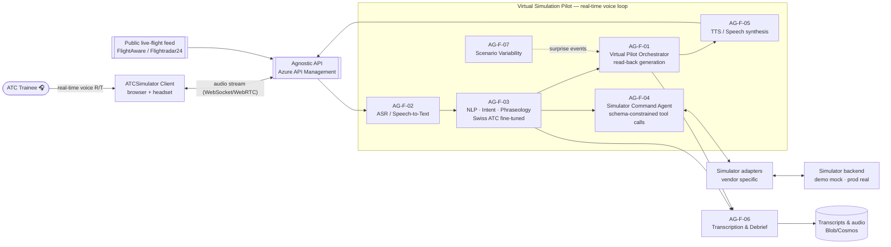
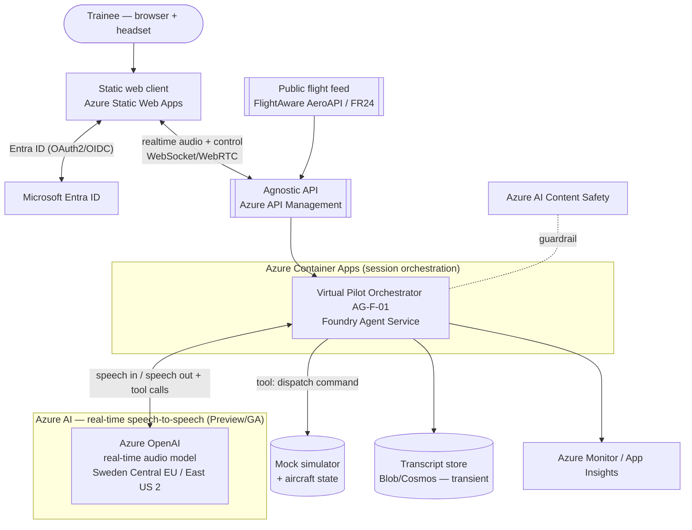
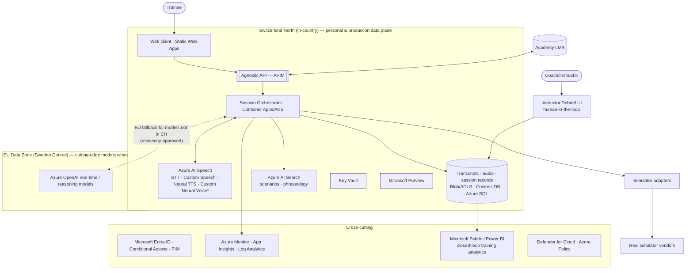
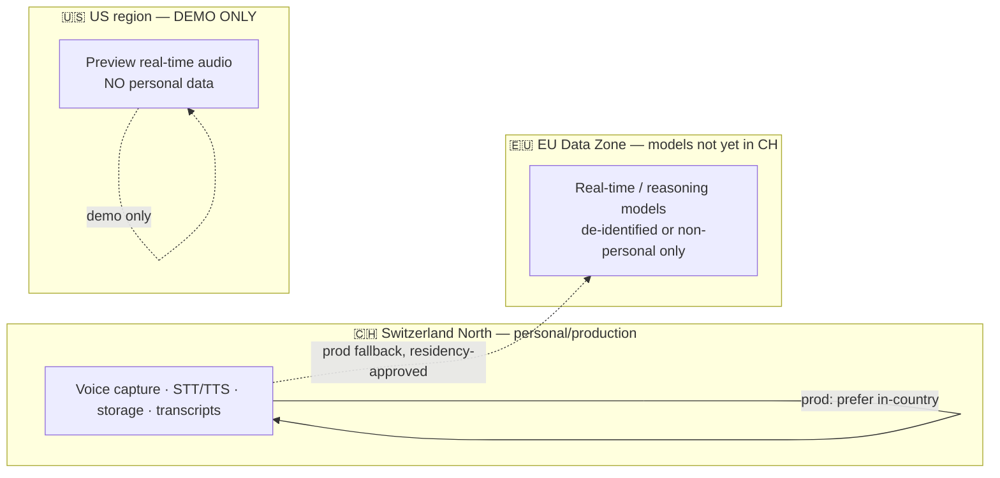
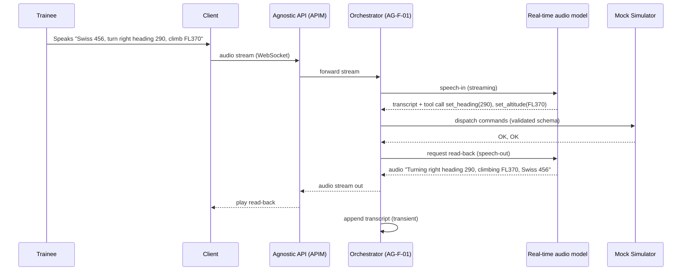

# ATCSimulator — Solution Design & Architecture (SD)

| Field | Value |
| --- | --- |
| Product | ATCSimulator |
| Document | Solution Design & Architecture (SD) |
| Version | 0.1 (Draft) |
| Date | 2026-07-14 |
| Author | Cloud Solution Architect (CSA), Microsoft |
| Status | Draft for Customer workshop (4 August 2026) |
| Classification | Confidential — anonymized |

**Related documents:** [PRD.md](./PRD.md) · [BOM.md](./BOM.md) · [AI.md](./AI.md) · [DATA.md](./DATA.md) · [SECURITY.md](./SECURITY.md) · [COMPLIANCE.md](./COMPLIANCE.md) · [DESIGN-PRINCIPLES.md](./DESIGN-PRINCIPLES.md) · [../AGENTS.md](../AGENTS.md) · [adr/ADR-0001-realtime-model-region.md](./adr/ADR-0001-realtime-model-region.md) · [adr/ADR-0002-agnostic-api-facade.md](./adr/ADR-0002-agnostic-api-facade.md) · [adr/ADR-0003-split-plane-data-residency.md](./adr/ADR-0003-split-plane-data-residency.md)

---

## 1. Architecture goals & drivers

| Driver | Source | Architectural response |
| --- | --- | --- |
| Replace human sim-pilots with a real-time Virtual Pilot | PRD G-1, FR-03…07 | Streaming speech-to-speech loop with deterministic command mapping |
| Simulator-vendor independence | CON-02, FR-12 | **Agnostic API** façade (Azure API Management) + adapter pattern |
| Swiss R/T (dialects, place names) | UC2, FR-03/04 | Domain-adapted ASR + phraseology NLP on a fine-tuned model |
| Keep personal data in Switzerland | CON-03, NFR-11/12 | **Split-plane residency** (Switzerland North vs EU Data Zone vs US-demo-only) |
| Not critical infrastructure; no operational ATC | CON-01, NFR-10 | Hard network/identity segregation; training-only |
| Green-field, minimal-viable governance, fast MVP | Discovery call, CON-04 | Landing zone + IaC + agent-driven SDLC; sandbox → production path |
| Latest & greatest, GA or Preview | Scope 2 | Azure OpenAI real-time audio for the demo; classic Speech for in-country |

## 2. Logical architecture (both scopes)

The heart of ATCSimulator is a **multi-agent real-time voice loop** behind a **simulator-vendor-agnostic API**. The six runtime agents (`AG-F-01…06`, plus the optional `AG-F-07` variability engine) implement the Customer's own "Virtual Simulation Pilot Agent" concept.

### 2.1 The six-step virtual-pilot pipeline (from the Customer's concept)

1. **ASR/STT** — transcribe the trainee's spoken instruction → text (`AG-F-02`).
2. **Keyword recognition / grouping / tokenization** — parse callsign, heading, level, QNH, waypoint, traffic (`AG-F-03`).
3. **Command lookup, build & dispatch** — map to simulator commands and call the Agnostic API, e.g. `SELECT AIRCRAFT SWISS 456; SET DIRECTION 290°; SET ALTITUDE 370` (`AG-F-04`).
4. **Read-back generation** — produce the correct pilot response text (`AG-F-01` + `AG-F-03`).
5. **TTS** — synthesize the read-back to voice and stream back (`AG-F-05`).
6. **Transcription** — persist the full conversation for review/analytics (`AG-F-06`).

### 2.2 Worked example (golden fixture G-01)
>
> Trainee: *"Swiss 456, turn right heading 290 degrees, and climb flight level 370."*
> → ASR text → NLP tokens `{callsign: SWISS456, action: TURN_RIGHT, heading: 290, action: CLIMB, level: 370}` → commands `SET DIRECTION 290°`, `SET ALTITUDE FL370` (dispatched, both `OK`) → read-back *"Turning right heading 290 degrees and climbing to flight level 370, Swiss 456."* → TTS audio → transcript row.

Full agent specifications (inputs/outputs, guardrails, side effects, human-in-the-loop points) are in [../AGENTS.md](../AGENTS.md). AI/model choices and guardrails are in [AI.md](./AI.md).

## 3. Demo / MVP architecture (Scope 2 — build first)

**Objective:** trainee selects an aircraft from a **public live-flight feed** and runs a **real-time voice** scenario with the Virtual Pilot. **No personal data. No operational ATC.**

### Demo design notes

- **Real-time speech-to-speech.** The demo uses the **Azure OpenAI real-time audio model** (speech-in/speech-out with tool calling) for the tightest latency and the "art of the possible" effect. Per [BOM.md](./BOM.md) §7, this model runs in **Sweden Central (EU)** or **East US 2 (US)** — **not yet in Switzerland North**. Because the demo carries **no personal data**, either region is acceptable; **Sweden Central is preferred** to keep data in the EU boundary (see [ADR-0001](./adr/ADR-0001-realtime-model-region.md)).
- **Deterministic control.** The model calls **tools/functions with a fixed schema** (`select_aircraft`, `set_heading`, `set_altitude`, `set_speed`, `read_back`) — the model never invents commands (NFR-21). The Simulator Command Agent validates and dispatches.
- **Aircraft from a public feed.** The flight-feed connector (read-only) fetches a live aircraft (callsign/type/position/altitude/heading) to seed the scenario (`data/scenarios/sample-scenario.json`).
- **Mock simulator.** For the demo, a lightweight mock implements the simulator adapter contract so no real simulator vendor is required (ASS-02).
- **Transient data.** Audio is processed in-stream; transcripts are optional and clearly non-personal in the demo.
- **Alternative in-country path.** Where a fully Swiss-resident demo is required, substitute **Azure AI Speech STT + Neural TTS in Switzerland North** with a GPT-4.1/GPT-5.x reasoning model for command mapping (higher latency, in-country). See §4.3 and [ADR-0001](./adr/ADR-0001-realtime-model-region.md).

## 4. Full / production architecture (Scope 1 — target)

Adds in-country residency, real simulator + LMS integration, instructor debrief, closed-loop analytics, and full governance/ops.

### 4.1 Simulator-agnostic integration (the Agnostic API)

- A stable **contract** (`api/openapi.yaml`) exposes session lifecycle, aircraft selection, instruction submission, read-back retrieval, transcript access, and a **command port**.
- **Adapters** translate the neutral command model to each simulator vendor's API/SDK/protocol. Adding a vendor = adding an adapter, not changing the core (CON-02, FR-12). See [ADR-0002](./adr/ADR-0002-agnostic-api-facade.md).

### 4.2 Split-plane data residency

Personal/production data and classic Speech stay **in Switzerland North**; only **de-identified or non-personal** requests use an **EU Data Zone** model when a required capability is not yet in-country; **US regions are used only for the no-personal-data demo**. See [ADR-0003](./adr/ADR-0003-split-plane-data-residency.md), [BOM.md](./BOM.md) §7, [COMPLIANCE.md](./COMPLIANCE.md).

### 4.3 Model strategy (see [AI.md](./AI.md), [BOM.md](./BOM.md))

- **Demo:** Azure OpenAI **real-time audio** (speech-to-speech + tool calling) — lowest latency, EU/US region.
- **Production in-country:** **Azure AI Speech** STT (+ Custom Speech domain adaptation) and **Neural TTS / Custom Neural Voice** in Switzerland North, orchestrated with a **GPT-4.1/GPT-5.x-class reasoning model** for intent & command mapping (in-country/EU per availability).
- **Foundation-model-agnostic:** the NLP/command layer is abstracted so models can be swapped as availability improves (NFR-16).

## 5. Runtime agents → services mapping (summary)

| Agent | Function | Demo service | Production service |
| --- | --- | --- | --- |
| AG-F-01 Virtual Pilot Orchestrator | Session & dialog orchestration, read-back | Foundry Agent Service on Container Apps + real-time model | Same, in-country/EU |
| AG-F-02 ASR | Speech-to-text (Swiss dialects, R/T) | Real-time audio model (STT) | Azure AI Speech STT + Custom Speech (CH North) |
| AG-F-03 NLP/Phraseology | Intent, tokenization, phraseology check | Reasoning model (structured output) | Fine-tuned reasoning model + AI Search |
| AG-F-04 Simulator Command | Voice→command, schema-constrained dispatch | Tool/function calling → mock sim | Adapters → real simulator via APIM |
| AG-F-05 TTS | Read-back voice, accents | Real-time audio model (TTS) | Neural TTS / Custom Neural Voice (CH North) |
| AG-F-06 Transcription & Debrief | Transcript, review, feedback | Blob/Cosmos (transient) | ADLS/Cosmos + Fabric analytics |
| AG-F-07 Scenario Variability | Surprise events | Orchestrator policy | Policy + scenario library (AI Search) |
| AG-F-08 Report Summarization (UC1) | Summarize LMS reports (Horizon-2) | — | Copilot Studio / Azure OpenAI + Graph/LMS connector |

Full BOM with SKUs and regional GA/Preview status: [BOM.md](./BOM.md).

## 6. Sequence — demo real-time voice loop

## 7. Non-functional realization (selected)

- **Latency (NFR-01):** real-time streaming model, partial results, barge-in; keep orchestrator thin; co-locate compute with the model region.
- **Determinism (NFR-21):** schema-constrained tool calling; the Simulator Command Agent rejects any command not in the allowed set.
- **Security (NFR-07…10):** Entra ID, managed identity, Private Link for the in-country plane, Key Vault, hard segregation from operational ATC. Detail in [SECURITY.md](./SECURITY.md).
- **Residency (NFR-11/12):** split-plane routing enforced at the orchestrator and APIM policy layer.
- **Observability (NFR-06):** distributed tracing across the voice loop; latency & WER dashboards; Content Safety events logged.
- **Reliability (NFR-05):** if the model/region is unavailable, the session pauses and **no command is dispatched** — fail safe.

## 8. Environments, landing zone & delivery

- **Landing zone** per CAF ([DESIGN-PRINCIPLES.md](./DESIGN-PRINCIPLES.md)); subscriptions/resource groups per environment (sandbox → dev → test → prod); the **sandbox** is an isolated environment allowing rapid prototyping without full architecture sign-off (CON-04), while production requires **EA sign-off** (see [../.github/agents/enterprise-architect.agent.md](../.github/agents/enterprise-architect.agent.md)).
- **IaC:** Bicep + Azure Developer CLI (`azd`), deployed via GitHub Actions with what-if validation and approval-gated promotion (see [COPILOT-BUILD-GUIDE.md](./COPILOT-BUILD-GUIDE.md), [OPERATIONS.md](./OPERATIONS.md)).
- **Traceability:** requirement → story → PR → test → evidence, per [../README.md](../README.md).

## 9. Key architecture decisions

| ADR | Decision |
| --- | --- |
| [ADR-0001](./adr/ADR-0001-realtime-model-region.md) | Real-time speech-to-speech model & region for the demo (Sweden Central EU preferred; East US 2 alt) |
| [ADR-0002](./adr/ADR-0002-agnostic-api-facade.md) | Simulator-vendor-agnostic API façade via Azure API Management |
| [ADR-0003](./adr/ADR-0003-split-plane-data-residency.md) | Split-plane data residency (Switzerland North vs EU Data Zone vs US-demo-only) |

## 10. Open questions for the workshop

- Which simulator vendor(s) expose an API/SDK for command injection, and what protocol? (ASS-02)
- Acceptable residency stance: strictly Swiss-only for production, or EU Data Zone acceptable for models not yet in Switzerland? (CON-03)
- Latency vs in-country trade-off for production (real-time audio in EU vs classic Speech in Switzerland North)?
- Public flight-feed licensing for demo use (ASS-03)?
- Target concurrency and Academy hours for sizing (NFR-03/04)?
