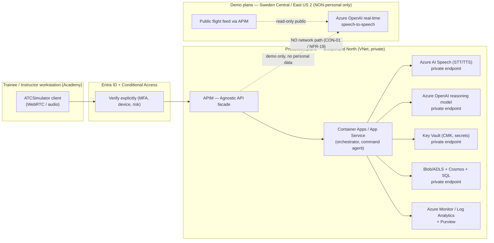

# Security Architecture & Zero Trust Baseline

| Field | Value |
| --- | --- |
| Product | ATCSimulator |
| Document | Security Architecture & Zero Trust Baseline |
| Version | 0.1 (Draft) |
| Date | 2026-07-14 |
| Author | Cloud Solution Architect (CSA), Microsoft |
| Status | Draft for Customer workshop (4 August 2026) |
| Classification | Public — anonymized demo |

**Related documents:** [COMPLIANCE.md](./COMPLIANCE.md) · [DATA.md](./DATA.md) · [AI.md](./AI.md) · [SD.md](./SD.md) · [BOM.md](./BOM.md) · [DESIGN-PRINCIPLES.md](./DESIGN-PRINCIPLES.md)

> **Scope note.** ATCSimulator is a **segregated training/simulation environment with no connection to live/operational ATC** (see [COMPLIANCE.md](./COMPLIANCE.md) §1, `CON-01`). It is **not** critical national infrastructure. It **does** process **personal/biometric-adjacent data** (trainee voice), so the security bar is "regulated-industry, state-of-the-art protection of personal data", aligned to FADP/GDPR "state of the art" and Azure Well-Architected **Security** pillar + **Zero Trust**.

---

## 1. Security principles & requirements overview

ATCSimulator adopts **Zero Trust** — *verify explicitly, use least privilege, assume breach* — across identity, network, data, application, and supply chain. Requirements are stated as `NFR-##` and traced to controls in [COMPLIANCE.md](./COMPLIANCE.md) §7.

| Pillar | Intent | Key `NFR`s |
| --- | --- | --- |
| Identity | No implicit trust; every principal verified, least-privileged, just-in-time. | NFR-01…04 |
| Network | Private-by-default data plane; no public egress for personal data; single controlled façade. | NFR-05…09 |
| Data protection | Encrypt everywhere; customer-controlled keys option; minimize & purge. | NFR-10…14 |
| Secrets & supply chain | No secrets in code; scanned IaC; posture management. | NFR-15…18 |
| Segregation | Hard boundary to operational ATC. | NFR-19 |
| Logging & audit | Full, tamper-evident observability & lineage. | NFR-20…22 |
| Resilience & ops | Secure DR, patching, incident response. | NFR-23…25 |

---

## 2. Identity (Microsoft Entra ID)

Identity is the primary security perimeter for ATCSimulator.

- **`NFR-01` Single identity plane.** All human and workload access is brokered by **Microsoft Entra ID**. No local/standalone accounts on data or AI services. Trainees, instructors, scenario authors, and operators authenticate via Entra ID (federated to the Customer's IdP as applicable). **[validate Customer IdP topology]**
- **`NFR-02` Conditional Access.** Enforce **Conditional Access** policies: require compliant/managed device + MFA for administrative and data-plane access; block legacy auth; restrict admin access to named locations; risk-based sign-in policies via Entra ID Protection. Session controls for high-risk operations.
- **`NFR-03` Managed identities + no shared secrets.** Service-to-service auth (App/Container Apps → Speech, Azure OpenAI, Storage, Cosmos, Key Vault, APIM) uses **system- or user-assigned managed identities** with **Entra-based (RBAC) data-plane auth** — **no API keys** where a managed-identity path exists. Disable local/key auth on Speech, Azure OpenAI, and Storage where supported.
- **`NFR-04` Least privilege + PIM.** **Azure RBAC least privilege**; standing access minimized. **Privileged Identity Management (PIM)** provides just-in-time, time-bound, approval-gated elevation for privileged roles (Owner, Contributor, Key Vault admin, AI resource admin). Access reviews on privileged and data-access groups. Separate duties: those who operate the platform are not the same principals who read trainee performance data.

> Traceability: NFR-01…04 → [COMPLIANCE.md](./COMPLIANCE.md) C-09.

---

## 3. Network

The design goal: **personal data never traverses a public data-plane endpoint.**

- **`NFR-05` Hub-spoke VNet.** ATCSimulator runs in a dedicated **VNet** (spoke) in **Switzerland North** for the production/personal plane, peered to a minimal hub (firewall/egress control, private DNS). Demo real-time plane runs in a **separate** subscription/VNet (Sweden Central/East US 2) with **no peering to the production personal plane** — see §6 and [COMPLIANCE.md](./COMPLIANCE.md) §5.
- **`NFR-06` Private Link / private endpoints.** **Azure AI Speech, Azure OpenAI/Foundry, Blob/ADLS, Cosmos DB, Azure SQL, Key Vault, AI Search** are reached exclusively over **private endpoints**. Public network access is **disabled** on these resources for the personal/production plane.
- **`NFR-07` No public data-plane egress for personal data.** Outbound traffic from the personal plane is forced through **Azure Firewall / egress control** with FQDN allow-listing; no direct internet data-plane egress. Diagnostic/telemetry egress is allow-listed and carries **no personal payloads**.
- **`NFR-08` APIM as the "Agnostic API" façade.** **Azure API Management** is the single, controlled entry/exit for the vendor-agnostic API boundary (voice services ↔ simulator vendors; demo public-feed ingress). APIM enforces authN/Z (Entra JWT validation, subscription keys for external simulator vendors), rate limiting, schema validation, request/response logging (personal data redacted), and mTLS to backends. External simulator vendors never reach backend services directly.
- **`NFR-09` Public-feed isolation (demo).** The demo's public live-flight feed (FlightAware/Flightradar24) is ingested **only via APIM** into the **non-personal demo plane**; it has **no route** into the personal/production plane.

> Traceability: NFR-05…09 → [COMPLIANCE.md](./COMPLIANCE.md) C-08, C-10; residency boundaries → [COMPLIANCE.md](./COMPLIANCE.md) §5 `CON-03`.

### 3.1 Network reference (mermaid)

---

## 4. Data protection

- **`NFR-10` Encryption in transit.** **TLS 1.2+** everywhere; mTLS APIM↔backends; secure WebRTC/media transport for the real-time audio stream. No unencrypted internal hops.
- **`NFR-11` Encryption at rest.** All stores (Blob/ADLS recordings & transcripts, Cosmos session state, SQL performance data) encrypted at rest by platform default (AES-256).
- **`NFR-12` Customer-managed keys (CMK) option.** Offer **CMK via Azure Key Vault** (Key Vault or Managed HSM) for Storage, Cosmos, SQL, and (where supported) AI services processing personal/sensitive data — giving the Customer key custody and revocation ("crypto-shred"). Default MVP may use Microsoft-managed keys; CMK is the recommended production posture for sensitive voice/performance data. **[validate CMK support per service at design time]**
- **`NFR-13` Key Vault as secrets/keys authority.** All secrets, certificates, and keys in **Key Vault** (private endpoint, RBAC, soft-delete + purge protection, rotation policy). No secrets in app config, code, or pipelines (see supply chain §5).
- **`NFR-14` Purge & retention of recordings/transcripts.** Enforce **minimization + time-bound retention** (see [DATA.md](./DATA.md) §4): prefer transient/streamed voice processing; recordings and transcripts carry TTL/lifecycle-management policies with automated purge; erasure workflow supports data-subject requests ([COMPLIANCE.md](./COMPLIANCE.md) C-06). CMK revocation provides crypto-shred as a backstop. Deletion is verifiable (job evidence).

> Traceability: NFR-10…14 → [COMPLIANCE.md](./COMPLIANCE.md) C-05, C-07.

---

## 5. Secrets & supply chain

- **`NFR-15` Secure SDLC with GitHub Advanced Security.** Repos use **GitHub Advanced Security**: **secret scanning + push protection** (block committed credentials), **CodeQL** static analysis, **Dependabot** dependency/vulnerability alerts. PRs require review + passing security checks before merge.
- **`NFR-16` IaC scanning.** All infrastructure is **Bicep/Terraform** (no click-ops in production). IaC is scanned (e.g., template analyzer / PSRule for Azure / checkov-class) for misconfiguration — public endpoints, missing encryption, over-broad RBAC — **before** deployment. Policy-as-code gates in CI.
- **`NFR-17` Defender for Cloud.** **Microsoft Defender for Cloud** enabled (CSPM + relevant workload plans: Servers/Containers, Storage, Key Vault, AI/APIs). Secure Score tracked; high-severity recommendations triaged; regulatory-compliance dashboard mapped to the Customer's control set.
- **`NFR-18` Supply-chain integrity.** Pinned dependencies, provenance where available, minimal base images, signed builds/deployments via GitHub Actions with **OIDC federation to Entra** (no long-lived cloud credentials in CI). Model/prompt artefacts versioned & reviewed (see [AI.md](./AI.md) §8, "no silent model swap").

> Traceability: NFR-15…18 → [COMPLIANCE.md](./COMPLIANCE.md) C-13, C-16.

---

## 6. Segregation of the training environment from operational ATC (hard boundary)

- **`NFR-19` Hard segregation (`CON-01`).** ATCSimulator MUST have **no network path, no shared identity plane, no shared data plane, and no shared secrets** with any operational/live ATC system. Enforced by: separate subscriptions/VNets with no peering to operational networks; distinct Entra security groups/PIM roles; distinct Key Vaults; Azure Policy denying peering/connectivity to operational scopes; **assertion tested** as part of release (segregation test evidence, [COMPLIANCE.md](./COMPLIANCE.md) C-10).
- The **demo real-time plane** (Sweden Central/East US 2) is additionally isolated from the **production personal plane** — no peering, no data replication (RISK-03 mitigation).
- Any future proposal to link ATCSimulator to an operational system is a **classification-changing event** requiring re-assessment, new DPIA, and assurance review (RISK-09).

---

## 7. Logging, audit & monitoring

- **`NFR-20` Centralized observability.** **Azure Monitor + Log Analytics + Application Insights** collect platform, application, APIM, identity sign-in, and resource diagnostic logs into a central workspace (in-region, access-controlled). Workspace-based Application Insights is linked to the Log Analytics workspace (see [ADR-0009](./adr/ADR-0009-workspace-observability.md)); production/personal telemetry is forced to Switzerland North, while demo/non-personal telemetry may stay in the demo region (`DP-18`). Real-time pipeline emits latency/quality telemetry (see [AI.md](./AI.md) §7) **without** personal audio payloads, transcript text, access tokens, or raw function-call arguments.
- **`NFR-21` Data governance & lineage (Purview).** **Microsoft Purview** catalogues data assets, classifies personal/sensitive data, tracks lineage across the voice→transcript→performance flow, and supports DLP posture. Sensitivity labels applied to personal/sensitive domains.
- **`NFR-22` Tamper-evidence & audit retention.** Security-relevant logs (admin actions, key access, data access, consent changes, purge/erasure jobs) are retained per policy with restricted access and immutability where required; support breach investigation and FADP/GDPR accountability. Log retention itself is minimized and access-audited (logs may contain personal identifiers).
- Alerting: Defender for Cloud + Sentinel-class analytics (optional) for security incidents; runbooks for breach notification ([COMPLIANCE.md](./COMPLIANCE.md) §3.3).

> Traceability: NFR-20…22 → [COMPLIANCE.md](./COMPLIANCE.md) C-14.

---

## 8. Resilience, operations & incident response

- **`NFR-23` Secure DR/BCP.** **Switzerland West** as in-country pairing for DR of the personal/production plane (backups, geo-redundancy stay in Switzerland). RPO/RTO **[to be set with Customer]**; DR is training-availability, not safety-of-life.
- **`NFR-24` Patch & posture hygiene.** Managed/PaaS services preferred to reduce patch surface; container images rebuilt on base-image CVEs; Defender recommendations SLA'd.
- **`NFR-25` Incident response.** Documented IR runbook incl. **breach-notification path to FDPIC / supervisory authority** and data subjects ([COMPLIANCE.md](./COMPLIANCE.md) §3.3); roles per RACI ([COMPLIANCE.md](./COMPLIANCE.md) §6.2). Tabletop the voice-pipeline breach scenario before production.

---

## 9. Threat model (STRIDE)

Two highest-value surfaces are modelled: **(A) the real-time voice pipeline** and **(B) the Agnostic API (APIM boundary)**. STRIDE = Spoofing, Tampering, Repudiation, Information disclosure, Denial of service, Elevation of privilege.

### 9.1 Real-time voice pipeline (trainee audio → STT → NLP/command → TTS → audio)

| STRIDE | Threat | Mitigation | `NFR` / control |
| --- | --- | --- | --- |
| **S**poofing | Attacker impersonates a trainee/instructor or injects audio into a session. | Entra auth + Conditional Access; per-session token bound to identity; mTLS/secure media transport; session-to-identity binding at APIM. | NFR-01/02/08/10 |
| **T**ampering | Manipulation of audio/transcript/command in transit or of the command payload sent to the simulator. | TLS/mTLS end-to-end; schema validation of commands; deterministic tool-calling with server-side validation ([AI.md](./AI.md) §3); integrity checks on stored recordings. | NFR-08/10; AI guardrails |
| **R**epudiation | User/operator denies an action or a data access. | Immutable, identity-attributed audit logs; consent-change and purge logs; Purview lineage. | NFR-20/21/22 |
| **I**nformation disclosure | Leakage of biometric-adjacent voice / transcripts / performance data (network exfil, model memorization, log spillage). | Private Link, no public egress; encryption + CMK option; log redaction (no audio in telemetry); minimization/purge; groundedness + no-training-on-data (RISK-08); least privilege. | NFR-06/07/11/12/14; [COMPLIANCE.md](./COMPLIANCE.md) C-05/07/08 |
| **D**enial of service | Flooding the real-time endpoint (costly + disrupts training). | APIM rate limiting/quotas; autoscale bounds + budget alerts; WAF on ingress; back-pressure on audio stream. | NFR-08/17 |
| **E**levation of privilege | Compromised workload identity reaches data stores or keys. | Managed identities + least-privilege RBAC; PIM JIT; Key Vault RBAC + purge protection; segregation of duties. | NFR-03/04/13/19 |

### 9.2 Agnostic API (APIM boundary to simulator vendors & demo feed)

| STRIDE | Threat | Mitigation | `NFR` / control |
| --- | --- | --- | --- |
| **S**poofing | Rogue "simulator vendor" or client calls the Agnostic API. | APIM: Entra JWT validation + per-vendor subscription keys/certs; mTLS to/from backends; IP allow-listing where feasible. | NFR-08 |
| **T**ampering | Malicious/malformed command payloads to drive the simulator or backend. | Strict OpenAPI schema validation at APIM ([DATA.md](./DATA.md) §5, `../../api/openapi.yaml`); reject unknown fields; command allow-list; server-side authorization per action. | NFR-08; AI §3 |
| **R**epudiation | Vendor disputes a dispatched command. | APIM request/response logging (personal data redacted), correlation IDs, signed audit trail. | NFR-20/22 |
| **I**nformation disclosure | Over-broad API responses leak personal/session data to a vendor integration. | Data contracts expose **minimum necessary** fields ([DATA.md](./DATA.md) §5); no personal data on the vendor/demo path; response filtering; DLP posture. | NFR-08/21; [COMPLIANCE.md](./COMPLIANCE.md) C-04 |
| **D**enial of service | API flooding via the public/vendor edge. | APIM quotas/throttling; WAF; autoscale bounds; circuit breakers. | NFR-08/17 |
| **E**levation of privilege | API path used to pivot into the production personal plane. | Hard segregation (NFR-19); demo plane has no route to production; least-privilege backend identities; no shared secrets. | NFR-19/03/04 |

---

## 10. Demo vs full-scope security delta

| Dimension | Demo / MVP (Scope 2) | Full / production (Scope 1) |
| --- | --- | --- |
| **Data sensitivity** | Public + synthetic; **no personal data**. | Personal/biometric-adjacent voice + performance. |
| **Residency** | Sweden Central (EU) / East US 2 (US) permitted (real-time model availability). | Switzerland North in-country; EU Data Zone fallback; **no US for personal data** (`CON-03`). |
| **Network** | Sandbox VNet; APIM façade still used; public feed ingress. | Full private-endpoint mesh; no public data-plane egress; forced-tunnel egress. |
| **Identity** | Entra auth + CA (still applied). | Full CA + PIM + access reviews + segregation of duties. |
| **Keys/encryption** | Platform-managed keys sufficient. | CMK option; Key Vault purge protection; crypto-shred. |
| **Segregation** | Isolated sandbox (no operational linkage). | Hard boundary asserted **and tested** (NFR-19). |
| **Logging** | Basic Azure Monitor. | Full Purview lineage + tamper-evident audit + IR runbooks. |
| **Sign-off** | Isolated sandbox → **no architecture sign-off** required. | Signed architecture (EA + Governance), Defender compliance dashboard. |
| **Supply chain** | GHAS + IaC scanning recommended (good practice). | Enforced gates, OIDC CI, provenance, no-silent-model-swap. |

> **Framing for the workshop:** the demo can adopt the *latest & greatest* (GA/Preview) cloud AI in EU/US because it holds **no personal data**; Zero-Trust identity/network hygiene still applies, but the heavy data-protection controls (CMK, in-country residency, purge/DSR, tested segregation) attach when real trainee voice enters production.

---

## 11. Security requirements index (`NFR-##`)

| ID | Requirement | Pillar |
| --- | --- | --- |
| NFR-01 | Single Entra ID identity plane; no local accounts on data/AI services. | Identity |
| NFR-02 | Conditional Access (MFA, device, risk, no legacy auth). | Identity |
| NFR-03 | Managed identities + Entra RBAC data-plane auth; disable key auth where possible. | Identity |
| NFR-04 | Least-privilege RBAC + PIM JIT + access reviews + SoD. | Identity |
| NFR-05 | Dedicated VNet (Switzerland North); demo plane separate, unpeered. | Network |
| NFR-06 | Private endpoints for Speech/OpenAI/Storage/Cosmos/SQL/KV/Search; public access disabled. | Network |
| NFR-07 | No public data-plane egress for personal data; forced-tunnel + FQDN allow-list. | Network |
| NFR-08 | APIM as sole Agnostic-API façade (authN/Z, schema validation, rate limit, mTLS, logging). | Network |
| NFR-09 | Demo public-feed isolated from personal/production plane. | Network |
| NFR-10 | TLS 1.2+ / mTLS / secure media transport everywhere. | Data |
| NFR-11 | Encryption at rest (AES-256) on all stores. | Data |
| NFR-12 | Customer-managed keys (CMK) option for sensitive data. | Data |
| NFR-13 | Key Vault as secrets/keys authority (private, RBAC, purge protection, rotation). | Data |
| NFR-14 | Minimization + time-bound retention + verifiable purge/erasure of recordings & transcripts. | Data |
| NFR-15 | GitHub Advanced Security (secret scanning/push protection, CodeQL, Dependabot). | Supply chain |
| NFR-16 | IaC (Bicep/Terraform) scanned + policy-as-code gates before deploy. | Supply chain |
| NFR-17 | Defender for Cloud (CSPM + workload plans); Secure Score triage. | Supply chain |
| NFR-18 | Supply-chain integrity; OIDC CI (no long-lived creds); versioned model/prompt artefacts. | Supply chain |
| NFR-19 | Hard segregation from operational ATC (no network/identity/data/secret sharing; tested). | Segregation |
| NFR-20 | Centralized Azure Monitor/Log Analytics/App Insights; no personal audio in telemetry. | Logging |
| NFR-21 | Purview cataloguing, classification, lineage, DLP posture; sensitivity labels. | Logging |
| NFR-22 | Tamper-evident, identity-attributed audit logs; minimized, access-audited retention. | Logging |
| NFR-23 | In-country DR pairing (Switzerland West); RPO/RTO agreed. | Resilience |
| NFR-24 | Patch/posture hygiene; managed services preferred. | Resilience |
| NFR-25 | Incident-response runbook incl. FDPIC/supervisory breach-notification path. | Resilience |
