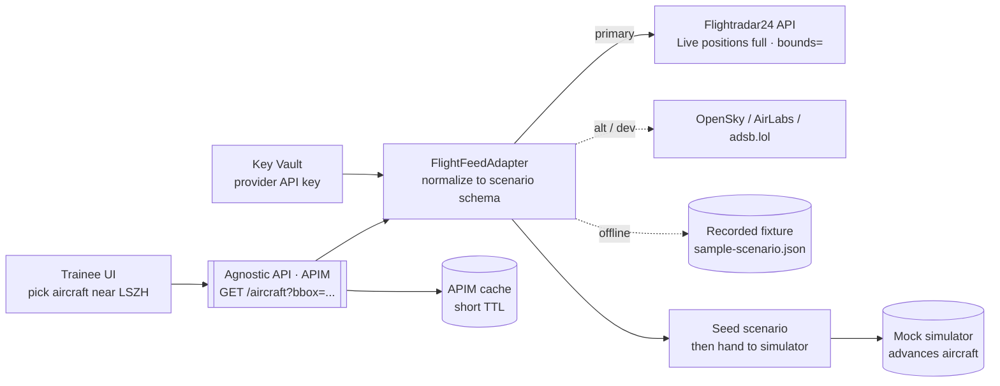

# ATCSimulator — Public Flight-Data Sourcing for the Demo (FLIGHT-DATA-SOURCES)

| Field | Value |
| --- | --- |
| Product | ATCSimulator |
| Document | Public Flight-Data Sourcing & Integration (Demo scope) |
| Version | 0.1 (Draft) |
| Date | 2026-07-14 |
| Author | Cloud Solution Architect (CSA), Microsoft |
| Status | Draft for Customer workshop (4 August 2026) |
| Classification | Confidential — anonymized |

**Related documents:** [SD.md](./SD.md) · [BOM.md](./BOM.md) · [PRD.md](./PRD.md) (FR-01, ASS-03) · [SECURITY.md](./SECURITY.md) · [COMPLIANCE.md](./COMPLIANCE.md) · [DATA.md](./DATA.md) · [adr/ADR-0004-flight-data-provider.md](./adr/ADR-0004-flight-data-provider.md) · [../api/openapi.yaml](../api/openapi.yaml) · [../data/scenarios/sample-scenario.json](../data/scenarios/sample-scenario.json)

> **Freshness.** Endpoints, pricing, and terms below were retrieved on **14 July 2026** from each provider's own documentation. **Pricing and terms change — re-verify on the provider site and confirm the licence for a training-simulator/derivative-works use before the Customer demo.**

---

## 1. What the demo actually needs from a flight feed

The demo (Scope 2, **FR-01**) requirement is simple: *let the trainee pick a real aircraft near a Swiss airport and use it to seed a voice-simulation scenario.* So the feed must give us, for aircraft in a **geographic area** (bounding box / radius around e.g. Zürich **LSZH** `47.43, 8.53`):

| Needed field | Used for | Present in `sample-scenario.json` |
| --- | --- | --- |
| Callsign / flight number | The aircraft the trainee addresses ("Swiss 456…") | `aircraft.callsign` |
| Aircraft type (ICAO) | Realistic performance & phraseology | `aircraft.type` |
| Latitude / longitude | Start position | `aircraft.position` |
| Altitude (baro/geo) | Start level | `aircraft.altitude_ft` |
| Heading / track | Start heading | `aircraft.heading_deg` |
| Ground speed | Start speed | `aircraft.ground_speed_kt` |
| Registration (nice-to-have) | GA callsigns (e.g. "N123AB") | `aircraft.registration` |

> **Key architectural insight — "seed once, then simulate."** The demo only needs **one snapshot** to *initialise* the scenario. After that, ATCSimulator's own kinematics/mock simulator advances the aircraft in response to the trainee's instructions — it does **not** keep tracking the real flight. This means **one API call per scenario start** (tiny cost/rate footprint), and it decouples the demo from feed latency, gaps, and outages. Continuous live tracking is explicitly **out of scope** for the demo.

**Nature of the data:** ADS-B / flight-tracking data describes **aircraft**, not identified natural persons → **not personal data**, so there is **no data-residency constraint** on the feed itself for the demo (see [COMPLIANCE.md](./COMPLIANCE.md), [DATA.md](./DATA.md)). The **gating concern is the provider's Terms of Service / commercial licence**, plus one Azure-hosting caveat noted below.

## 2. The options at a glance

| Provider | Type | Bounding-box / area query | Commercial licence? | Free/entry tier | Fields incl. heading? | Best for |
| --- | --- | --- | --- | --- | --- | --- |
| **Flightradar24 API** (`fr24api.flightradar24.com`) | Commercial aggregator (ADS-B/MLAT/estimation) | ✅ `bounds` (lat/lon box) | ✅ Yes (per T&C) | **Explorer $9/mo** + free **sandbox** key | ✅ (light+full: callsign, reg, type, orig/dest) | **Primary demo pick** — matches referenced source, cheap, licensed |
| **FlightAware AeroAPI v4** (`aeroapi.flightaware.com`) | Commercial (ADS-B + Aireon satellite) | ✅ `/flights/search -latlong "minLat minLon maxLat maxLon"` | ✅ Standard/Premium; Personal = personal/academic only | Personal ≈ $5 free queries/mo (non-commercial) | ✅ position, track, alt, speed | Strong alternative; richest status/ETA data |
| **OpenSky Network** (`opensky-network.org/api`) | Community/research | ✅ `/states/all?lamin&lomin&lamax&lomax` | ❌ **Non-commercial/research only** (commercial by contact) | Free (400 credits/day anon; 4000 auth) | ✅ `true_track` | Free **local dev / PoC** only — see Azure caveat |
| **adsb.lol** (`api.adsb.lol`) | Community, open data (ODbL) | ✅ `/v2/point/{lat}/{lon}/{radius}` (≤250 nm) | ⚠️ Open data, contact for production | Free | ✅ | Free dev; attribution required |
| **airplanes.live** (`api.airplanes.live/v2`) | Community, unfiltered | ✅ `/point/{lat}/{lon}/{radius}` (≤250 nm) | ❌ **Non-commercial** | Free, 1 req/sec | ✅ | Free dev; no SLA |
| **ADS-B Exchange** (Enterprise API) | Commercial, unfiltered | ✅ filter + streaming | ✅ Yes | Paid (RapidAPI/enterprise) | ✅ | Commercial, unfiltered coverage |
| **AirLabs** (`airlabs.co/api/v9/flights`) | Commercial aggregator | ✅ `bbox=SWlat,SWlng,NElat,NElng` | ✅ Yes | Free tier (subset of fields) | ✅ `dir` | Clean bbox + free tier alt |
| **aviationstack** (`api.aviationstack.com/v1`) | Commercial aggregator (schedule/status) | ⚠️ by flight/route, limited live position | ✅ paid; free = personal | Free 100 req/mo (HTTP only) | partial | Schedule/status, not ideal for map-pick |

## 3. Provider deep-dive (demo-relevant facts)

### 3.1 Flightradar24 API — **recommended primary** (matches the referenced source)

- **Separate product & subscription** from the FR24 website; sign up at the FR24 API portal to get a token. A **free sandbox API key** lets you test endpoints without spending credits.
- **Endpoints we need:** *Live flight positions (light)* — lat, lon, speed, altitude; *Live flight positions (full)* — adds callsign, registration, aircraft type, origin, destination. Also airports/airlines reference endpoints, historic, flight tracks. A **`bounds`** parameter selects a geographic box (more reliable than the airport filter for a map-pick), and you can filter by callsign/registration.
- **Pricing (credit-based, per returned entity):** Explorer **$9/mo** (~30–60k credits), Essential **$90/mo**, Advanced **$900/mo**. *Live positions light* costs ~**6 credits per flight returned**; a no-result query costs 1 credit. With "seed once" (one small bounded query per scenario), Explorer is ample for a demo.
- **Latency:** typically **< 1 s** response; positions refresh ~**every 3 s** per aircraft.
- **Commercial use:** permitted per FR24 T&C. **Official SDKs (JavaScript, Python)** and an **MCP server** exist — the MCP server is interesting for the agent-driven build (a Copilot/agent can query flights in natural language).
- **Why primary:** it is the source Urs referenced, it is inexpensive, **commercially licensed**, has the richest demo-relevant fields (callsign + type + registration + route), and offers a free sandbox for building.

### 3.2 FlightAware AeroAPI v4 — strong alternative

- REST, base `https://aeroapi.flightaware.com/aeroapi`, auth via **`x-apikey`** header; 60+ endpoints; OpenAPI spec published.
- **Area query:** `GET /flights/search?query=-latlong "minLat minLon maxLat maxLon" -belowAltitude N` returns airborne flights in a box; `GET /flights/{id}/position` gives a single aircraft's position/track/altitude/speed.
- **Pricing tiers:** **Personal** (personal/academic **only**, ~$5 free queries/mo — *not* valid for a Customer/commercial demo), **Standard** ($100/mo min, B2C commercial), **Premium** ($1,000/mo min, B2B + Foresight predictions + Aireon satellite ADS-B). Rate up to ~100 result-sets/sec (Premium).
- **Coverage:** global, ADS-B + **satellite ADS-B (Aireon)** — excellent, but the Personal free tier's licence excludes a commercial demo, so budget for **Standard** if using AeroAPI in front of the Customer.

### 3.3 OpenSky Network — free, but two hard caveats

- REST, base `https://opensky-network.org/api`; `GET /states/all?lamin=&lomin=&lamax=&lomax=` returns state vectors in a WGS-84 bounding box. **Verified Switzerland box:** `lamin=45.8389&lomin=5.9962&lamax=47.8229&lomax=10.5226`.
- **State-vector fields** include `callsign`, `longitude`, `latitude`, `baro_altitude`/`geo_altitude`, `velocity`, **`true_track`** (heading), `vertical_rate`, `squawk`, `category` — everything the demo needs.
- **Auth:** OAuth2 **client-credentials** (Bearer token, 30-min expiry). Anonymous = 400 credits/day @ 10 s resolution; authenticated = 4,000/day @ 5 s; contributors 8,000/day. A bounded query over Switzerland costs ~1 credit.
- ⚠️ **Caveat 1 — licence:** OpenSky is for **research and non-commercial** purposes; commercial use requires contacting them. A Microsoft-to-Customer commercial demo is a licensing grey area → prefer a commercially-licensed provider for the customer-facing demo.
- ⚠️ **Caveat 2 — Azure hosting:** OpenSky's own docs state they **may block AWS and other hyperscaler IP ranges** due to abuse. An Azure-hosted demo could be throttled/blocked. → OpenSky is ideal for **local developer spikes**, risky for an **Azure-hosted** demo.

### 3.4 Community ADS-B feeds — adsb.lol / airplanes.live

- **adsb.lol:** free, open data under **ODbL** (attribution/share-alike). Handy endpoints: `/v2/point/{lat}/{lon}/{radius}`, `/v2/closest/{lat}/{lon}/{radius}` (single nearest aircraft — perfect for "pick one near LSZH"), `/v2/callsign/{callsign}`, `/v2/type/{type}`. Radius ≤ 250 nm. Production use → contact the maintainer.
- **airplanes.live:** free REST `api.airplanes.live/v2/point/{lat}/{lon}/{radius}` (≤250 nm), **1 request/second**, **non-commercial**, **no SLA / no uptime guarantee**.
- Both are great for **internal dev**, but the **non-commercial / ODbL** terms and lack of SLA make them unsuitable as the primary source for a **commercial customer demo** without explicit clearance.

### 3.5 Aggregators — AirLabs / aviationstack / ADS-B Exchange

- **AirLabs:** `GET /api/v9/flights?bbox=SWlat,SWlng,NElat,NElng` with fields `hex, reg_number, lat, lng, alt, dir` (heading), `speed`, `flight_iata`, `aircraft_icao`, `status`; has a **free tier** (subset of fields) and commercial plans. Clean bbox model — a solid commercial alternative.
- **aviationstack:** more **schedule/status**-oriented (query by flight/route, live position where available, 30–60 s delay); free = 100 req/mo HTTP-only. Less suited to a **map-pick-an-aircraft** UX.
- **ADS-B Exchange (Enterprise API):** commercial, **unfiltered** global coverage, `X-Api-Key`, filter endpoints + **real-time streaming (push)**. Good if unfiltered/military coverage or push streaming is wanted.

## 4. Field mapping — provider → `sample-scenario.json`

| Scenario field | Flightradar24 (full) | FlightAware AeroAPI | OpenSky `/states/all` | AirLabs |
| --- | --- | --- | --- | --- |
| `aircraft.callsign` | `callsign` | `ident` | `states[i][1]` (callsign) | `flight_icao`/`flight_iata` |
| `aircraft.registration` | `registration` | registration | (derive from `icao24`) | `reg_number` |
| `aircraft.type` | `type` | `aircraft_type` | `category` (coarse) | `aircraft_icao` |
| `aircraft.position.lat/lon` | `lat`/`lon` | position lat/lon | `states[i][6]`/`[5]` | `lat`/`lng` |
| `aircraft.altitude_ft` | `alt` | `altitude` | `baro_altitude` (m→ft) | `alt` (m→ft) |
| `aircraft.heading_deg` | `track` | `heading` | `true_track` | `dir` |
| `aircraft.ground_speed_kt` | `gspeed` | `groundspeed` | `velocity` (m/s→kt) | `speed` |

> Unit conversions: OpenSky altitude/velocity are **metric** (m, m/s) → convert to **feet / knots**. FR24 & AeroAPI already report aviation units. The **FlightFeedAdapter** normalizes all providers to the scenario schema.

## 5. Recommendation

1. **Primary (customer demo): Flightradar24 API — Explorer ($9/mo) or Essential ($90/mo).** Commercially licensed, matches the referenced source, richest demo fields, free sandbox to build against, official SDKs + MCP. Use the *Live flight positions (full)* endpoint with a `bounds` box around the chosen Swiss airport.
2. **Alternative (customer demo): FlightAware AeroAPI Standard ($100/mo)** if the Customer prefers FlightAware or wants Aireon satellite coverage. Use `/flights/search -latlong`.
3. **Free developer spikes only: OpenSky Network** (exact Swiss bbox in hand) or **adsb.lol/airplanes.live** — great for building/testing locally, **not** for the commercial customer demo (non-commercial licence; OpenSky may block Azure IPs).
4. **Always ship a recorded fixture.** Capture **one real snapshot** into a fixture (extend [`../data/scenarios/sample-scenario.json`](../data/scenarios/sample-scenario.json)) so the workshop demo is **reproducible offline** and independent of live-feed availability/rate limits. Live feed = the "wow"; the fixture = the safety net. This is the recommended default demo path.

Decision recorded in [adr/ADR-0004-flight-data-provider.md](./adr/ADR-0004-flight-data-provider.md).

## 6. Integration pattern (how ATCSimulator consumes it)



**Design rules (tie to existing ADRs & NFRs):**

- **Behind the Agnostic API / APIM façade** with a **`FlightFeedAdapter`** interface — swap FR24 ↔ AeroAPI ↔ OpenSky ↔ fixture without touching the app (same vendor-agnostic pattern as [ADR-0002](./adr/ADR-0002-agnostic-api-facade.md)).
- **Server-side only.** The provider **API key lives in Key Vault** and is used by the backend/adapter — **never** exposed to the browser ([SECURITY.md](./SECURITY.md), NFR-07/09).
- **Seed once, then simulate** (see §1) → one bounded query per scenario start; minimal credits.
- **Cache** at APIM with a short TTL; handle `429` rate-limit with backoff; on feed failure **fall back to the recorded fixture** (fail-safe, NFR-05).
- **No personal data** flows from the feed → no residency constraint on the feed call (demo can run from Sweden Central/EU or a Swiss region); the ToS/licence is the compliance gate, tracked as **ASS-03** ([PRD.md](./PRD.md)).

## 7. Sample requests (as of Jul 2026 — verify exact paths in each portal)

**OpenSky — aircraft over Switzerland (free, dev):**

```bash
# OAuth2 client-credentials → Bearer token (token valid 30 min)
TOKEN=$(curl -s -X POST \
  "https://auth.opensky-network.org/auth/realms/opensky-network/protocol/openid-connect/token" \
  -d "grant_type=client_credentials" -d "client_id=$CID" -d "client_secret=$CSECRET" | jq -r .access_token)

# Bounding box over Switzerland
curl -s -H "Authorization: Bearer $TOKEN" \
  "https://opensky-network.org/api/states/all?lamin=45.8389&lomin=5.9962&lamax=47.8229&lomax=10.5226" | jq .
```

**FlightAware AeroAPI — airborne flights in a box near LSZH:**

```bash
curl -s -H "x-apikey: $AEROAPI_KEY" \
  'https://aeroapi.flightaware.com/aeroapi/flights/search?query=-latlong "47.2 8.3 47.7 8.8"'
```

**airplanes.live — single nearest aircraft to LSZH (free, dev):**

```bash
curl -s "https://api.airplanes.live/v2/point/47.43/8.53/50"   # 50 nm radius
```

**AirLabs — bbox around Zürich (commercial, has free tier):**

```bash
curl -s "https://airlabs.co/api/v9/flights?bbox=47.2,8.3,47.7,8.8&api_key=$AIRLABS_KEY"
```

**Flightradar24 — live positions in a bounds box (primary; exact path/param per FR24 API portal):**

```bash
# Conceptual — use the FR24 API portal's "Live flight positions full" endpoint with a bounds box.
curl -s -H "Authorization: Bearer $FR24_TOKEN" \
  "https://fr24api.flightradar24.com/<live-flight-positions-full>?bounds=47.7,8.3,47.2,8.8"
```

## 8. Terms-of-Service & compliance notes (validate before the demo)

- **Licence is the gate, not residency.** Flight/ADS-B data is public and non-personal; the constraint is each provider's **ToS/commercial licence** and any **attribution** requirement (e.g., adsb.lol ODbL). Confirm the licence explicitly permits **use in a training simulator / creation of derivative works** for the Customer.
- **Non-commercial providers** (OpenSky, airplanes.live) must **not** be the source for a commercial customer demo; keep them to internal dev.
- **OpenSky + Azure:** possible hyperscaler-IP blocking — don't depend on it from Azure.
- **Keep it demo-only:** the feed seeds a **training** scenario with **no link to operational ATC** (CON-01). Do not present the demo as live operational awareness.
- Track provider choice, tier, and key handling as **ASS-03 / RISK** items and in [OPERATIONS.md](./OPERATIONS.md) cost drivers.
