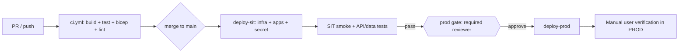

# Cloud Platform IaC & GitHub CI/CD Design

| Field | Value |
| --- | --- |
| Product | ATCSimulator |
| Document | Cloud Platform IaC & GitHub CI/CD — Design |
| Type | Spec |
| Version | 0.1 (Draft) |
| Date | 2026-07-15 |
| Author | ATCSimulator team |
| Status | Draft approved for planning |
| Classification | Public — anonymized demo |
| Subscription | `75102af9-fc92-45d4-99a8-5510a24b5421` (ME-MngEnvMCAP164444-urruegg-2) |
| Directory | `Contoso (mngenvmcap164444.onmicrosoft.com)` |
| Region | Sweden Central (EU) |

**Related documents:** [SD.md](../SD.md) · [SECURITY.md](../SECURITY.md) · [VERSIONING.md](../VERSIONING.md) · [two-PoCs design](./2026-07-14-two-pocs-demo-foundation-design.md) · [AGENT_WORKFLOW.md](../../.github/agents/AGENT_WORKFLOW.md) · [azure.yaml](../../azure.yaml) · [infra/main.bicep](../../infra/main.bicep)

---

## 1. Objective

Establish the cloud platform (IaC) and GitHub CI/CD so the sprint-1 App Service
baseline (shared web shell + `flight-data-api` + `voice-agent-api`) is deployed to
two cloud environments with a gated production promotion.

Desired outcomes:

1. End-to-end tested **SIT** and **PROD** environments usable for the PoC, Demo, and MVP scope.
2. The **PoC deployed end-to-end and user-verified in PROD**.

## 2. Environments

Three tiers, only two of them cloud-hosted:

| Tier | Hosting | Purpose | Trigger |
| --- | --- | --- | --- |
| dev | Local only | Developer inner loop (Vite + `dotnet run`) | n/a |
| sit | Cloud (`rg-atcsim-sit`) | Integration testing; gates PROD | Auto on merge to `main` |
| prod | Cloud (`rg-atcsim-prod`) | Production for PoC/Demo/MVP | Manual required-reviewer gate |

- Single subscription, two resource groups, both in **Sweden Central**.
- The `dev` tier is not deployed to the cloud; it remains the local inner loop.

## 3. Region & residency decision

- **Decision:** SIT and PROD both run in **Sweden Central (EU)** to showcase the art
  of the possible on the currently available Microsoft stack (including real-time
  speech options for later voice work).
- **Traceability:** PoC/Demo is **public/synthetic data only** (`CON-03`), so the
  EU region is compliant. The MVP's in-country requirement (personal/production data
  and classic STT/TTS → **Switzerland North**, DP-18) is **documented and deferred**;
  when MVP personal-data scope is committed, residency is revisited (see
  [SECURITY.md](../SECURITY.md) and the region availability caveat in the BOM).
- **Open item to report:** what is GA in Switzerland North today vs the EU Data Zone
  is captured for stakeholders as part of this sprint's documentation.

## 4. Infrastructure as code

- Reuse the existing RG-scoped [infra/main.bicep](../../infra/main.bicep) and modules
  (App Service plan B1 Linux, web app, two API apps, Key Vault, App Insights + Log
  Analytics) from sprint 1.
- Add `infra/parameters/sit.bicepparam` and `infra/parameters/prod.bicepparam`
  (prefix `atcsim`, `location = swedencentral`, `environment` tag); keep
  `dev.bicepparam` for local validation.
- `resourceToken = uniqueString(resourceGroup().id)` yields per-environment unique
  resource names automatically, so SIT and PROD never collide.

## 5. Identity & authentication (OIDC, no stored cloud secrets)

- One Entra app registration `gh-atcsim-deployer` with **federated credentials**
  subject-scoped to `repo:urruegg/ATCSimulator:environment:sit` and
  `repo:urruegg/ATCSimulator:environment:prod`.
- **RBAC scoped to the two resource groups** (least privilege): **Contributor** plus
  **User Access Administrator** — the latter is required because `main.bicep` creates
  Key Vault role assignments. Not subscription-wide.
- GitHub **Environments**: `sit` (no gate) and `prod` (**required reviewer**). Store
  `AZURE_CLIENT_ID`, `AZURE_TENANT_ID`, `AZURE_SUBSCRIPTION_ID` as variables and
  `FR24_TOKEN` as a per-environment secret.

## 6. CI/CD workflows

Two workflow files under `.github/workflows/`:

- **`ci.yml`** — on pull request and push to `main`: `dotnet test` (both API test
  projects), `npm ci && npm test && npm run build` (shell), `az bicep build`
  (infra), and markdownlint. This also establishes the currently-missing CI.
- **`cd.yml`** — on push to `main` after CI is green (and `workflow_dispatch`):
  - `deploy-sit` (environment `sit`): OIDC login → `az deployment group create`
    (infra) → write FR24 secret to Key Vault → build/publish apps →
    `az webapp deploy` → run the SIT verification script → output SIT URLs.
  - `deploy-prod` (environment `prod`, `needs: deploy-sit`): required-reviewer gate
    → same deployment against `rg-atcsim-prod` → output PROD URLs for manual
    user-verification.

## 7. Deployment mechanics (GitHub Actions native, no azd)

- **Infra:** `az deployment group create -g rg-atcsim-<env> -f infra/main.bicep -p infra/parameters/<env>.bicepparam`.
- **APIs (.NET):** `dotnet publish -c Release` → zip → `az webapp deploy --type zip`.
- **Web (Vite SPA):** built **per environment** inside the deploy job, because Vite
  bakes `VITE_*` values at build time; the target environment's API base URLs and
  Entra client IDs are injected then. The built `dist` is deployed to the Node App
  Service with a `pm2 serve … --spa` startup command. Azure Static Web Apps is noted
  as a cleaner future option and is out of scope here.

## 8. Verification

- **Automated SIT gate** (must pass before the PROD gate opens):
  - both APIs `/health` return 200;
  - `GET /api/aircraft?bounds=…` returns at least one live FR24 aircraft;
  - `POST /api/voice/respond` returns a mock answer;
  - web root returns 200.
  Implemented as a small script executed in the `deploy-sit` job.
- **PROD verification:** the workflow posts the PROD URLs; a human performs the
  manual walkthrough (sign in → select an aircraft on the map → run the voice proof).
  This satisfies outcome 2.

## 9. Secrets & configuration

- `FR24_TOKEN` (GitHub environment secret) is written to Key Vault
  (`az keyvault secret set --name fr24-token`); the app consumes it through the
  existing `Fr24__Token` Key Vault reference.
- Foundry / real-time model settings remain documented placeholders (voice stays
  mock this sprint).
- No secrets in the repository: OIDC for cloud access, Key Vault for app secrets.

## 10. Security & guardrails

- Least-privilege RBAC scoped to the two resource groups.
- Key Vault RBAC and no public data endpoints (already enforced in the modules).
- `az bicep build` validation gate in CI; PSRule/checkov IaC scanning and a
  Defender-for-Cloud / Secure-Score uplift are noted as follow-ups.
- No operational-ATC connectivity (`CON-01`); no personal data in these environments
  (`CON-03`).

## 11. Responsibilities

- **Agent-produced:** `sit`/`prod` bicepparams, `ci.yml`, `cd.yml`, the SIT
  verification script, `scripts/bootstrap-cicd.ps1`, and ALM/operations
  documentation, plus the sprint issue and implementation plan.
- **Human-run (non-delegable, see [NON_DELEGABLE_WORK.md](../../.github/agents/NON_DELEGABLE_WORK.md)):**
  the one-time identity/RBAC/resource-group bootstrap, creating the GitHub
  Environments + reviewer + secrets/variables, providing the FR24 token, approving
  the PROD gate, and performing the PROD user-verification. Cloud (`az`/`gh`) auth
  is not available in the build workspace, so all cloud execution is human-run.

## 12. Out of scope

- Foundry / real voice path (voice remains the tool-first mock).
- Azure Static Web Apps migration for the web tier.
- `semantic-release` automation (Phase 2, post-PoC — see [VERSIONING.md](../VERSIONING.md)).
- Personal-data / Switzerland-North residency and multi-region disaster recovery.

## 13. Decisions captured (brainstorming, 2026-07-15)

1. Region: Sweden Central (EU) for SIT and PROD; CH residency documented and deferred.
2. Promotion: merge to `main` auto-deploys SIT; PROD behind a required-reviewer gate.
3. Verification: automated smoke + API/data checks gate SIT; PROD verified manually.
4. Scope: baseline only; voice stays mock; FR24 token provided.
5. Deploy mechanism: GitHub Actions native `az` CLI + Bicep (no azd).
