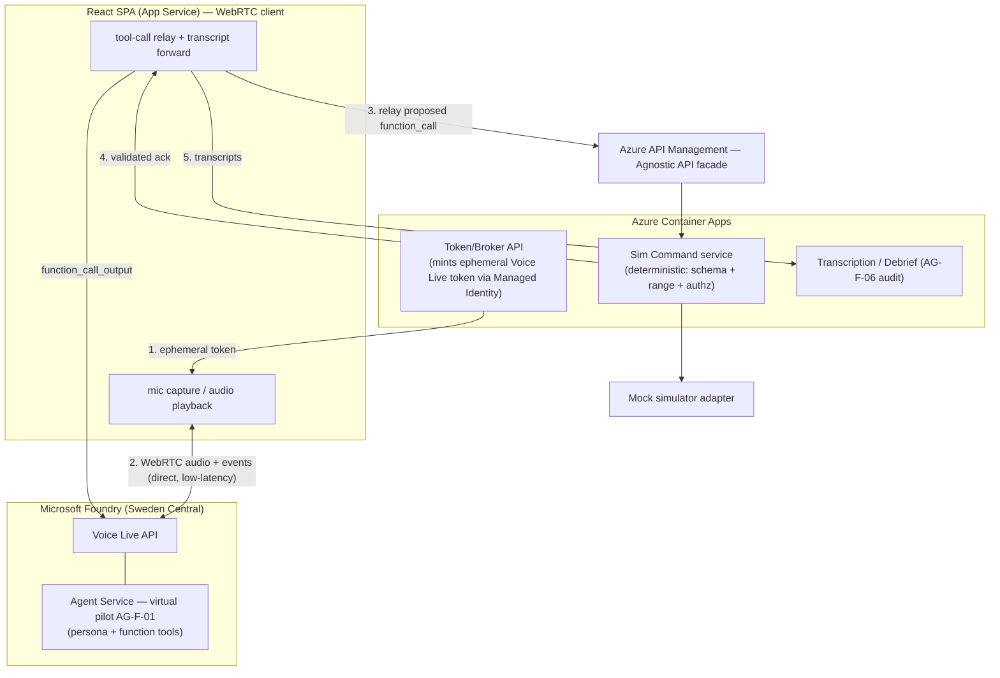

# Voice Live + Foundry Agent Service — PoC Scope Readjustment Design

| Field | Value |
| --- | --- |
| Product | ATCSimulator |
| Document | Voice Live + Foundry Agent Service — PoC Scope Readjustment (Design) |
| Type | Spec |
| Version | 0.1 (Draft) |
| Date | 2026-07-15 |
| Author | ATCSimulator team |
| Status | Draft approved for planning |
| Classification | Public — anonymized demo |
| Subscription | `75102af9-fc92-45d4-99a8-5510a24b5421` (ME-MngEnvMCAP164444-urruegg-2) |
| Region | Sweden Central (EU) — demo plane |

**Related documents:** [BOM.md](../BOM.md) · [SD.md](../SD.md) · [AI.md](../AI.md) · [SECURITY.md](../SECURITY.md) · [COMPLIANCE.md](../COMPLIANCE.md) · [DESIGN-PRINCIPLES.md](../DESIGN-PRINCIPLES.md) · [AGENTS.md](../../AGENTS.md) · [ADR-0001](../adr/ADR-0001-realtime-model-region.md) · [ADR-0002](../adr/ADR-0002-agnostic-api-facade.md) · [ADR-0003](../adr/ADR-0003-split-plane-data-residency.md) · [api/openapi.yaml](../../api/openapi.yaml) · [cloud-platform design](./2026-07-15-cloud-platform-cicd-design.md)

---

## 1. Objective

Readjust the **PoC / demo plane (Scope 2)** real-time voice loop to adopt the
**Azure Voice Live API** (managed speech-to-speech) driven by **Microsoft Foundry
Agent Service**, following guidance from the Foundry CSA. This supersedes the
hand-orchestrated `gpt-realtime` approach of [ADR-0001](../adr/ADR-0001-realtime-model-region.md)
for the demo, while preserving every ATCSimulator guardrail.

Desired outcomes:

1. A lower-latency, lower-engineering virtual-pilot loop using a single managed API.
2. The virtual pilot's intelligence lives in a **Foundry Agent Service** agent.
3. The deterministic simulator-command boundary and residency posture are unchanged.

## 2. Approved decisions

| # | Decision | Choice |
| --- | --- | --- |
| D1 | Real-time audio transport | **WebRTC direct** (browser ↔ Voice Live), latency-first |
| D2 | Virtual-pilot brain | **Foundry Agent Service** (`agent_id`/`project_id`) behind Voice Live |
| D3 | Avatar | **Voice-only** for the PoC (no talking-head avatar) |
| D4 | Scope of change | **Demo plane only**; production (Scope 1) in-country pipeline unchanged |
| D5 | Command path | **Server-side** deterministic dispatch via the Agnostic API (see §4) |

## 3. Architecture (demo plane, Sweden Central / EU, no personal data)

Flow:

1. The browser requests a short-lived Voice Live credential from the Token/Broker API.
2. The browser opens a **WebRTC** session directly with Voice Live (audio media + data channel events) for the lowest latency.
3. When the agent proposes a `function_call` (for example `SET_HEADING`), the browser **relays** the proposed call to the **Agnostic API** — it does not execute it locally.
4. The **Sim Command service** validates (schema + range + authorization) and dispatches to the mock simulator, returning a validated result that the browser sends back to Voice Live as `function_call_output`; the agent then voices the read-back.
5. Voice Live transcription events are forwarded to the Transcription/Debrief service for audit (`AG-F-06`).

## 4. Guardrail reconciliation (WebRTC direct)

WebRTC direct keeps the **audio media** path browser ↔ Voice Live. The
non-negotiable guardrail — *the LLM proposes, a deterministic layer disposes; no
free-text or untrusted path ever commands the simulator; server-side
authorization* ([AI.md](../AI.md) §4, [AGENTS.md](../../AGENTS.md) AG-F-04,
`CON-01`) — is preserved by keeping the **command path server-side**:

- The browser only **relays** the agent's *proposed* `function_call` to the Agnostic API.
- The **Sim Command service** performs schema, range, and authorization validation and is the **only** component that dispatches to the simulator.
- The browser never calls the simulator directly; it holds no long-lived secrets (only an ephemeral Voice Live token).

This makes D1 (WebRTC direct) effectively a hybrid: **direct audio, server-side commands**.

## 5. Component changes

Changed:

- **New:** Microsoft Foundry resource + project + **Agent Service** virtual-pilot agent (phraseology persona + function tools = the deterministic sim commands). Models are managed by Voice Live — no model deployment or capacity planning.
- **`voice-agent-api` (mock) → Token/Broker API** on Azure Container Apps: mints short-lived Voice Live Microsoft Entra tokens via Managed Identity (`Cognitive Services User` + `Foundry User`), and hosts the command-relay and transcript-ingestion endpoints.
- **React SPA** gains a WebRTC client (mic capture, Voice Live peer connection, tool-call relay, transcript forwarding). Continues to run on App Service.

Unchanged:

- **Agnostic API contract** ([api/openapi.yaml](../../api/openapi.yaml)) and the deterministic Sim Command validation remain the disposer.
- **Production (Scope 1)** stays in-country decomposed (Azure AI Speech STT/TTS + reasoning model) per [ADR-0003](../adr/ADR-0003-split-plane-data-residency.md).
- `flight-data-api` and the public flight feed are unaffected.

## 6. Bill of Materials deltas

- **Add:** *Azure Voice Live API* (Foundry, managed speech-to-speech) as the demo virtual-pilot loop.
- **Supersede for the demo:** raw `gpt-realtime` / `gpt-4o-transcribe` / `gpt-4o-mini-tts` (BOM A6–A8) — retained only as the conceptual fallback.
- **Confirm:** Azure Container Apps (B2) hosts the Token/Broker + Sim Command + Debrief services.
- **Confirm:** App Service (B4) continues to host the React SPA.
- **Drop for demo audio:** Azure Web PubSub / SignalR (B6) is not needed — WebRTC replaces it (may still serve control/telemetry later).

## 7. Residency & compliance

- Demo plane only: Voice Live runs in **Sweden Central (EU)** with **no personal data** (`CON-03`); public flight data + synthetic voices only.
- **No operational-ATC connectivity** (`CON-01`) — the only external write target remains the training mock simulator via the Agnostic API.
- Voice Live regional availability (and any Switzerland North availability) must be **re-verified at design time** (`CON-05`); production residency answer is unchanged.

## 8. Security

- Keyless: the Token/Broker API uses **Managed Identity** to mint ephemeral Voice Live Entra tokens; no keys in the browser or in code ([SECURITY.md](../SECURITY.md)).
- Foundry RBAC: `Cognitive Services User` + `Foundry User` assigned to the broker's identity.
- Content Safety and synthetic-voice disclosure ([AI.md](../AI.md), `DP-16`) remain in force.

## 9. Risks & mitigations

| Risk | Mitigation |
| --- | --- |
| WebRTC direct weakens governance of the command path | Server-side command dispatch (§4); browser only relays proposed calls |
| Voice Live not available in Switzerland North | Demo plane only; production stays in-country decomposed (`CON-05`) |
| Transcript/audit gap because backend is out of the audio path | Forward Voice Live transcription events to the Debrief service (`AG-F-06`) |
| Foundry Agent Service requires a Foundry resource (not Speech-only) | Provision a Microsoft Foundry resource explicitly |

## 10. Out of scope (YAGNI)

Avatar, Custom Neural Voice, in-country (Switzerland North) Voice Live, and real
simulator integration.

## 11. Traceability

- Requirements: real-time voice loop (`FR` in [AI.md](../AI.md) §1) · latency budget (`NFR`, [AI.md](../AI.md) §7.2).
- Constraints: `CON-01`, `CON-03`, `CON-05`. Principles: `DP-11`, `DP-16`, `DP-18`.
- ADRs: supersedes/annotates [ADR-0001](../adr/ADR-0001-realtime-model-region.md); constrained by [ADR-0002](../adr/ADR-0002-agnostic-api-facade.md) and [ADR-0003](../adr/ADR-0003-split-plane-data-residency.md).

## 12. Documentation to update during implementation

- New **ADR-0004** — Voice Live + Foundry Agent Service + WebRTC transport for the demo.
- Annotate **ADR-0001** as superseded for the demo plane.
- Update `BOM.md` (§3.1/§3.2), `SD.md`, `AI.md` (§1/§4), and `AGENTS.md` (AG-F mapping to Voice Live).

## 13. Testing & evaluation

- Golden-phraseology / command-mapping evals unchanged and still gate merges ([AI.md](../AI.md) §7).
- Add contract tests for the command-relay → Agnostic API path (schema + range rejection).
- Verify ephemeral-token minting and that the browser holds no long-lived secret.

## 14. Next step

On approval, this design transitions to an implementation plan in
[../plans](../plans) via the writing-plans skill.
