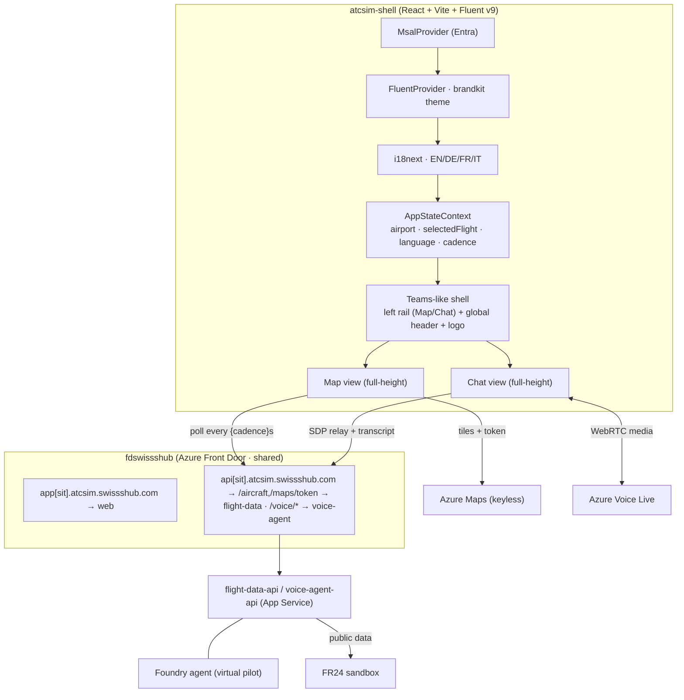

# ZRH Real-Flight UX + Shared Platform — Design

| Field | Value |
| --- | --- |
| Product | ATCSimulator |
| Document | ZRH Real-Flight UX + Shared Platform — Design (Spec) |
| Type | Spec |
| Version | 0.1 (Draft) |
| Date | 2026-07-16 |
| Author | ATCSimulator team |
| Status | Draft for review |
| Classification | Public — anonymized demo |
| Subscription | `75102af9-fc92-45d4-99a8-5510a24b5421` (ME-MngEnvMCAP164444-urruegg-2) |
| Region | Sweden Central (EU) — demo plane |

**Related documents:** [SD.md](../SD.md) · [AI.md](../AI.md) · [DATA.md](../DATA.md) · [SECURITY.md](../SECURITY.md) · [BOM.md](../BOM.md) · [ADR-0002 Agnostic API](../adr/ADR-0002-agnostic-api-facade.md) · [ADR-0004 Voice Live + Foundry](../adr/ADR-0004-voice-live-foundry-agent.md) · [PoC E2E validation runbook](../runbooks/poc-e2e-validation-runbook.md) · [CI/CD deployment runbook](../runbooks/cicd-deployment-runbook.md) · [brandkit](../brandkit/) · sprint doc [2026-07-16](../sprints/2026-07-16-poc-outcome-and-next-sprint-foundation.md)

---

## 1. Objective

Deliver a Teams-like React experience for **ZRH real flight data**, in one combined spec/plan built in four phases. Two main areas, one shared shell, four languages, brandkit-themed — plus the shared platform (Azure Maps, Azure DNS delegation of `swissshub.com`, Azure Front Door, custom domains + TLS). Demo plane only (Scope 2): public/synthetic data, no personal data, no operational-ATC connectivity (`CON-01`, `CON-03`).

## 2. Approved decisions

| # | Decision | Choice |
| --- | --- | --- |
| D1 | Spec/plan structure | **One combined spec + plan**, built in 4 phases |
| D2 | Build sequence | **UI-first phased** — Shell → Map → Chat → Platform/DNS cutover last |
| D3 | Chat fidelity | **Full live loop** — Azure Voice Live + Foundry agent; ATC (mic) and Pilot both transcribed |
| D4 | Shell layout | **Teams-like left app rail** (Fluent icons + labels) + global header |
| D5 | Languages | **EN / DE / FR / IT**, switchable in header, persisted |
| D6 | Airport selector | **All Swiss airports** selectable (full scope, 21 in `data/airports.ts`); **ZRH** is the default anchor |
| D7 | Map refresh | **User setting**, default **~5 s** polling |
| D8 | Flight data source | **FR24 sandbox** (public data only) |
| D9 | Azure Maps auth | **Keyless** — backend token endpoint via Managed Identity (no key in browser) |
| D10 | Public entry | **Shared Azure Front Door** (`fdswissshub`) fronts all hostnames; Front Door-managed TLS |
| D11 | DNS | **Azure DNS** authoritative for `swissshub.com`; GoDaddy NS delegation (manual, human) |
| D12 | Shared services | Dedicated **`swissshub`** resource group (cross-solution, tenant-wide) |
| D13 | Certificates | **Azure Front Door-managed certificates** for the public custom domains |

## 3. Architecture

One React SPA (`atcsim-shell`) restructured into a Teams-like shell, with global providers and a shared selection state every view reads.

### 3.1 Resource groups

- **`swissshub`** (shared, cross-solution): Azure DNS zone `swissshub.com`, Azure Front Door profile `fdswissshub`. Reusable by other solutions in the tenant.
- **`rg-atcsim-sit` / `rg-atcsim-prod`** (solution): web + `flight-data-api` + `voice-agent-api` App Services, Azure Maps account, Foundry, Key Vault, App Insights.

> **DNS naming note.** An Azure **public DNS zone resource must be named as its FQDN**, so the zone is `swissshub.com` (not `dnsswissshub`). The `fdswissshub` name applies to the Front Door profile. Any additional shared DNS-related resources may use the `dnsswissshub` label.

## 4. Phase 1 — App shell, i18n, theming

**Frontend structure** (under `src/web/atcsim-shell/src/`):

- `app/AppShell.tsx` — full-height (`100vh`) Teams-like frame: left `AppRail` + top `Header` + routed content outlet that flex-fills remaining height.
- `app/AppRail.tsx` — vertical nav with **Fluent UI icons + labels** (`Map` / `Chat`).
- `app/Header.tsx` — **brandkit logo top-left**, `LanguagePicker`, `AirportPicker`, `UserMenu` (Fluent icons: Globe/Location/Person).
- `state/AppStateContext.tsx` — `airport`, `selectedFlight`, `language`, `refreshCadence`; persisted to `localStorage`; setters fan out to all views.
- `i18n/index.ts` + `i18n/locales/{en,de,fr,it}.json` — `react-i18next`, default EN, detector + persistence.
- `theme/atcsimulatorTheme.ts` + `theme/tokens.css` — adapted from `docs/brandkit/color/`.
- `app/router.tsx` — `/` (Map) and `/chat` nested under `AppShell`.

**Phase 1, step 1 — brand artifact placement** (copied into the app, done in the sprint branch):

| Brand artifact (`docs/brandkit/…`) | Destination in `src/web/atcsim-shell/` |
| --- | --- |
| `logo/atcsimulator-logo.svg`, `-symbol.svg`, `-logo-tagline.svg`; `icon/atcsimulator-icon.svg` | `public/brand/` |
| `icon/favicons/atcsimulator-{16,32,48,180,192,512}.png` | `public/favicons/` + `index.html` links |
| `color/atcsimulator-theme.ts` | `src/theme/atcsimulatorTheme.ts` (adapt imports) |
| `color/atcsimulator-tokens.css` | `src/theme/tokens.css` (imported in `main.tsx`) |

**Header behaviors:** language switch re-translates all views; airport switch clears the selected flight and re-centers the map; cadence setting re-times polling; UserMenu shows the MSAL account with **Sign out** and **Sign in with another account**. The airport dropdown lists **all Swiss airports** (full scope); **ZRH** is the default.

**Conventions (shell-wide):** Fluent UI icons everywhere feasible; brandkit logo top-left; every main view maximizes vertically to the app-window height.

## 5. Phase 2 — Map view (extended PoC 1)

- `features/flight-data/AircraftMapPage.tsx` — full-height **Azure Maps** (`azure-maps-control`) centered on the **ZRH wider area**, all sandbox flights as markers in one view; click-to-select highlights the aircraft and sets `selectedFlight` (arms the Chat view).
- `features/flight-data/SelectedFlightHeader.tsx` — real-time header (callsign · type · reg · FL · heading · speed · position); shows the **advisory** ("Select an aircraft on the map to begin") when nothing is selected.
- `features/flight-data/useFlightPolling.ts` — polls the flight API every `refreshCadence` seconds (default 5), updates markers + header.
- `features/flight-data/mapAuth.ts` — fetches a Maps token from `GET /api/maps/token` and configures anonymous-auth-with-token (no key in browser).
- Backend: `flight-data-api` gains `GET /api/maps/token` (Managed Identity → Azure Maps token) and an airport→bounding-box mapping for `ZRH`.

## 6. Phase 3 — Chat view (extended PoC 2, live)

- `features/chat/ChatPage.tsx` — full-height; top **selected-flight header** (same component as Map); two columns — **ATC left** (Fluent headset/person-voice icon) and **Pilot right** (Fluent airplane icon) — with role-tagged, transcribed turns.
- `voice/voiceLiveClient.ts` (existing) — WebRTC media to Azure Voice Live; the browser does media only.
- `features/chat/useLiveTranscript.ts` — receives transcript events (ATC STT + Pilot) from the broker and renders role-tagged bubbles.
- `features/chat/MicControl.tsx` — push-to-talk (Fluent Mic/MicOff), listening/speaking status, **synthetic-voice disclosure** (`DP-16`).
- Backend: `voice-agent-api` broker (ADR-0004) holds the Voice Live control channel, validates any `function_call` server-side, and streams transcript events to the browser for display. **Requires publishing the Foundry virtual-pilot agent** and setting `VoiceLive__AgentId`/`VoiceLive__ProjectId`.
- Selecting a flight passes its context (callsign/type) into the session so the pilot read-back uses the correct callsign.

## 7. Phase 4 — Shared platform & infra

- **Azure Maps** (`maps.bicep`, solution RG): account (S0/Gen2); `flight-data-api` Managed Identity granted **Azure Maps Data Reader**.
- **Azure DNS** (`dns.bicep`, `swissshub` RG): public zone `swissshub.com`; outputs the 4 Azure NS records. **Manual gate (human):** set those NS at GoDaddy to delegate the domain. Subdomain + Front Door validation records (`_dnsauth` TXT, CNAME to the Front Door endpoint) added after delegation propagates.
- **Azure Front Door** (`frontdoor.bicep`, `swissshub` RG, profile `fdswissshub`): custom domains `app`/`appsit`/`api`/`apisit` under `atcsim.swissshub.com`; **Front Door-managed TLS**; routes — `app[sit]` → web App Service; `api[sit]` path-routes `/api/aircraft` + `/api/maps/token` → flight-data and `/api/voice/*` → voice-agent (WebSocket enabled for the Voice Live SDP relay). Origins are the App Service default hostnames, locked to Front Door (header/`X-Azure-FDID` check).
- **Environments:** PROD (`app`, `api`) and SIT (`appsit`, `apisit`).
- **CI/CD:** extend the existing GitHub Actions CD to deploy the shared RG (idempotent) and configure Front Door routes/domains; keep the SIT-auto / PROD-reviewer gate.

## 8. Security & guardrails

- Keyless throughout: Azure Maps via Managed Identity token endpoint; Voice Live via broker Managed Identity; no secrets in the browser (`SECURITY.md`).
- Deterministic command boundary unchanged (ADR-0004): the broker validates any `function_call` (schema + range + allow-list) server-side; the browser never commands the simulator (`CON-01`).
- Content Safety + synthetic-voice disclosure (`DP-16`) in the Chat view.
- Front Door origin lock so App Services are only reachable via `fdswissshub`.

## 9. Residency & compliance

- Demo plane only, Sweden Central (EU); public flight data + synthetic voices; **no personal data** (`CON-03`).
- No operational-ATC connectivity (`CON-01`).
- Voice Live region availability re-verified at design time (`CON-05`).

## 10. Testing & validation

- **Frontend (Vitest):** language switch; all-Swiss-airports picker; `AppStateContext` persistence; map polling hook; selected-flight header advisory state; Maps token fetch; chat transcript rendering + synthetic-voice disclosure present.
- **Backend (xUnit):** `/api/maps/token` returns a token via Managed Identity (mocked credential); airport→bbox mapping; existing Voice Live validator/dispatch tests remain green (12/12).
- **Infra:** `az bicep build` for shared + solution templates; Front Door route + custom-domain validation; DNS delegation check.
- **E2E:** extend the [PoC E2E validation runbook](../runbooks/poc-e2e-validation-runbook.md) — signed-in map with live ZRH flights, select → live chat read-back, language switch, custom-domain reachability + TLS.
- Golden-phraseology / command-mapping evals remain the merge gate.

## 11. Out of scope (YAGNI)

- FR24 **production** feed (the demo uses the FR24 sandbox for all Swiss airports); talking-head avatar; Custom Neural Voice; in-country (Switzerland North) Voice Live; multi-solution onboarding of other repos onto the shared services (the shared RG is created to allow it, but wiring other solutions is separate work).

## 12. Open items / dependencies

- **Human gate:** GoDaddy nameserver change to delegate `swissshub.com` to Azure DNS (unblocks custom domains + TLS).
- **Human gate:** publish the Foundry virtual-pilot agent + set `VoiceLive__AgentId`/`VoiceLive__ProjectId` (enables the live Chat loop).
- **Human gate:** PROD deployment approval (existing reviewer gate).

## 13. Traceability

Realizes the next-sprint foundation in [2026-07-16 sprint doc](../sprints/2026-07-16-poc-outcome-and-next-sprint-foundation.md). Constrained by [ADR-0002](../adr/ADR-0002-agnostic-api-facade.md) (Front Door as the single API entry aligns with the Agnostic-API façade) and [ADR-0004](../adr/ADR-0004-voice-live-foundry-agent.md) (live voice loop). New ADRs to add during implementation: shared platform (Front Door + DNS + shared RG) and Azure Maps keyless auth.
